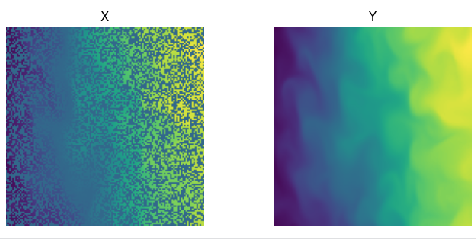
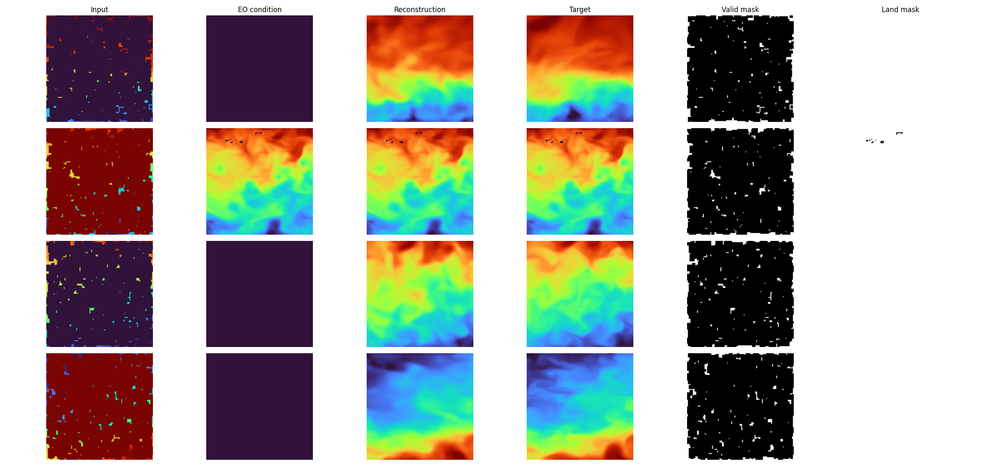
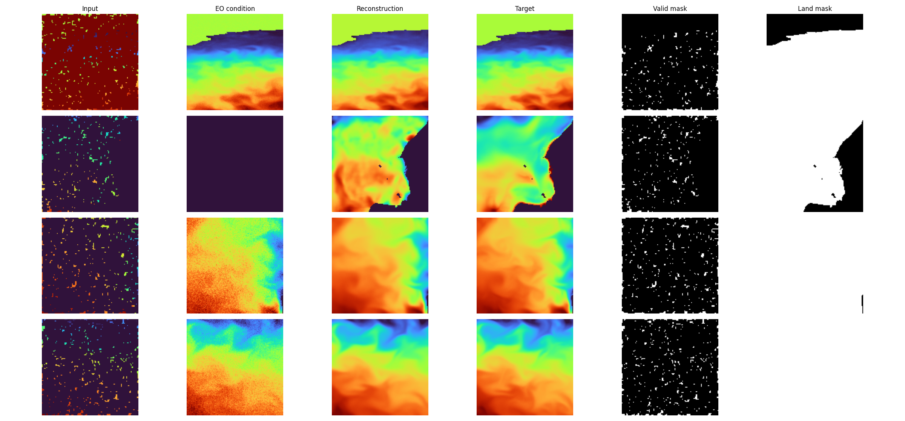
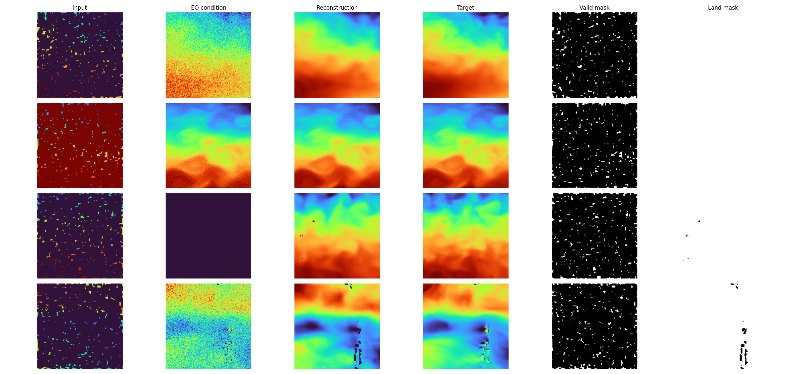
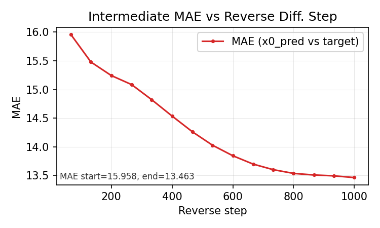

<p align="center">
  <div style="width:70%; overflow:hidden; border-radius:16px;">
    
  </div>
</p>

# Densifying Sparse Ocean Depth Observations
This implementation is a first test, checking the feasability of densifying sparse ocean measurements.

## Environment & Dependencies

- The project uses **Python 3.12.3**.
- All Python dependencies are listed in a single `requirements.txt` file located at the **repository root**.
- Install dependencies with:
```bash
pip install -r requirements.txt
```


## Data
Currently, monthly tiles from 2000 - 2025 from the [Global Ocean Physics Reanalysis dataset](https://data.marine.copernicus.eu/product/GLOBAL_MULTIYEAR_PHY_001_030/files?subdataset=cmems_mod_glo_phy_my_0.083deg_P1M-m_202311&path=GLOBAL_MULTIYEAR_PHY_001_030%2Fcmems_mod_glo_phy_my_0.083deg_P1M-m_202311%2F2024%2F) have been downloaded and are manually masked to simulate real sparse observations. Excluding patches with >20% NoData values, ~106k samples are avaialble (128x128, 1/12 °). Download the data by installing the `copernicusmarine` package, then use the CLI like so `copernicusmarine get -i cmems_mod_glo_phy_my_0.083deg_P1M-m  --filter "*2021/*"`  
The of the obstructions and the coverage percentage are selectable in the `data_config.yaml`.

The validation split is geographically coherent: the same spatial locations/windows across timesteps are assigned to either train or val, not both.

Dataset example for 50% occlusion:  
  

### Implemented dataset/task modes
There are currently two implemented training tasks:

1. **Straight corrupted -> uncorrupted (single-band)**  
   Uses `SurfaceTempPatchLightDataset` (`temp_v1` style):
   - `x`: corrupted temperature band
   - `y`: clean temperature band (ground truth)
   - optional masks: `valid_mask`, `land_mask`

2. **EO-conditioned multiband reconstruction**  
   Uses `SurfaceTempPatch4BandsLightDataset` (`eo_4band` style):
   - `eo`: first band used as extra condition (surface/EO-like observation)
   - `x`: corrupted deeper temperature bands
   - `valid_mask`: mask channel used as additional condition
   - `y`: clean deeper temperature bands (ground truth)
   - optional masks: `valid_mask`, `land_mask`

EO + multiband dataloader example (`eo` + deeper levels as corrupted/target):


In config, switch this via `dataset.dataset_variant`:
- `temp_v1` for single-band corrupted->clean
- `eo_4band` for EO + multiband conditioning

### Dataset tweaks
- Synthetic occlusion pipeline to create sparse observations with configurable `mask_fraction`.
- Patch-based masking with min/max patch sizes (`mask_patch_min`, `mask_patch_max`) instead of single-pixel drops.
- Validity/land masks derived from nodata or fill values; invalid pixels are tracked separately from corruption.
- Optional filtering of tiles by `max_nodata_fraction` to avoid overly invalid patches.
- Corrupted input + mask channel return modes for conditional modeling (`x_return_mode`).
- Z-score temperature normalization and optional geometric augmentation (rotations/flips) applied consistently to data and masks.
- Dataset index build with nodata-fraction metadata for fast filtering.
- Geographically coherent split support via the index `split` column (same location kept in one split over time).
- Optional patch-center coordinate return (`return_coords`) using index columns (`lat0/lat1/lon0/lon1`) with dateline-safe longitude center computation.

## Model
As a first prototype, a conditional pixel-space Diffuser is modeled after [DiffusionFF](https://github.com/mikonvergence/DiffusionFastForward).  

Current implemented conditioning/target setups:
- Single-band: `x -> y` (corrupted temp to clean temp)
- EO multiband: `[eo, x, valid_mask] -> y` (EO + corrupted deeper bands + mask to clean deeper bands)

Loss can be computed with or without masking by valid pixels (`mask_loss_with_valid_pixels`).

### Model Description
- **Model type**: Conditional diffusion model in pixel space (`PixelDiffusionConditional`) with a **ConvNeXt U-Net denoiser** (`UnetConvNextBlock`). CNN/U-Net-style model.
- **Architecture (default config in this repo)**:
  - `dim_mults=[1,2,4,8]` gives 4 encoder stages and 3 decoder stages.
  - Encoder stage block pattern: `ConvNextBlock -> ConvNextBlock -> LinearAttention -> Downsample` (last encoder stage uses identity downsample).
  - Bottleneck block pattern: `ConvNextBlock -> LinearAttention -> ConvNextBlock`.
  - Decoder stage block pattern: `concat skip -> ConvNextBlock -> ConvNextBlock -> LinearAttention -> Upsample` (last decoder stage uses identity upsample).
  - Output head: final `ConvNextBlock` followed by `1x1 Conv2d` to `generated_channels`.
- **Parameter count**: current EO config is approximately **57M parameters**.
- **Backbone I/O**:
  - Input to denoiser at each reverse/training step: `cat([x_t, condition], dim=1)` with shape `(B, generated_channels + condition_channels, H, W)`.
  - Output from denoiser: `(B, generated_channels, H, W)` (predicts `epsilon` noise or `x0`, based on `model.parameterization`).
- **Conditioning construction (EO task)**:
  - Dataset returns `eo: (B,1,H,W)`, `x: (B,3,H,W)`, `valid_mask: (B,3,H,W)`, `y: (B,3,H,W)`.
  - With EO config (`condition_include_eo=true`, `condition_mask_channels=1`), condition is:
    - `condition = cat([eo, x, valid_mask_reduced], dim=1) = (B,5,H,W)`
    - where `valid_mask_reduced` is `(B,1,H,W)`.
- **Training flow (EO task)**:
  - Target `y` is the diffusion sample branch: `(B,3,H,W)`.
  - Random timestep `t` is sampled per item: `(B,)`.
  - Forward process adds Gaussian noise to `y` only: `y_t = q(y_t | y_0)` and returns sampled `noise` `(B,3,H,W)`.
  - Denoiser input becomes `cat([y_t, condition], dim=1) = (B,8,H,W)`.
  - With `parameterization: "epsilon"` (default), loss compares predicted noise vs sampled noise.
- **Inference flow**:
  - Start from random latent `x_T ~ N(0,I)` with shape `(B,3,H,W)`.
  - Keep `condition` fixed (`(B,5,H,W)` in EO mode) through all reverse steps.
  - At each step, denoiser input is `cat([x_t, condition], dim=1) = (B,8,H,W)`, output `(B,3,H,W)`.
  - Sampler update:
    - DDPM: injects stochastic noise each step for `t>0`.
    - DDIM: deterministic when `eta=0`, stochastic when `eta>0`.
- **Where noise is injected**:
  - Noise is **added to the generated/target branch** (`y` in training, latent `x_t` in inference).
  - Noise is **not added to conditioning channels** (`eo`, `x`, `valid_mask`).
  - Conditioning is provided by **channel concatenation**, not by adding noise to condition tensors.

For model/training knobs, see **Appendix A1** (major + minor settings) and **Appendix A2** (FiLM coordinate injection details).

## Training
Train with `train.py`. You can now choose which config files to use from CLI.

### CLI config selection
```bash
python3 train.py --data-config configs/data_config_eo_4band.yaml --train-config configs/training_config_eo_4band.yaml --model-config configs/model_config_eo_4band.yaml
```

Notes:
- `--train-config` and `--training-config` are equivalent.
- If omitted, all three arguments default to:
  - `configs/data_config.yaml`
  - `configs/training_config.yaml`
  - `configs/model_config.yaml`

### EO + 3-band conditional training
Use the EO/4-band config set to train with:
- condition = `eo` (1 band)  + corrupted `x` (3 bands) + `valid_mask` (1 band) = 5 condition channels
- target = `y` (3 clean temperature bands)
- `dataset.eo_dropout_prob` enables EO dropout (randomly zeroes EO for a subset of samples in both train and val)
  - reasoning: this reduces EO shortcut learning so the model does not over-rely on EO and still reconstructs from the actual corrupted `x` (+ mask context).

```bash
python3 train.py \
  --data-config configs/data_config_eo_4band.yaml \
  --train-config configs/training_config_eo_4band.yaml \
  --model-config configs/model_config_eo_4band.yaml
```

### Straight corrupted -> uncorrupted training
Use the default single-band setup:

```bash
python3 train.py \
  --data-config configs/data_config.yaml \
  --train-config configs/training_config.yaml \
  --model-config configs/model_config.yaml
```

### What happens during training
- A timestamped run folder is created under `logs/`.
- The exact config files used for the run are copied into that folder, and checkpointing keeps `best.ckpt` (by `trainer.ckpt_monitor`) plus `last.ckpt`.
- The only supported model type is `cond_px_dif` (`PixelDiffusionConditional`).
- Training resumes automatically when `model.resume_checkpoint` is set to a valid `.ckpt` path in `configs/model_config.yaml`.

## Inference
Inference can be run by loading a checkpoint into the same model class and calling the model's `predict_step`.

### 1) Build model from config + load checkpoint
```python
from pathlib import Path

import torch
import yaml
from pytorch_lightning import Trainer

from data.datamodule import DepthTileDataModule
from data.dataset_temp_v1 import SurfaceTempPatchLightDataset
from models.difFF import PixelDiffusionConditional


def load_yaml(path: str) -> dict:
    with Path(path).open("r", encoding="utf-8") as f:
        return yaml.safe_load(f)


model_config_path = "configs/model_config.yaml"
data_config_path = "configs/data_config.yaml"
training_config_path = "configs/training_config.yaml"
ckpt_path = "logs/<run>/best.ckpt"

dataset = SurfaceTempPatchLightDataset.from_config(data_config_path, split="all")
datamodule = DepthTileDataModule(dataset=dataset)
datamodule.setup("fit")

model = PixelDiffusionConditional.from_config(
    model_config_path=model_config_path,
    data_config_path=data_config_path,
    training_config_path=training_config_path,
    datamodule=datamodule,
)

checkpoint = torch.load(ckpt_path, map_location="cpu")
model.load_state_dict(checkpoint["state_dict"], strict=True)
model.eval()
```

If you run the EO multiband mode, swap the dataset class to `SurfaceTempPatch4BandsLightDataset` and use the EO config files.

### 2) Run a single `predict_step` directly
For `PixelDiffusionConditional`, `predict_step` expects at least `x`; it will also use `valid_mask` and optional `coords` if present.

```python
batch = next(iter(datamodule.val_dataloader()))
batch = {k: (v if not torch.is_tensor(v) else v.to(model.device)) for k, v in batch.items()}

with torch.no_grad():
    pred = model.predict_step(batch, batch_idx=0)

y_hat = pred["y_hat"]               # standardized output
y_hat_denorm = pred["y_hat_denorm"] # temperature-denormalized output
```

### 3) Run prediction through Lightning
```python
trainer = Trainer(accelerator="auto", devices="auto", logger=False)
predictions = trainer.predict(model=model, dataloaders=datamodule.val_dataloader())
```

Each prediction item includes:
- `y_hat`
- `y_hat_denorm`
- `denoise_samples` (if intermediates requested)
- `sampler`

## Results
### Experiment 1 (1-band corruption, 50%)
Preliminary results for sub-surface reconstruction with 1-band setup and 50% pixelated occlusion (clustered), 24hr train time. Valid masks for training, land mask only for visualization. Loss calculated over whole image. No inpainting pixel anchoring in DDPM sampling. PSNR ~40dB, SSIM ~0.90.


The same checkpoint applied to 75 percent occusion indicates it learned the distribution somewhat well.  


### Experiment 2 (3-band x and y, EO condition, 95% corruption)
EO-conditioned multiband setup (`x`: 3-band corrupted input (depth levels 3,4,5), `y`: 3-band clean target, plus EO condition (surface obs.)), evaluated at 95% corruption. Good results, but likely over-reliance on EO condition.


### Experiment 3 (High corruption and EO dropout)
Test setting with 75% corruption and 50% EO condition dropout, keeping the same checkpoint for comparison. Quality obviosuly suffers with EO condition removed, but reconstructs distribution well. Note: EO dropout is random, so model has seen same location with EO condition previously. Unlikely that model momorizes this though with only 57M parameters and 110k samples.


After 100 training epochs on the previous setting, I switched to 95% percent corruption and still 50% dropout. Samples where EO is available are well and faithfully reconstructed. Samples without the EO conditioning generate a very plausible reconstruction, but it is visible that some currents/patterns look correct but are not 100% correlated with the ground truth. This might be a point where we can draw a very realistic reconstruction from the distribution, but we do not have enough information to accurately reconstruct this exact scenario.  


### Experiment 4 (High corruption, EO dropout, and EO degradation)
Now, to simulate an EO observation that is not so well correlated with the `y` variable, the `eo` gets degraded: a random multiplication between 0.9 and 1.1, and a small speckle noise gets added. This should encourage the model to respect the structure and shape of the EO observation, but rely less on it's absolute values. This model has been trained from scratch. It seems like the reconstruction still works reasonably well, both for degraded EO images and for purely `x->y` reconstruction  
  


### Experiment 5: Lower temperature Levels
The following levels were extracted to make the target harder: 0 (EO), 4 (5m), 10 (16m), 17 (50m). Training is done with 95% corruption, 50% EO dropout, and EO conditioning degradation.

Works for these depth levels without a loss in quality



### Sampling Process
The sampling process is currently guided by a cosine schedule. Plotting the intermediate steps shows a lot of noise initially, until the very end of the schedule. In addition to qualitative intermediates, we now log:
- MAE vs intermediate denoising step (using the per-step `x0` prediction against target).
- Diffusion schedule diagnostics (reverse + forward): `sqrt(alpha_bar_t)`, `sqrt(1-alpha_bar_t)`, `beta_tilde_t`, and `log10(SNR+eps)`.

Currently in the DDPM setting, a lot of compute is spent in very noisy early steps with limited visual ROI. DDIM sampling could fix that, alternatively a less agressive noise schedule. Potentially switching to `x0` parameterization can make this effect smaller as well.  

The image below shows the original x as well as 15 intermediate reconstructions along the denoising path.  
<p align="center">
  
</p>
The generated images at the intermediate denoising steps have the following MAE in relation to the target:
<p align="center">
  
</p>

Current noise scheduled implemented: `linear`, `sigmoid` and `cosine`. Cosine is curently active and produces the following noise schedules.  
<p align="center">
  
</p>


# Comments

## Known Issues
- somewhat speckled, noisy output. Ideas: DDIM sampling, structure-aware weighted loss, x0 parameterization. 
- patches with large land areas make generation struggle everywhere in image

## Untested Imlpementations:
- `mask_loss_with_valid_pixels` - doesnt work - fixed ✅
- `coord_conditioning` - neither tested nor run - only implemented - works, tested ✅
- new dataset_light and datamodule not yet tested. - works ✅
- new x0 parameterization is implemented, but not tested yet  - works very well ✅
- Date + Coord embedding simplemented, but not yet tested 

## Notes
none currently.

## ToDos
- [ ] DDIM Sampling implemented but doesnt work! switching from DDPM to DDIM sampling might mess up noise schedules, but for now a DDPM checkpoint doesnt work with DDIM sampling
- [ ] Increase unet.dim (e.g., 64 → 96 or 128), deeper level by extending dim_mults (e.g., [1, 2, 4, 8, 8])
- [ ] Add a frequency-aware loss like L2 on gradients or PSD loss to get rid of speckle noise in output
- [ ] Activate and test EMA Weights

**Done**:
- [x] Encode timestamp somehow: merged in mlp with coord embeddings
- [x] Try out x0 instead of epsilon param
- [x] **Important**: Make val set geographically consistent. As in, select ~20 perc of geographic locations for val, keep them the same over time
- [x] Add known‑pixel clamping during sampling (inpainting‑style diffusion): at each step, overwrite known pixels with observed values.
- [x] in dataset, implmeent bigger boxes of corruption instead of pixels
- [x] make dataset.py a save-to-disk funcitonality, then load straight form tensors
- [x] Implement masked loss for train/val for land pixels  
- [x] Implement masked loss for train/val for reconstruction pixels?
- [x] Implement two masks: known land pixels and  missing pixels? Add land to known?
- [x] Include Deps file


## RoadMap
#### Tier 1
- [x] Aux data: coords, other priors:  
  Patch‑level [FiLM](https://arxiv.org/abs/1709.07871) conditioning with patch-center (lat, lon) embedding and ConvNeXt scale/shift injection for global geophysical priors.
- [ ] Simulate EO data img + sparse in-situ observation: 1 band surface temp + multiple bands (corrupted) for depth profile. 
- [ ] Reduce resolution to something that we could expect from Argo profiles

#### Tier 2
- [ ] Check more CopernicusMarine products like ARMOR3D as alternative data sources. 
- [x] More sophisticated way to feed masks to model, how to do it? masks * img?   
- [ ] more capable backbone?   

# Appendix: 

## A1: Major and Minor Model Settings

These are the model/training behaviors in this repo and where they are wired in config.

### Major model settings

- **Input channels with mask (conditioning channels)**  
  The conditional diffusion model receives corrupted data plus mask channels.  
  Configure in `configs/model_config.yaml`:
  - `model.condition_channels`: total conditioning channels passed to the denoiser (data + mask).
  - `model.condition_mask_channels`: number of condition channels that are mask semantics.
  - `model.condition_include_eo`: if true, prepend `eo` as an additional condition channel when present.
  - `model.condition_use_valid_mask`: if false, keep `valid_mask` out of condition input (still available for masked loss/logging).  
  In EO 3-band mode this is set to 5 condition channels total: `eo (1) + x (3) + mask (1)`.

- **EO dropout (conditioning regularization)**  
  Configure in `configs/data_config.yaml` or `configs/data_config_eo_4band.yaml`:
  - `dataset.eo_dropout_prob` (for example `0.25`)  
  EO is randomly zeroed for the configured fraction of samples in both train and val.  
  This is used to prevent EO over-reliance and encourage reconstruction from the sparse/deeper `x` signal itself.

- **Masked pixel loss computation**  
  Loss can be restricted to valid (ocean) pixels to avoid land/no-data bias.  
  Configure in `configs/model_config.yaml`:
  - `model.mask_loss_with_valid_pixels: true`  
  When enabled, the conditional loss is computed over missing pixels (`1 - valid_mask`),
  optionally restricted to ocean pixels via `land_mask`, then normalized by mask sum.

- **Anchoring known pixels at inference (inpainting clamp)**  
  During sampling, known pixels are overwritten at every diffusion step for stability.  
  Configure in `configs/model_config.yaml`:
  - `model.clamp_known_pixels: true`  
  This uses the conditioning input + mask to keep known values fixed while denoising.

    

- **Coordinate encoding + FiLM injection**  
  Patch-center coordinates are encoded and injected via FiLM scale/shift in ConvNeXt blocks.  
  Configure in:
  - `configs/data_config.yaml`: `dataset.return_coords: true` (adds coords to each batch)
  - `configs/model_config.yaml`: `model.coord_conditioning.enabled: true`
  - `model.coord_conditioning.encoding`: `unit_sphere`, `sincos`, or `raw`
  - `model.coord_conditioning.include_date`: include `batch["date"]` (`YYYYMMDD`) in FiLM conditioning
  - `model.coord_conditioning.date_encoding`: currently `day_of_year_sincos` (fixed denominator `365`)
  - `model.coord_conditioning.embed_dim`: embedding width (defaults to `unet.dim` if null)
  Exact mechanism is described in **Appendix A2**.

### Minor model/training settings

- **Learning-rate scheduler (Warmup + ReduceLROnPlateau)**  
  Configure in `configs/training_config.yaml`:
  - `scheduler.warmup.enabled`, `steps`, `start_ratio`
  - `scheduler.reduce_on_plateau.enabled`
  - `scheduler.reduce_on_plateau.monitor`, `mode`, `factor`, `patience`, `threshold`, `cooldown`
  - `trainer.lr_logging_interval` (learning-rate monitor cadence)
  Notes:
  - Warmup is step-based (optimizer updates), not epoch-based.
  - Default warmup ramps LR linearly from `0.1 * training.lr` to `training.lr` over the first `1000` optimizer steps.
  - Warmup is currently wired in the conditional model path; after warmup, `ReduceLROnPlateau` controls LR as usual.

- **Checkpointing + resume**  
  Configure in:
  - `configs/model_config.yaml`: `model.resume_checkpoint` (false/null or a `.ckpt` path)
  - `configs/training_config.yaml`: `trainer.ckpt_monitor` (metric used for `best.ckpt`; `last.ckpt` is always saved)

- **W&B logging (metrics/images/watch)**  
  Configure in `configs/training_config.yaml`:
  - `wandb.project`, `wandb.entity`, `wandb.run_name`, `wandb.log_model`
  - `wandb.verbose`, `wandb.log_images_every_n_steps`, `wandb.log_stats_every_n_steps`
  - `wandb.watch_gradients`, `wandb.watch_parameters`, `wandb.watch_log_freq`, `wandb.watch_log_graph`

- **Validation-time sampling + diagnostics**  
  Configure in `configs/training_config.yaml`:
  - `training.validation_sampling.sampler` (`ddpm` or `ddim`)
  - `training.validation_sampling.ddim_num_timesteps`, `ddim_eta`
  Notes: PSNR/SSIM are computed when `skimage` is available; one cached val example per epoch is used for full reconstruction logging.

## A2: FiLM Coordinate Injection Details

### Coordinate Encoding Options
Encoding options (set with `model.coord_conditioning.encoding`):
- `unit_sphere`: Convert lat/lon to a 3D unit vector (x,y,z). This avoids lon wrap discontinuity and is the default.
- `sincos`: Use sin/cos for lat and lon (4D). Also wrap-safe, slightly higher dimensional.
- `raw`: Normalize degrees to [-1, 1] (lat/90, lon/180). Simplest but can be discontinuous at +/-180.

When `model.coord_conditioning.include_date=true`, `batch["date"]` is parsed as `YYYYMMDD`.
Monthly file names (`YYYYMM`) are mapped to `YYYYMM15` before encoding.

### Date Encoding And Fusion With Coordinates
Date encoding is controlled by `model.coord_conditioning.date_encoding`.

Current option:
- `day_of_year_sincos`: parse `YYYYMMDD` -> compute non-leap `day_of_year` -> encode as:
  - `sin(2*pi*day_of_year/365)`
  - `cos(2*pi*day_of_year/365)`

Fusion with coordinate encoding:
- First encode coordinates using `model.coord_conditioning.encoding`.
- If `include_date=true`, concatenate date features to the coordinate feature vector:
  - `fused = concat(coord_features, date_features)`
- The fused vector is passed through the coordinate MLP to produce one embedding used by FiLM.

### Exact Injection Mechanism (Scale-Shift)
The coordinate embedding is injected via a per-channel FiLM scale and shift inside each `ConvNextBlock`.

Inside `ConvNextBlock`:
```python
self.coord_mlp = nn.Sequential(nn.GELU(), nn.Linear(coord_emb_dim, dim * 2))
...
scale_shift = self.coord_mlp(coord_emb)   # (B, 2*dim)
scale, shift = scale_shift.chunk(2, dim=1) # each (B, dim)

h = h * (1 + scale[:, :, None, None]) + shift[:, :, None, None]
```

That is:
```
h[b,c,x,y] <- h[b,c,x,y] * (1 + s[b,c]) + t[b,c]
```

Notes:
- `scale` and `shift` are per-sample, per-channel and broadcast to `(B, C, H, W)`.
- Applied after the depthwise conv (`ds_conv`) and before the main conv stack (`self.net`).
- This is classic FiLM conditioning: coordinates decide how strongly each channel is amplified/suppressed and offset.
- Why `1 + scale`? It keeps the identity map easy: if `scale=0` and `shift=0`, coords do nothing. This is more stable than multiplying by `scale` directly.

### Interaction With Time Conditioning
Time conditioning is additive:
```python
condition = self.mlp(time_emb)   # (B, dim)
h = h + condition[:, :, None, None]
```

So:
- Time adds a bias per channel.
- Coords do a scale-and-shift per channel.
- These are compatible: time tells the block where it is in diffusion, coords tell it where on Earth the sample belongs.
