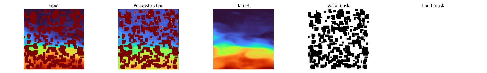

# Densifying Sparse Ocean Depth Observations
This implementation is a first test, checking the feasability of densifying sparse ocean measurements.

## Data
Currently, monthly tiles from 2000 - 2025 from the [Global Ocean Physics Reanalysis dataset](https://data.marine.copernicus.eu/product/GLOBAL_MULTIYEAR_PHY_001_030/files?subdataset=cmems_mod_glo_phy_my_0.083deg_P1M-m_202311&path=GLOBAL_MULTIYEAR_PHY_001_030%2Fcmems_mod_glo_phy_my_0.083deg_P1M-m_202311%2F2024%2F) have been downloaded and are manually masked to simulate real sparse observations. Excluding patches with >20% NoData values, ~106k samples are avaialble (128x128, 1/12 °). Download the data by installing the `copernicusmarine` package, then use the CLI like so `copernicusmarine get -i cmems_mod_glo_phy_my_0.083deg_P1M-m  --filter "*2021/*"`  
The of the obstructions and the coverage percentage are selectable in the `data_config.yaml`.

Dataset example for 50% occlusion:  
  

Current Status:
- 1-band only for experimentation
- 128x128 hardcoded

### Repository Tweaks (Data)
- Synthetic occlusion pipeline to create sparse observations with configurable `mask_fraction`.
- Patch-based masking with min/max patch sizes (`mask_patch_min`, `mask_patch_max`) instead of single-pixel drops.
- Validity/land masks derived from nodata or fill values; invalid pixels are tracked separately from corruption.
- Optional filtering of tiles by `max_nodata_fraction` to avoid overly invalid patches.
- Corrupted input + mask channel return modes for conditional modeling (`x_return_mode`).
- Z-score temperature normalization and optional geometric augmentation (rotations/flips) applied consistently to data and masks.
- Dataset index build with nodata-fraction metadata for fast filtering.
- Optional patch-center coordinate return (`return_coords`) using index columns (`lat0/lat1/lon0/lon1`) with dateline-safe longitude center computation.

## Model
As a first prototype, a conditional pixel-space Diffuser is modeled after [DiffusionFF](https://github.com/mikonvergence/DiffusionFastForward).  

The model is trained on 1-channel temp + valid pixel mask. Loss can be pulled including or excluding the mask.

### Repository Tweaks (Model)
- ReduceLROnPlateau learning-rate scheduler configuration and logging support.

### Major Model Settings + Where to Configure
These are the core conditioning/robustness tricks in this repo and where they are wired in config.

- **Input channels with mask (conditioning channels)**  
  The conditional diffusion model receives the corrupted data plus a mask channel.  
  Configure in `configs/model_config.yaml`:
  - `model.condition_channels`: total conditioning channels passed to the denoiser (data + mask).
  - `model.condition_mask_channels`: number of those channels that are mask semantics (excluded from normalization).  
  This is built from `x` and `valid_mask` in the dataset.

- **Masked pixel loss computation**  
  Loss can be restricted to valid (ocean) pixels to avoid land/no‑data bias.  
  Configure in `configs/model_config.yaml`:
  - `model.mask_loss_with_valid_pixels: true`  
  When enabled, the conditional loss is multiplied by the `valid_mask` and normalized by its sum.

- **Coordinate encoding + FiLM injection**  
  Patch-center coordinates are encoded and injected via FiLM scale/shift in every ConvNeXt block.  
  Configure in:
  - `configs/data_config.yaml`: `dataset.return_coords: true` (adds coords to each batch)
  - `configs/model_config.yaml`: `model.coord_conditioning.enabled: true`
  - `model.coord_conditioning.encoding`: `unit_sphere`, `sincos`, or `raw`
  - `model.coord_conditioning.embed_dim`: embedding width (defaults to `unet.dim` if null)

- **Anchoring known pixels at inference (inpainting clamp)**  
  During sampling, known pixels are overwritten at every diffusion step for stability.  
  Configure in `configs/model_config.yaml`:
  - `model.clamp_known_pixels: true`  
  This uses the conditioning input + mask to keep known values fixed while denoising.

### Repository Tweaks (Training/Logging)
- PSNR and SSIM computed during validation (when `skimage` is available).
- Validation-time sampling (DDPM or DDIM) for qualitative reconstruction checks.
- Per-epoch cached validation example used for full reconstruction logging.
- W&B image logging for inputs, targets, predictions, masks, and reconstruction grids.
- Periodic stats logging (e.g., masked fraction, stdev etc) during train/val.
- Checkpointing + resume support, plus learning-rate monitoring callbacks.
- Optional W&B `watch` settings for gradients/parameters/graphs.

### Sampling
- DDIM/DDPM sampling possible
- inpaitning-style injection of known values during generation can be turned on

## Results
Preliminary results for sub-surface reconstruction, 50% pixelated occlusion (clustered), 24hr train time. Valid masks for training, land mask only for vosualization. Loss calculated over whole image. No inpainting pixel anchoring in DDPM sampling.
  

## Environment & Dependencies

- The project uses **Python 3.12.3**.
- All Python dependencies are listed in a single `requirements.txt` file located at the **repository root**.
- Install dependencies with:
```bash
pip install -r requirements.txt
```

# Comments

## Known Issues
- `mask_loss_with_valid_pixels` does the inverse? 😂
  

## Untested Imlpementations:
- `mask_loss_with_valid_pixels` - doesnt work
- `coord_conditioning` - neither tested nor run - only implemented 

## Notes
Currently num_workers=0 and pin_mermory=False due to previous PID datalader death. This way, GPUs arent saturated. Find this error and put up again for effective training. ✅ - reduced val workers to 0, increased num_workers and pin_memory=True, bac to good saturation.


## ToDos
- [x] Include Deps file
- [x] DDIM Sampling
- [ ] Reduce resolution to something that we could expect from Argo profiles
- [x] in dataset, implmeent bigger boxes of corruption instead of pixels
- [ ] make dataset.py a save-to-disk funcitonality, then load straight form tensors
- [x] Implement masked loss for train/val for land pixels  
- [x] Implement masked loss for train/val for reconstruction pixels?
- [x] Implement two masks: known land pixels and  missing pixels? Add land to known?
- [ ] Increase unet.dim (e.g., 64 → 96 or 128), deeper level by extending dim_mults (e.g., [1, 2, 4, 8, 8])

## RoadMap
#### Tier 1
- [x] Aux data: coords, other priors:  
  Patch‑level [FiLM](https://arxiv.org/abs/1709.07871) conditioning with patch-center (lat, lon) embedding and ConvNeXt scale/shift injection for global geophysical priors.
- [ ] Simulate EO data img + sparse in-situ observation: 1 band surface temp + multiple bands (corrupted) for depth profile. 
- [x] Add known‑pixel clamping during sampling (inpainting‑style diffusion): at each step, overwrite known pixels with observed values.

#### Tier 2
- [ ] Check more CopernicusMarine products like ARMOR3D as alternative data sources. 
- [ ] More sophisticated way to feed masks to model, how to do it? masks * img?   
- [ ] more capable backbone?   

## Appendix: FiLM Coordinate Injection Details

### Coordinate Encoding Options
Encoding options (set with `model.coord_conditioning.encoding`):
- `unit_sphere`: Convert lat/lon to a 3D unit vector (x,y,z). This avoids lon wrap discontinuity and is the default.
- `sincos`: Use sin/cos for lat and lon (4D). Also wrap-safe, slightly higher dimensional.
- `raw`: Normalize degrees to [-1, 1] (lat/90, lon/180). Simplest but can be discontinuous at +/-180.

### Exact Injection Mechanism (Scale-Shift)
The coordinate embedding is injected via a per-channel FiLM scale and shift inside each `ConvNextBlock`.

Inside `ConvNextBlock`:
```python
self.coord_mlp = nn.Sequential(nn.GELU(), nn.Linear(coord_emb_dim, dim * 2))
...
scale_shift = self.coord_mlp(coord_emb)   # (B, 2*dim)
scale, shift = scale_shift.chunk(2, dim=1) # each (B, dim)

h = h * (1 + scale[:, :, None, None]) + shift[:, :, None, None]
```

That is:
```
h[b,c,x,y] <- h[b,c,x,y] * (1 + s[b,c]) + t[b,c]
```

Notes:
- `scale` and `shift` are per-sample, per-channel and broadcast to `(B, C, H, W)`.
- Applied after the depthwise conv (`ds_conv`) and before the main conv stack (`self.net`).
- This is classic FiLM conditioning: coordinates decide how strongly each channel is amplified/suppressed and offset.
- Why `1 + scale`? It keeps the identity map easy: if `scale=0` and `shift=0`, coords do nothing. This is more stable than multiplying by `scale` directly.

### Interaction With Time Conditioning
Time conditioning is additive:
```python
condition = self.mlp(time_emb)   # (B, dim)
h = h + condition[:, :, None, None]
```

So:
- Time adds a bias per channel.
- Coords do a scale-and-shift per channel.
- These are compatible: time tells the block where it is in diffusion, coords tell it where on Earth the sample belongs.
