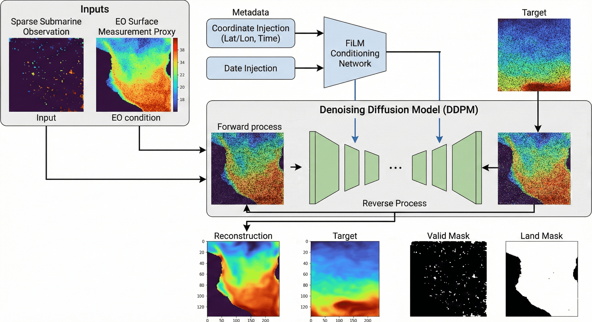

<p align="center">  
    
</p>  
  
<p align="center">  
  <a href="https://depthdif.donike.net/">  
      
  </a>  
  <a href="https://depthdif.donike.net/experiments/">  
      
  </a>  
</p>  
  
# DepthDif  
  
DepthDif is a conditional diffusion project for densifying sparse ocean temperature observations. Visit the [Documentation](https://depthdif.donike.net/) for more info on the models, datasets, and auxiliary data - or follow along with the [Experiments](https://depthdif.donike.net/experiments/).  
  
  
  
## Installation  
  
This project uses Python 3.12.3.  
  
```bash  
python -m pip install -r requirements.txt  
```  
  
## Model Overview  
  
- Model: `PixelDiffusionConditional` (conditional pixel-space diffusion with ConvNeXt U-Net denoiser).  
- Main task modes:  
  - `eo_4band`: EO-conditioned multiband reconstruction (`[eo, x, valid_mask] -> y`).  
- Additional standalone raw-source datasets: `data/dataset_ostia_argo.py` (`OstiaArgoTileDataset`) for CSV-driven OSTIA condition tile retrieval plus date-matched EN4 profile extraction from `argo_file_path`, with each Argo profile resampled onto the fixed 50-level GLORYS depth grid, optional temporal-window averaging via `days`, and georeferenced GeoTIFF export via `save_to_disk(...)`; and `data/dataset_ostia_argo_disk.py` (`OstiaArgoTiffDataset`) for loading the exported OSTIA/ARGO/GLORYS GeoTIFF triplets back from the manifest CSV, with GLORYS stored on disk as packed `int16` (`0.01°C` precision) and decoded back to Celsius on read.
- Config layout:  
  - `configs/px_space/`: active pixel-space diffusion configs  
  - `configs/lat_space/`: latent-space config set (`model_config.yaml`, `training_config.yaml`, `data_config.yaml`, `ae_config.yaml`)  
  
DepthDif is a conditional diffusion model: it reconstructs dense depth fields from corrupted submarine observations, conditioned on EO (surface) data plus sparse corrupted subsurface input. Synthetic sparse inputs are generated with continuous curved trajectory masks to mimic submarine movement; in the current dataset version, each track keeps one measurement every few pixels (random 2-8 pixel stride) until the configured corruption percentage is reached. It can inject coordinate/date context via FiLM conditioning and reconstruct the full target image.  
  
Ambient-occlusion training is available via `model.ambient_occlusion.*`: the model receives a further-corrupted sparse Argo input during training while loss is evaluated on the originally observed `x` pixels. At timestep `t`, clean target `x_0` is noised as  
`x_t = sqrt(alpha_bar_t) * x_0 + sqrt(1 - alpha_bar_t) * epsilon`, with `epsilon ~ N(0, I)`.  
With an observed mask `m` and further-corrupted training mask `m' <= m`, the network predicts from the ambient input (`x_t * m'`, condition) and is optimized with  
`L = E[ || (epsilon - epsilon_theta(x_t * m', cond, t)) * m ||_2^2 ]`.  
See `docs/ambient-occlusion-objective.md` for the full mathematical objective, figure walkthrough, and citation.  
  
  
## Training  
  
OSTIA + Argo disk training:  

```bash  
python train.py \  
  --data-config configs/px_space/data_ostia_argo_disk.yaml \  
  --train-config configs/px_space/training_config.yaml \  
  --model-config configs/px_space/model_config.yaml  
```  

Ambient-occlusion objective example:  

```bash  
python train.py \  
  --data-config configs/px_space/data_ostia_argo_disk.yaml \  
  --train-config configs/px_space/training_config.yaml \  
  --model-config configs/px_space/model_config_ambient.yaml \  
  --set training.wandb.run_name=ambient_ostia_argo_disk_v1  
```  
  
Notes:  
- `--train-config` and `--training-config` are equivalent.  
- Training outputs are written under `logs/<timestamp>/` with `best.ckpt` and `last.ckpt`.  
- `model.resume_checkpoint` resumes full Lightning state; `model.load_checkpoint` warm-starts by loading only model weights.  
- Latent diffusion workflow configs live in `configs/lat_space/`; see `docs/autoencoder.md` for AE + latent setup and launch commands.  
- Latent launcher scripts: `scripts/train_autoencoder.sh`, `scripts/train_latent_diffusion.sh`.  
  
## Inference  
  
Use `inference.py`:  
  
1. Set config/checkpoint constants at the top of `inference.py` (`MODEL_CONFIG_PATH`, `DATA_CONFIG_PATH`, `TRAIN_CONFIG_PATH`, `CHECKPOINT_PATH`).  
   For the active EO setup in this repository, use:  
   `configs/px_space/model_config.yaml`, `configs/px_space/data_ostia_argo_disk.yaml`, `configs/px_space/training_config.yaml`  
2. Choose `MODE` (`"dataloader"` or `"random"`).  
3. Run:  
  
```bash  
python inference.py  
```  
  
## Documentation  
  
- Full documentation: `docs/` (or build/serve with MkDocs).  
- Autoencoder + latent workflow guide: `docs/autoencoder.md`.  
- Experiments page: `docs/experiments.md`.  
  