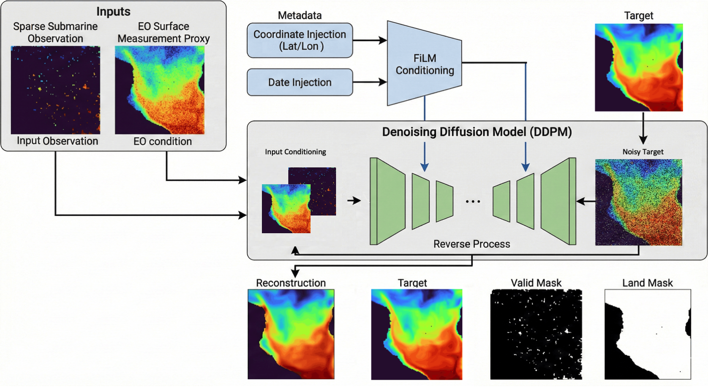
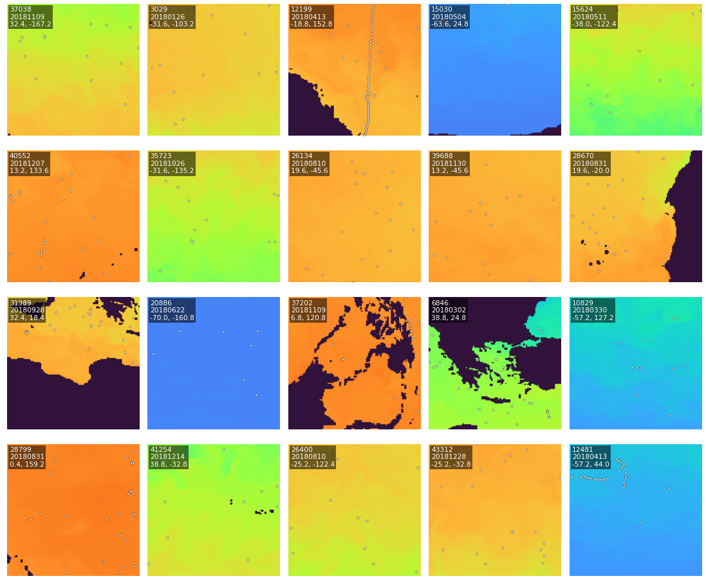

<p align="center">
  <a href="https://pypi.org/project/depth-recon/">
    
  </a>
  = 3.12" />
  
  
  <a href="https://github.com/simon-donike/DepthDif/actions/workflows/publish-pypi.yml">
    
  </a>
  
  <a href="https://depthdif.donike.net/">
    
  </a>
  <a href="https://depthdif.donike.net/experiments/">
    
  </a>
  <a href="https://huggingface.co/datasets/simon-donike/OceanVariableReconstruction/">
    
  </a>
  <a href="https://colab.research.google.com/github/simon-donike/DepthDif/blob/main/Colab_Demo.ipynb">
    
  </a>
</p>


<p align="center">
  
</p>

# DepthDif

DepthDif is a conditional diffusion project for densifying sparse ocean temperature observations. Visit the [Documentation](https://depthdif.donike.net/) for more info on the models, datasets, and auxiliary data - or follow along with the [Experiments](https://depthdif.donike.net/experiments/).


## Demo

Run the public inference notebook directly in Google Colab:

[](https://colab.research.google.com/github/simon-donike/DepthDif/blob/main/Colab_Demo.ipynb)

## Installation

This project uses Python 3.12.3.

```bash
python -m pip install -r requirements.txt
```

The root `requirements.txt` delegates to `pyproject.toml` so local installs and
package metadata use the same curated dependency list.

For public inference only, install the published PyPI package:

```bash
python -m pip install depth-recon
```

To install a branch or tag directly from GitHub, use the same package metadata:

```bash
python -m pip install "depth-recon @ git+https://github.com/simon-donike/DepthDif.git@main"
```

The equivalent explicit editable install is:

```bash
python -m pip install -e .
```

PyPI releases are published by GitHub Actions when a version tag such as
`v0.1.0` is pushed on `main`. The tag must match `project.version` in
`pyproject.toml`, and the repository's `pypi` environment must provide PyPI
publishing credentials.

## Model Overview

- Model: `PixelDiffusionConditional` (conditional pixel-space diffusion with ConvNeXt U-Net denoiser).
- Active dataset: `src/depth_recon/data/dataset_argo_geotiff_gridded.py` (`ArgoGeoTIFFGriddedPatchDataset`) reads exported GeoTIFF rasters and preprocessed ARGO/EN4 profiles through the pixel super-configs.
- Optional dataset ablation: `dataset.synthetic.enabled=true` builds sparse `x` from random GLORYS `y` pixels, controlled by `dataset.synthetic.pixel_count`.
- Config layout:
  - `src/depth_recon/configs/px_space/training_super_config.yaml`: active pixel training super-config
  - `src/depth_recon/configs/px_space/inference_super_config.yaml`: active pixel inference super-config
  - `src/depth_recon/configs/lat_space/`: latent-space model/training/autoencoder configs

DepthDif is a conditional diffusion model: it reconstructs dense GLORYS depth fields from sparse ARGO profile observations, conditioned on OSTIA surface SST, ARGO observation support, GLORYS spatial support, plus coordinate/date context.

Ambient-occlusion training is available via `model.ambient_occlusion.*`: the model receives a further-corrupted sparse Argo input during training while loss is evaluated on the original `x` support intersected with valid `y` support and GLORYS spatial support (`x_valid_mask ∩ y_valid_mask ∩ land_mask`). With the current `x0` training preset, the model predicts the clean target on that masked support rather than the old missing-pixel region. At inference time, both standard and ambient outputs are masked back to `NaN` wherever `y_valid_mask==0`, then cleaned with GLORYS `land_mask` and an optional final `output_land_mask` overlay when supplied by inference/export code; ambient mode does not do a post-hoc overwrite with observed `x` values when `clamp_known_pixels=false`.
See `docs/ambient-occlusion-objective.md` for the full mathematical objective, figure walkthrough, and citation.


## Data Example

Representative surface-level training patches:

<p align="center">
  
</p>

## Training

Pixel-space GeoTIFF training uses `src/depth_recon/configs/px_space/training_super_config.yaml` plus one scenario selector to keep the data/model channel contract aligned:

```bash
/work/envs/depth/bin/python train.py --scenario temperature
/work/envs/depth/bin/python train.py --scenario salinity
/work/envs/depth/bin/python train.py --scenario joint
```

Ambient-occlusion objective example:

```bash
/work/envs/depth/bin/python train.py \
  --scenario temperature \
  --set model.ambient_occlusion.enabled=true \
  --set model.ambient_occlusion.further_drop_prob=0.25 \
  --set training.wandb.run_name=ambient_ostia_argo_geotiff_v1
```

Notes:
- Default config: `src/depth_recon/configs/px_space/training_super_config.yaml`; pass `--config <path>` for a custom super-config.
- `--scenario temperature|salinity|joint` derives `model.output_fields`, `data.dataset.output.fields`, `data.dataset.output.include_salinity`, `model.generated_channels`, and `model.condition_channels`.
- `--set data.*`, `--set model.*`, and `--set training.*` overrides apply after scenario resolution for intentional experiments.
- Training outputs are written under `logs/<timestamp>/` with `best.ckpt`, `last.ckpt`, the original super-config, and resolved effective data/model/training config snapshots.
- `model.resume_checkpoint` is the optional checkpoint path; `model.load_checkpoint_only` selects weights-only loading instead of full Lightning state resume.
- Latent diffusion workflow configs live in `src/depth_recon/configs/lat_space/`; see `docs/autoencoder.md` for AE + latent setup and launch commands.
- Pixel config details and key meanings are documented in `docs/settings.md`; latent diffusion still uses the `src/depth_recon/configs/lat_space/` config files documented in `docs/autoencoder.md`.

## Inference

Public ISO-week inference is available from the `depth-recon` PyPI package. It
downloads the public model/config artifacts from Hugging Face, downloads EN4/ARGO
and optionally OSTIA source files, and writes stitched prediction GeoTIFFs plus
metadata for one ISO-week Wednesday.

```python
from depth_recon import run_week_inference

run_dir = run_week_inference(
    year=2015,
    iso_week=25,
    rectangle=(-20.0, 30.0, 10.0, 50.0),
    device="cuda",
    config_repo="simon-donike/DepthDif",
)
```

The public API downloads configs/checkpoints and the land mask from Hugging Face,
downloads EN4/ARGO and, by default, OSTIA for the selected ISO week, and returns
the GeoTIFF run directory. Pass `export_uncertainty=True` to also write a 5-sample 1-channel uncertainty raster. Existing cached files are reused automatically. Pass
`auto_download_ostia=False` without `ostia_dir` to run ARGO-only inference.
The package API uses non-overlapping public inference patches by default
(`patch_stride=tile_size`, normally 128), so small rectangles select compact
patch sets.
GLORYS is not required for the standard public inference path; it is only needed
for training or optional ground-truth comparison exports.
EN4/ARGO downloads use the Met Office annual EN.4.2.2 profile archives for each
calendar month touched by the selected ISO week.
OSTIA downloads use the Copernicus Marine CLI credentials configured in the
environment, or credentials passed to `run_week_inference` via
`copernicus_username` plus `copernicus_token`. The Copernicus Marine toolbox
accepts that token through its password field, so `copernicus_password` remains
supported as a backwards-compatible alias.

By default, the package uses `simon-donike/DepthDif` at revision `main`, cached public config/checkpoint assets, and `world_land_mask_glorys_0p1.tif`; the runtime call materializes an inference super-config before export.

To prepare the public model files and land mask before a run:

```python
from depth_recon import resolve_public_inference_assets

bundle = resolve_public_inference_assets()
print(bundle.assets.checkpoint)
print(bundle.land_mask_path)
```

To fetch source files separately:

```bash
depth-recon-download-argo --year 2015 --iso-week 25 --output-dir ./en4_profiles
depth-recon-download-ostia --year 2015 --iso-week 25 --output-dir ./ostia
```

The same inference call is also exposed as a console script:

```bash
depth-recon-infer-week \
  --year 2015 \
  --iso-week 25 \
  --rectangle -20 30 10 50 \
  --device cuda
```

Use `src/depth_recon/inference/run_single.py` for a local smoke test. Set `CONFIG_PATH`, optional `SCENARIO`, and `CHECKPOINT_PATH` at the top of the file, then run:

```bash
/work/envs/depth/bin/python -m depth_recon.inference.run_single
```

For a full spatial export, use `src/depth_recon/inference/export_global.py`. It selects the nearest available dataset snapshot inside the requested ISO week, runs inference on every patch for that day, streams the accumulation to disk, and writes stitched prediction, decoded/dequantized GLORYS, and absolute prediction-vs-GLORYS error GeoTIFFs for Surface, 10m, 50m, 100m, 250m, 500m, 1000m, 2000m, 2500m, and 5000m under `inference/outputs/global_top_band_<YYYYMMDD>/`. Pass `--export-uncertainty` to also write one 5-sample 1-channel uncertainty GeoTIFF for the active variable. Temperature exports are in degrees Celsius; salinity exports are in PSU. Requested depths are mapped to the nearest GLORYS channel and each TIFF records both the requested and actual source depth in metadata. By default it also writes GeoJSON exports for observed Argo point locations, up to 1000 sampled full-profile locations with per-point graphs, and patch squares. The exporter defaults to the GeoTIFF-backed dataset, reads its dedicated inference grid from `src/depth_recon/configs/px_space/inference_super_config.yaml`, stitches overlaps with deterministic spatial weights, applies periodic dateline edge blending for full-world outputs, and masks final land pixels to the GeoTIFF nodata value. Extra export-time Gaussian blur is disabled by default; pass a positive `--sigma` only when explicitly needed.

For a pooled validation-set depth summary, use `src/depth_recon/inference/export_validation_error_summary.py`. It loads the configured dataset `val` split, runs inference across the whole split, computes per-depth median absolute error against both GLORYS and the observed ARGO values, writes `validation_error_by_depth.csv`, and saves both a single-panel error graph and a two-panel median-profile/error figure under `inference/outputs/validation_error_summary/` by default.

```bash
/work/envs/depth/bin/python -m depth_recon.inference.export_validation_error_summary \
  --scenario temperature \
  --checkpoint logs/<run>/best.ckpt \
  --split val \
  --year 2015 \
  --iso-week 25 \
  --device cuda
```

The standalone Analysis Dashboard data is generated as part of globe packaging. The packager reads the run's absolute-error GeoTIFF depth exports, groups errors by approximate ocean basin and fixed lat-lon cells, and writes `error-analysis.json` beside `globe-config.json` for `docs/analysis/index.html` to read.

To package one exported run for the Cesium globe viewer in the docs, use:

```bash
/work/envs/depth/bin/python -m depth_recon.inference.export_cesium_globe_assets \
  --run-dir inference/outputs/global_top_band_<YYYYMMDD> \
  --public-base-url https://<bucket-or-site>/inference_production/globe/ \
  --rclone-remote r2:<bucket>/inference_production/globe \
  --rclone-sync-scope globe
```

The globe packager also writes `error-analysis.json`/`error-analysis.html` by default, tiles every exported prediction, GLORYS, and absolute-error depth level into Cesium-ready WebP folders, tiles optional uncertainty rasters when present, copies exported WebP profile-comparison graphs, and uploads those assets, GeoJSON, and `globe-config.json` when `--rclone-sync-scope globe` is used. When `src/depth_recon/data/local_data/NE2_LR_LC_SR_W_DR.tif` exists locally, the same bundle also includes a higher-quality Natural Earth basemap under `basemaps/natural_earth_ii_webp_q95/`. Raw GeoTIFFs remain local in the run directory. The standalone viewer page lives at `docs/globe/index.html` and can load a hosted `globe-config.json`.

For the production globe with both variables, run separate temperature and salinity checkpoints through the wrapper. It writes `inference/outputs/global_variables_<YYYY>_W<WW>/globe/` with `variables.temperature`, `variables.salinity`, and a viewer Temperature/Salinity selector. By default each variable export writes at most 1000 full-profile graph images. Add `--export-uncertainty` to generate and tile one uncertainty map for each variable; the viewer hides the Uncertainty option when a manifest does not include `uncertainty_tiles_url`.

```bash
/work/envs/depth/bin/python -m depth_recon.inference.export_global_variables \
  --year 2018 \
  --iso-week 25 \
  --temperature-checkpoint logs/<temperature-run>/best.ckpt \
  --salinity-checkpoint logs/<salinity-run>/best.ckpt \
  --device cuda \
  --public-base-url https://globe-assets.hyperalislabs.com/inference_production/globe \
  --rclone-remote r2:depth-data/inference_production/globe \
  --rclone-sync-scope globe
```

## Experiment Script

Use `experiments.py` for quick qualitative ablations on a single dataloader sample. It loads the configured model and checkpoint, runs a few fixed conditioning cases (`eo_plus_x`, `x_only_no_eo`, `coords_date_only_no_eo_no_x`), saves comparison plots under `temp/images/`, and prints compact tensor statistics for each case.

Typical run:

```bash
/work/envs/depth/bin/python experiments.py
```

Before running, check the config and checkpoint constants at the top of `experiments.py` if you want a different model, dataset split, or checkpoint.

## Documentation

- Full documentation: `docs/` (or build/serve with MkDocs).
- Autoencoder + latent workflow guide: `docs/autoencoder.md`.
- Experiments page: `docs/experiments.md`.
