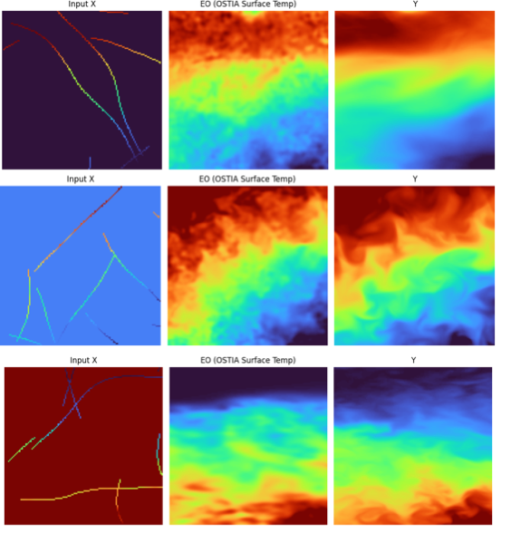

# Data Source
DepthDif now uses two raw upstream sources:
- Copernicus Marine monthly reanalysis for sub-surface temperatures (targets and sparse inputs)
- OSTIA L4 SST for sea-surface EO conditioning

Use this page for raw-source provenance and download details. See [Synthetic Dataset](data.md) for project-specific preprocessing and transformations.

## Product A: Sub-Surface Reanalysis (Copernicus)
- Provider: Copernicus Marine Service  
- Product family: Global Ocean Physics Reanalysis  
- Dataset used in this project: `global-reanalysis-001-030-monthly`  
- Source model: `MERCATOR GLORYS12V1`  
- Typical files: monthly NetCDF (`*.nc`)  

Reference dataset link:  
[Global Ocean Physics Reanalysis](https://data.marine.copernicus.eu/product/GLOBAL_MULTIYEAR_PHY_001_030/files?subdataset=cmems_mod_glo_phy_my_0.083deg_P1M-m_202311&path=GLOBAL_MULTIYEAR_PHY_001_030%2Fcmems_mod_glo_phy_my_0.083deg_P1M-m_202311%2F2024%2F)

## Download
Example CLI from this project:
`copernicusmarine get -i cmems_mod_glo_phy_my_0.083deg_P1M-m --filter "*YYYY/*"`

## Product B: Surface EO SST (OSTIA)
- Provider: Copernicus Marine Service / UKMO OSTIA stream  
- Dataset used in this project: `SST_GLO_SST_L4_NRT_OBSERVATIONS_010_001`  
- Files used here: monthly folders containing one selected file at `YYYYMM15120000`  
- Variable used for conditioning: `analysed_sst` (sea-surface temperature)

OSTIA dataset sample used in this project:

Temporal note for current OSTIA overlap workflow:
- previous depth workflow was monthly reanalysis composites
- EO now comes from OSTIA mid-month snapshots (15th day at 12:00 UTC), not monthly mean composites
- overlap dataset keeps only months where both sources are available

## Data Contents (`data/data_info.txt`, Reanalysis Sample)
The raw source file contains the following data variables (NetCDF variables):

| Variable | Dimensions | Description | Units |
|---|---|---|---|
| `bottomT` | `(time, latitude, longitude)` | Sea floor potential temperature | `degrees_C` |
| `mlotst` | `(time, latitude, longitude)` | Density ocean mixed layer thickness | `m` |
| `zos` | `(time, latitude, longitude)` | Sea surface height | `m` |
| `sithick` | `(time, latitude, longitude)` | Sea ice thickness | `m` |
| `siconc` | `(time, latitude, longitude)` | Ice concentration | `1` |
| `usi` | `(time, latitude, longitude)` | Sea ice eastward velocity | `m s-1` |
| `vsi` | `(time, latitude, longitude)` | Sea ice northward velocity | `m s-1` |
| `so` | `(time, depth, latitude, longitude)` | Salinity | `Practical Salinity Unit` |
| `thetao` | `(time, depth, latitude, longitude)` | Temperature | `degrees_C` |
| `uo` | `(time, depth, latitude, longitude)` | Eastward velocity | `m s-1` |
| `vo` | `(time, depth, latitude, longitude)` | Northward velocity | `m s-1` |

## Core Input Axes (Reanalysis Product)
- `time`: monthly timestamp (single monthly slice per file in the inspected sample)  
- `latitude`: from `-80` to `90`  
- `longitude`: from `-180` to `179.9167`  
- `depth`: 50 vertical levels  

## Depth Levels (Meters)
| Level | Depth (m) |
|---:|---:|
| 0 | 0.494 |
| 1 | 1.541 |
| 2 | 2.646 |
| 3 | 3.819 |
| 4 | 5.078 |
| 5 | 6.441 |
| 6 | 7.930 |
| 7 | 9.573 |
| 8 | 11.405 |
| 9 | 13.467 |
| 10 | 15.810 |
| 11 | 18.496 |
| 12 | 21.599 |
| 13 | 25.211 |
| 14 | 29.445 |
| 15 | 34.434 |
| 16 | 40.344 |
| 17 | 47.374 |
| 18 | 55.764 |
| 19 | 65.807 |
| 20 | 77.854 |
| 21 | 92.326 |
| 22 | 109.729 |
| 23 | 130.666 |
| 24 | 155.851 |
| 25 | 186.126 |
| 26 | 222.475 |
| 27 | 266.040 |
| 28 | 318.127 |
| 29 | 380.213 |
| 30 | 453.938 |
| 31 | 541.089 |
| 32 | 643.567 |
| 33 | 763.333 |
| 34 | 902.339 |
| 35 | 1062.440 |
| 36 | 1245.291 |
| 37 | 1452.251 |
| 38 | 1684.284 |
| 39 | 1941.893 |
| 40 | 2225.078 |
| 41 | 2533.336 |
| 42 | 2865.703 |
| 43 | 3220.820 |
| 44 | 3597.032 |
| 45 | 3992.484 |
| 46 | 4405.224 |
| 47 | 4833.291 |
| 48 | 5274.784 |
| 49 | 5727.917 |
