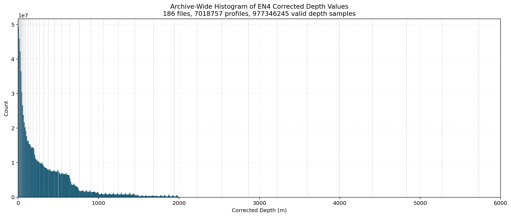

# Data Sources  
This page documents the raw upstream products used in the production workflow.  
  
Use [Depth Alignment](depth-alignment.md) for the vertical-grid problem, EN4/ARGO resampling strategy, and the saved alignment diagnostics. Use [Production Dataset](production-datasets.md) for the spatial and temporal sampling pipeline built on top of these sources.  
  
## Overview  
| Source | Role In Project | Native Sampling | Key Variables |  
|---|---|---|---|  
| GLORYS | fixed sub-surface reference grid and aligned target grid | global gridded reanalysis, fixed 50 depth levels | `thetao`, `depth` |  
| OSTIA | surface EO condition | daily 2D SST snapshots | `analysed_sst` |  
| EN4 / ARGO profiles | in-situ temperature observations and ground-truth source values | irregular profile depths per observation | `TEMP`, `DEPH_CORRECTED` |  
  
## Product A: GLORYS Reanalysis  
- Provider: Copernicus Marine Service  
- Product family: Global Ocean Physics Reanalysis  
- Source model used here: `MERCATOR GLORYS12V1`  
- Practical role in this project:  
  - provides one fixed, monotonic vertical grid  
  - defines the canonical depth axis used for aligned production targets  
  - can also provide gridded temperature values on that same grid  
  
Relevant helper scripts:  
- `data/get_glorys/download_glorys_monthly.sh`  
- `data/get_glorys/download_glorys_weekly.sh`  
  
Representative depth-grid characteristic:  
- 50 fixed depth levels from roughly `0.494 m` to `5727.917 m`  
- shallow spacing is dense and deeper spacing becomes progressively coarser  
  
GLORYS depth distribution:  
  
  
### GLORYS Depth Levels  
| Level | Depth (m) |  
|---:|---:|  
| 0 | 0.494 |  
| 1 | 1.541 |  
| 2 | 2.646 |  
| 3 | 3.819 |  
| 4 | 5.078 |  
| 5 | 6.441 |  
| 6 | 7.930 |  
| 7 | 9.573 |  
| 8 | 11.405 |  
| 9 | 13.467 |  
| 10 | 15.810 |  
| 11 | 18.496 |  
| 12 | 21.599 |  
| 13 | 25.211 |  
| 14 | 29.445 |  
| 15 | 34.434 |  
| 16 | 40.344 |  
| 17 | 47.374 |  
| 18 | 55.764 |  
| 19 | 65.807 |  
| 20 | 77.854 |  
| 21 | 92.326 |  
| 22 | 109.729 |  
| 23 | 130.666 |  
| 24 | 155.851 |  
| 25 | 186.126 |  
| 26 | 222.475 |  
| 27 | 266.040 |  
| 28 | 318.127 |  
| 29 | 380.213 |  
| 30 | 453.938 |  
| 31 | 541.089 |  
| 32 | 643.567 |  
| 33 | 763.333 |  
| 34 | 902.339 |  
| 35 | 1062.440 |  
| 36 | 1245.291 |  
| 37 | 1452.251 |  
| 38 | 1684.284 |  
| 39 | 1941.893 |  
| 40 | 2225.078 |  
| 41 | 2533.336 |  
| 42 | 2865.703 |  
| 43 | 3220.820 |  
| 44 | 3597.032 |  
| 45 | 3992.484 |  
| 46 | 4405.224 |  
| 47 | 4833.291 |  
| 48 | 5274.784 |  
| 49 | 5727.917 |  
  
## Product B: OSTIA Surface EO  
- Provider: Copernicus Marine Service / UKMO OSTIA stream  
- Dataset used here: `SST_GLO_SST_L4_REP_OBSERVATIONS_010_011`  
- Practical role in this project:  
  - provides the sea-surface EO condition  
  - stays purely 2D in depth terms  
  - is aligned to sub-surface targets only through spatial and temporal matching, not through a vertical transform  
  
Characteristics:  
- one daily SST snapshot at `12:00 UTC`  
- global 2D grid  
- main variable used here: `analysed_sst`  
  
OSTIA example tile:  
  
  
## Product C: EN4 / ARGO Profiles  
- Provider: UK Met Office Hadley Centre EN4  
- Dataset family: EN4.2.2 profile archives  
- Practical role in this project:  
  - source of ground-truth temperature observations  
  - samples the water column on profile-specific corrected depth coordinates rather than on one shared archive-wide vertical grid  
  - therefore requires an explicit projection onto a common target depth axis before channel-wise learning or pixel-aligned supervision is well-defined  
  
Relevant helper script:  
- `data/get_argo/download_en4_profiles.sh`  
  
Key raw variables:  
- `TEMP`: observed temperature profile values  
- `DEPH_CORRECTED`: corrected physical depth assigned to each observed sample  
  
Vertical sampling characteristics:  
- EN4 stores profiles in rectangular arrays, but the array slot index is only a storage coordinate and not a physically invariant depth coordinate across the archive  
- valid `DEPH_CORRECTED` entries vary profile-by-profile because the observing system samples at irregular depths and because quality control leaves a variable number of retained observations per profile  
- the effective support of the archive is strongly concentrated in the upper ocean, while the tail toward larger depths becomes progressively sparser  
- any model that consumes these observations as aligned channels therefore needs an external canonical depth axis; in this repository that role is assigned to the fixed GLORYS `depth` coordinate  
  
Archive-wide corrected-depth histogram with GLORYS reference levels:  
  
  
Interpretation of this diagnostic:  
- the histogram aggregates every finite `DEPH_CORRECTED` value from all EN4 files into fixed `10 m` bins, so it estimates the empirical marginal sampling density of corrected observation depths over the full archive  
- the vertical dotted lines mark the discrete GLORYS depth levels, which makes the mismatch between the continuous-irregular EN4 sampling distribution and the discrete GLORYS target grid directly visible  
- the pronounced concentration at shallow depths and the rapidly decaying count with increasing depth imply that any depth-aligned learning setup is inherently supported by many more observations near the surface than in the deep ocean  
- because the EN4 archive does not realize one common native vertical basis, nearest-level matching or interpolation onto GLORYS should be understood as a coordinate transformation from irregular observation space into a fixed target basis, not as a simple reinterpretation of pre-aligned native channels  

See [Depth Alignment](depth-alignment.md) for:  
- what `DEPH_CORRECTED` means in practice  
- why EN4 slot indices are not a stable physical depth axis  
- archive-wide corrected-depth visualizations  
- the recommended `ARGO -> GLORYS depth grid` resampling strategy  
- saved alignment artifacts and diagnostics  
  
## Raw Product Notes  
Representative raw reanalysis variables in GLORYS:  
| Variable | Dimensions | Description | Units |  
|---|---|---|---|  
| `bottomT` | `(time, latitude, longitude)` | Sea floor potential temperature | `degrees_C` |  
| `mlotst` | `(time, latitude, longitude)` | Mixed layer thickness | `m` |  
| `zos` | `(time, latitude, longitude)` | Sea surface height | `m` |  
| `so` | `(time, depth, latitude, longitude)` | Salinity | `Practical Salinity Unit` |  
| `thetao` | `(time, depth, latitude, longitude)` | Temperature | `degrees_C` |  
| `uo` | `(time, depth, latitude, longitude)` | Eastward velocity | `m s-1` |  
| `vo` | `(time, depth, latitude, longitude)` | Northward velocity | `m s-1` |  
