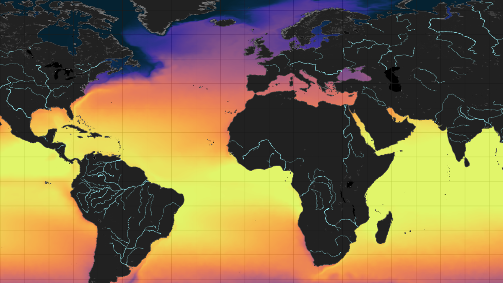
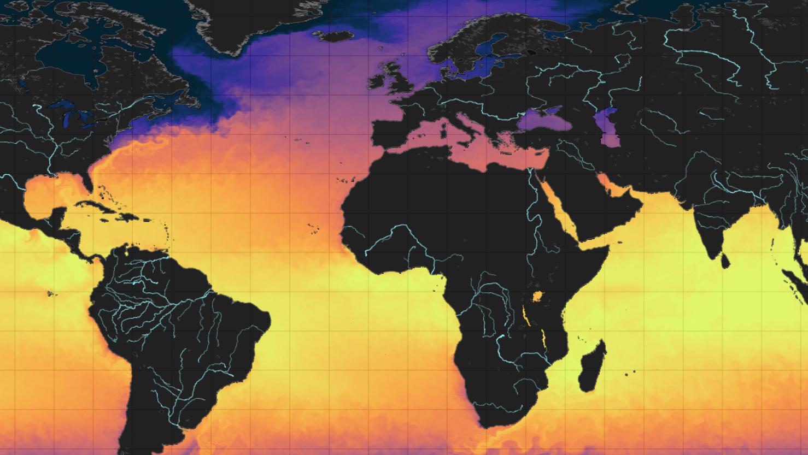
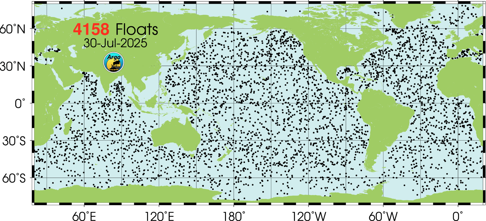

# Data Sources
This page documents the native properties of the upstream products used in the project.

Use [Depth Alignment](depth-alignment.md) for ARGO-to-GLORYS vertical resampling and [Production Dataset](production-datasets.md) for spatial and temporal dataset assembly.

## Overview
| Source | Role In Project | Native Sampling | Key Variables |
|---|---|---|---|
| GLORYS | 3D ocean reanalysis field | global gridded field, fixed 50 depth levels | `thetao`, `depth` |
| OSTIA | daily surface temperature field | daily global 2D grid | `analysed_sst` |
| EN4 / ARGO profiles | in-situ temperature observations | profile-specific corrected depths | `TEMP`, `DEPH_CORRECTED` |
| Sea Level L4 | daily surface height and currents | daily global 0.125 degree grid | sea-surface-height fields, geostrophic currents |

## Product A: GLORYS Reanalysis

GLORYS is a global ocean reanalysis product that provides physically consistent 3D temperature fields on a fixed depth grid.

- Provider: Copernicus Marine Service
- Product family: Global Ocean Physics Reanalysis
- Source model used here: `MERCATOR GLORYS12V1`
- Native variables used here: `thetao`, `depth`
- Vertical coordinate: 50 fixed depth levels from roughly `0.494 m` to `5727.917 m`

Relevant helper scripts:
- `data/dataset_creation/data_download_raw/get_glorys/download_glorys_monthly.sh`
- `data/dataset_creation/data_download_raw/get_glorys/download_glorys_weekly.sh`

GLORYS depth distribution:  

## Product B: OSTIA Surface EO

OSTIA is a satellite- and in-situ-derived ocean surface temperature product that provides daily global sea-surface temperature fields.

- Provider: Copernicus Marine Service / UKMO OSTIA stream
- Dataset used here: `SST_GLO_SST_L4_REP_OBSERVATIONS_010_011`
- Native variable used here: `analysed_sst`
- Temporal sampling: one daily SST snapshot at `12:00 UTC`
- Geometry: global 2D grid

OSTIA example tile:  

## Product C: EN4 / ARGO Profiles

EN4 / ARGO provides in-situ ocean temperature profiles with irregular corrected depth samples that capture sparse but physically grounded vertical structure.

- Provider: UK Met Office Hadley Centre EN4
- Dataset family: EN4.2.2 profile archives
- Raw variables used here: `TEMP`, `DEPH_CORRECTED`
- Profile storage: rectangular arrays with capacity for up to `400` profile samples
- Vertical sampling: corrected depths vary profile-by-profile and are irregular in physical depth

Relevant helper script:
- `data/dataset_creation/data_download_raw/get_argo/download_en4_profiles.sh`

Archive-wide corrected-depth histogram with GLORYS reference levels:  

- The histogram aggregates finite `DEPH_CORRECTED` values over the scanned EN4 archive.
- Sampling density is concentrated in the upper ocean and decreases with depth.
- The dotted GLORYS depth markers show the discrete reference levels used elsewhere in the project.

Example ARGO profile in 3D:  
  
Important: `z` shows the netCDF dimension (400), not actual depth. 

## Product D: Global Ocean L4 Sea Level

The Copernicus reprocessed global sea-level product provides daily gridded sea-surface-height fields and derived geostrophic currents.

- Provider: Copernicus Marine Service
- Product ID: `SEALEVEL_GLO_PHY_L4_MY_008_047`
- Dataset ID used here: `cmems_obs-sl_glo_phy-ssh_my_allsat-l4-duacs-0.125deg_P1D`
- Native resolution: `0.125° x 0.125°`
- Temporal resolution: daily
- Format: NetCDF-4
- Native variables include sea-surface-height fields and geostrophic currents.

Relevant helper script:
- `data/dataset_creation/data_download_raw/get_sealevel/download_sealevel_daily.sh`

## Raw Product Notes
Representative raw GLORYS variables:  
| Variable | Dimensions | Description | Units |
|---|---|---|---|
| `bottomT` | `(time, latitude, longitude)` | Sea floor potential temperature | `degrees_C` |
| `mlotst` | `(time, latitude, longitude)` | Mixed layer thickness | `m` |
| `zos` | `(time, latitude, longitude)` | Sea surface height | `m` |
| `so` | `(time, depth, latitude, longitude)` | Salinity | `Practical Salinity Unit` |
| `thetao` | `(time, depth, latitude, longitude)` | Temperature | `degrees_C` |
| `uo` | `(time, depth, latitude, longitude)` | Eastward velocity | `m s-1` |
| `vo` | `(time, depth, latitude, longitude)` | Northward velocity | `m s-1` |
