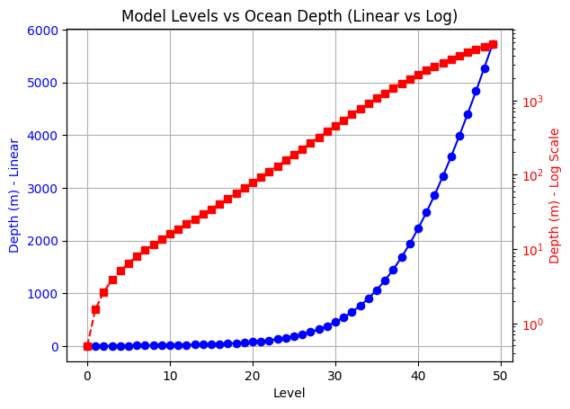
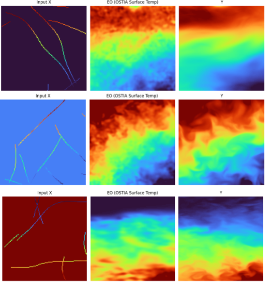
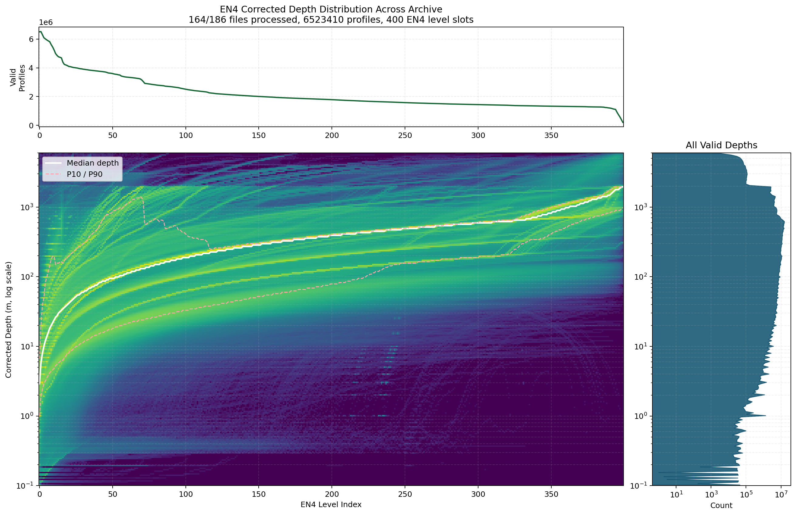
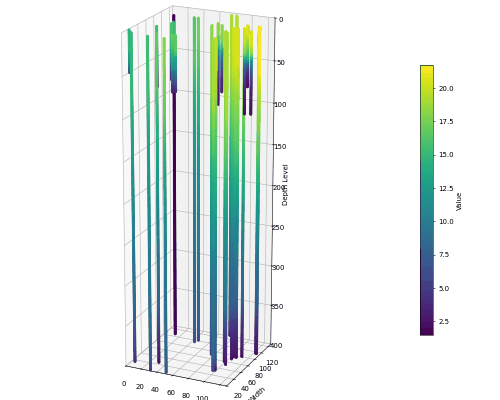
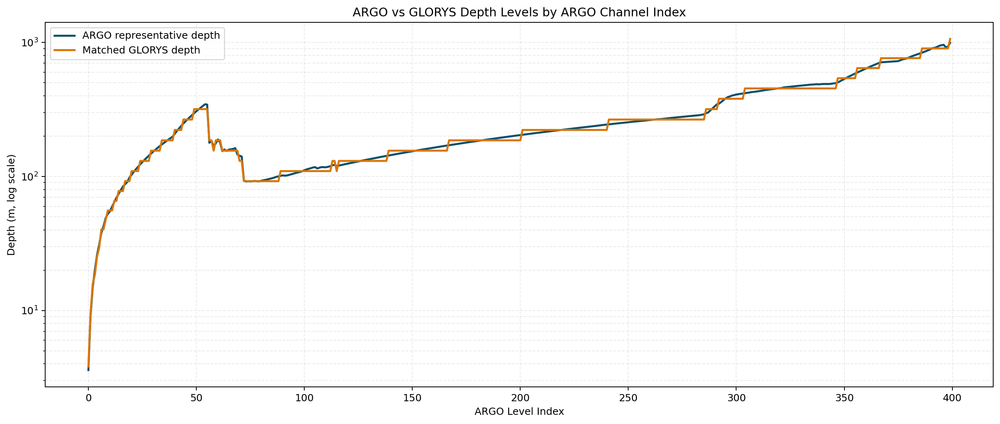
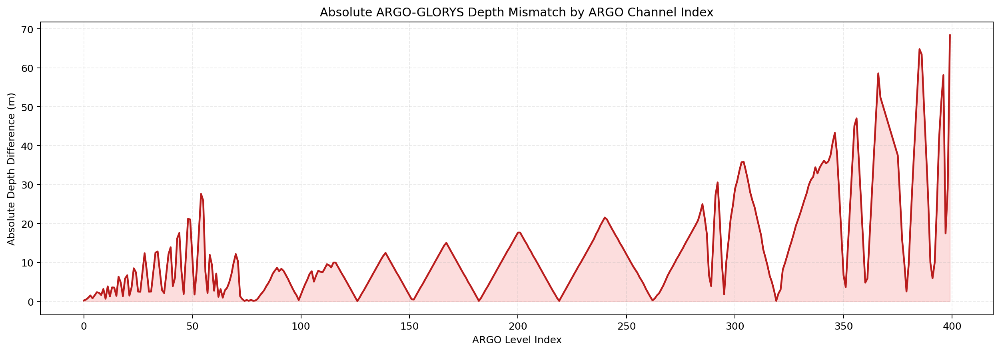
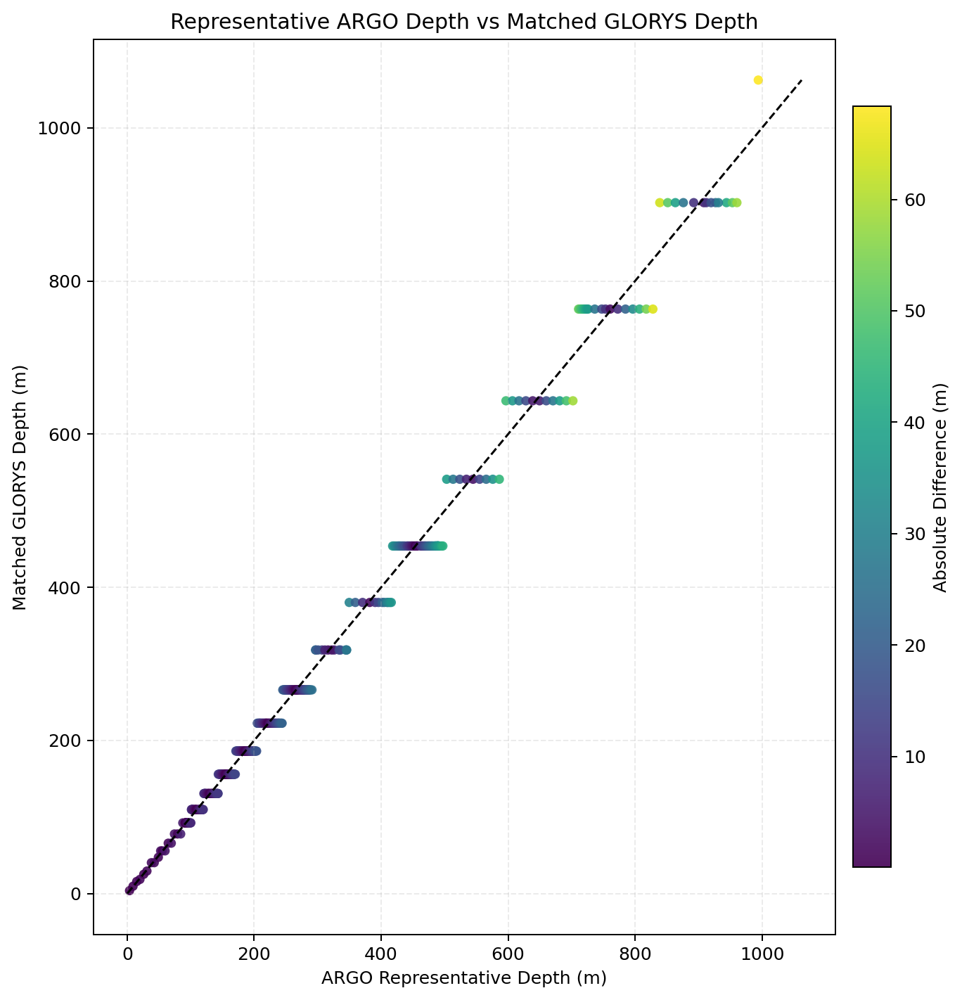
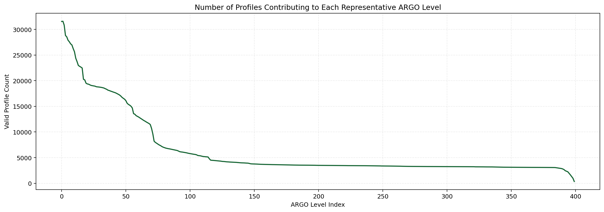

# Data Sources And Alignment
This page documents the raw upstream products used in the production workflow and, more importantly, how they relate to each other physically.

The key distinction is:
- GLORYS already lives on one fixed vertical grid
- OSTIA is a daily surface-only product
- EN4/ARGO profiles are irregular in depth and therefore must be resampled to a shared target grid before they can be treated as consistent model channels

Use [Production Dataset](production-datasets.md) for the spatial and temporal sampling pipeline. Use [Synthetic Dataset](data.md) for the synthetic training/export setup built on top of these sources.

## Overview
| Source | Role In Project | Native Sampling | Key Variables |
|---|---|---|---|
| GLORYS | Fixed sub-surface reference grid and aligned production target grid | global gridded reanalysis, fixed 50 depth levels | `thetao`, `depth` |
| OSTIA | Surface EO condition | daily 2D SST snapshots | `analysed_sst` |
| EN4 / ARGO profiles | In-situ temperature observations and ground-truth source values | irregular profile depths per observation | `TEMP`, `DEPH_CORRECTED` |

## Product A: GLORYS Reanalysis
- Provider: Copernicus Marine Service
- Product family: Global Ocean Physics Reanalysis
- Source model used here: `MERCATOR GLORYS12V1`
- Practical role in this project:
  - provides one fixed, monotonic vertical grid
  - gives the canonical depth axis used for ARGO resampling in the production workflow
  - can also provide aligned gridded temperature values on that same grid

Relevant helper scripts:
- `data/get_glorys/download_glorys_monthly.sh`
- `data/get_glorys/download_glorys_weekly.sh`

Representative depth-grid characteristic:
- 50 fixed depth levels from roughly `0.494 m` to `5727.917 m`
- shallow spacing is dense and deeper spacing becomes progressively coarser

GLORYS depth distribution:

### GLORYS Depth Levels
| Level | Depth (m) |
|---:|---:|
| 0 | 0.494 |
| 1 | 1.541 |
| 2 | 2.646 |
| 3 | 3.819 |
| 4 | 5.078 |
| 5 | 6.441 |
| 6 | 7.930 |
| 7 | 9.573 |
| 8 | 11.405 |
| 9 | 13.467 |
| 10 | 15.810 |
| 11 | 18.496 |
| 12 | 21.599 |
| 13 | 25.211 |
| 14 | 29.445 |
| 15 | 34.434 |
| 16 | 40.344 |
| 17 | 47.374 |
| 18 | 55.764 |
| 19 | 65.807 |
| 20 | 77.854 |
| 21 | 92.326 |
| 22 | 109.729 |
| 23 | 130.666 |
| 24 | 155.851 |
| 25 | 186.126 |
| 26 | 222.475 |
| 27 | 266.040 |
| 28 | 318.127 |
| 29 | 380.213 |
| 30 | 453.938 |
| 31 | 541.089 |
| 32 | 643.567 |
| 33 | 763.333 |
| 34 | 902.339 |
| 35 | 1062.440 |
| 36 | 1245.291 |
| 37 | 1452.251 |
| 38 | 1684.284 |
| 39 | 1941.893 |
| 40 | 2225.078 |
| 41 | 2533.336 |
| 42 | 2865.703 |
| 43 | 3220.820 |
| 44 | 3597.032 |
| 45 | 3992.484 |
| 46 | 4405.224 |
| 47 | 4833.291 |
| 48 | 5274.784 |
| 49 | 5727.917 |

## Product B: OSTIA Surface EO
- Provider: Copernicus Marine Service / UKMO OSTIA stream
- Dataset used here: `SST_GLO_SST_L4_REP_OBSERVATIONS_010_011`
- Practical role in this project:
  - provides the sea-surface EO condition
  - stays purely 2D in depth terms
  - is aligned to sub-surface targets only through spatial and temporal matching, not through a vertical transform

Characteristics:
- one daily SST snapshot at `12:00 UTC`
- global 2D grid
- main variable used here: `analysed_sst`

OSTIA example tile:

## Product C: EN4 / ARGO Profile Observations
- Provider: UK Met Office Hadley Centre EN4
- Dataset family: EN4.2.2 profile archives
- Practical role in this project:
  - source of ground-truth temperature observations
  - physically irregular in depth
  - must be interpolated to a shared target grid before channels are comparable across profiles

Relevant helper script:
- `data/get_argo/download_en4_profiles.sh`

### What `DEPH_CORRECTED` Means
`DEPH_CORRECTED` is the corrected physical depth assigned to each observed sample after EN4 processing. It should be read as:
- the depth of that specific observation
- not a universal ARGO depth grid
- not a guarantee that slot `k` means the same physical depth in every profile

### Why The EN4 Grid Is Tricky
EN4 stores profile arrays in rectangular form:
- shape like `(N_PROF, 400)`
- `400` is storage capacity, not a common physical 400-level ocean grid
- each individual profile only fills the slots it actually observed
- different profiles can therefore have:
  - different valid depth counts
  - different exact depth values
  - slightly different local monotonic behavior after QC and correction

This is why raw EN4 slot indices should not be used directly as production depth channels.

Archive-wide corrected-depth distribution:

How to read this figure:
- top panel: how many valid profile values contribute to each EN4 slot index across the scanned archive
- lower-left heatmap: where corrected depths concentrate for each EN4 slot index; brighter regions mean more observations
- white line: approximate median corrected depth per EN4 slot
- dashed lines: approximate `p10` and `p90` depth envelopes per slot
- right panel: overall depth histogram across all valid corrected-depth samples

Interpretation:
- if EN4 slot index were a universal physical depth grid, the median curve would rise smoothly and monotonically
- the visible local dips and broad spread show that EN4 slot index is only a storage coordinate and that the realized physical depth varies across profiles
- this is the main reason ARGO must be interpolated onto a shared target depth grid instead of treating raw slot indices as stable channels

Example 3D ARGO profile visualization:

How to read this figure:
- each occupied voxel corresponds to one observed ARGO value in a rasterized profile tensor
- the vertical axis is depth level, with sparse occupied cells showing that observations do not fill a dense regular 3D volume

Interpretation:
- this gives an intuitive view of why ARGO behaves like sparse, irregular profile observations rather than a complete dense depth cube
- it is a qualitative illustration of the sampling structure, not a canonical depth-grid definition

## Recommended Handling Strategy
If ARGO is the ground truth, the clean production choice is:
1. Treat the fixed GLORYS `depth` axis as the common target grid.
2. For each EN4 / ARGO profile independently:
   - extract valid `(DEPH_CORRECTED, TEMP)` pairs
   - sort by depth
   - interpolate temperature onto the GLORYS depth levels
3. Mask target depths outside the supported ARGO range instead of extrapolating fake values.

This preserves the scientific meaning:
- ARGO still provides the ground-truth values
- GLORYS only provides the common depth coordinates
- every aligned profile then has one stable channel layout

### Why Not Use Raw EN4 Slot Indices As Channels
Because EN4 slot index is a storage coordinate, not a physical vertical coordinate:
- aggregating by slot index across all profiles mixes different realized depths
- representative curves by slot index can show local dips or other non-monotonic artifacts
- those artifacts are properties of the archive-wide aggregation, not a valid universal ocean depth grid

### Why GLORYS Is The Practical Canonical Grid
- fixed and monotonic across files
- already physically meaningful
- avoids inventing a second custom ARGO-derived grid
- lets both sources live on the same depth channels after interpolation

## Saved Alignment Artifacts
The following artifacts summarize how the raw EN4 archive relates to the GLORYS grid:
- `data/glorys_argo_alignment/argo_to_glorys_channel_mapping.json`
- `data/glorys_argo_alignment/glorys_argo_alignment_report.txt`
- `data/glorys_argo_alignment/argo_glorys_depth_alignment.csv`
- `data/glorys_argo_alignment/argo_depth_level_summary.csv`
- `data/glorys_argo_alignment/glorys_depth_coverage_summary.csv`
- `data/glorys_argo_alignment/argo_corrected_depth_distribution.png`

Useful diagnostics:

How to read these diagnostics:
- `argo_glorys_depth_vs_index.png`:
  - compares the representative ARGO depth assigned to each EN4 slot against the nearest matched GLORYS depth
  - use it to see where the two vertical layouts broadly track each other and where the approximation becomes coarse
- `argo_glorys_absolute_difference.png`:
  - shows the absolute depth mismatch between representative ARGO depth and matched GLORYS depth for every EN4 slot
  - low values indicate good local alignment; peaks indicate ranges where nearest-neighbor channel matching is physically rough
- `argo_glorys_depth_scatter.png`:
  - parity-style comparison between representative ARGO depths and matched GLORYS depths
  - points near the diagonal mean close agreement; visible offsets from the diagonal indicate systematic mismatch at those depths
- `argo_level_valid_profile_count.png`:
  - shows how many profiles contributed to the representative depth estimate for each EN4 slot
  - high counts mean the representative depth is supported by many profiles; low counts indicate that the estimate is based on rarer deep observations and should be interpreted more cautiously

Helper scripts:
- `data/EDA_glorys_argo_alignment.py`
- `data/plot_argo_corrected_depth_distribution.py`

## Source Product Notes
Representative raw reanalysis variables in GLORYS:
| Variable | Dimensions | Description | Units |
|---|---|---|---|
| `bottomT` | `(time, latitude, longitude)` | Sea floor potential temperature | `degrees_C` |
| `mlotst` | `(time, latitude, longitude)` | Mixed layer thickness | `m` |
| `zos` | `(time, latitude, longitude)` | Sea surface height | `m` |
| `so` | `(time, depth, latitude, longitude)` | Salinity | `Practical Salinity Unit` |
| `thetao` | `(time, depth, latitude, longitude)` | Temperature | `degrees_C` |
| `uo` | `(time, depth, latitude, longitude)` | Eastward velocity | `m s-1` |
| `vo` | `(time, depth, latitude, longitude)` | Northward velocity | `m s-1` |
