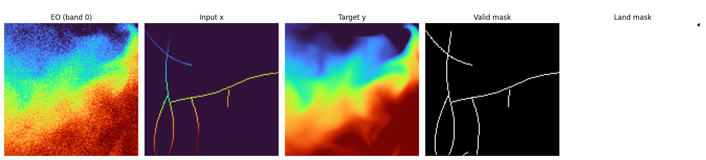

# Synthetic Dataset
This page documents the synthetic datasets used by DepthDif after preprocessing raw ocean products.
Current training data combines two different upstream sources:
- sub-surface targets (`y`) and sparse sub-surface inputs (`x`) from Copernicus reanalysis (`thetao`)
- sea-surface EO condition (`eo`) from OSTIA (`analysed_sst`)

Dataset example for 50% occlusion:  

## On-Disk Export Format (Sub-Surface Reanalysis)
The data export script is `data/dataset_to_disk.py`.

Core behavior:
- reads `*.nc` files from `dataset.source.root_dir`  
- extracts any configured number of depth levels (`bands`) from any selected 3D variable (`variable`, default `thetao`)  
- writes each patch to `y_npy/<sample_id>.npy`  
- writes an index CSV with paths and metadata (`patch_index_with_paths.csv`)  
- can enforce nodata filtering via `max_nodata_fraction`  
- includes geographic bounds per patch (`lat0`, `lat1`, `lon0`, `lon1`) in the CSV  
- supports writing a geo-location-based `train`/`val` split CSV via `data/assign_window_split.py` (window-level split)  

For legacy `eo_4band` (same-source surface + depth), the on-disk 4-band layout is:  
- channel 0: EO/surface condition  
- channels 1..3: deeper temperature target bands  

## OSTIA EO Overlap Dataset
OSTIA EO tiles are generated with `data/get_ostia/overlap_ostia_depth.py`.

Core behavior:
- reads the depth index CSV (for example `patch_index_with_paths_split.csv`)
- keeps only months where both depth and OSTIA files are available
- extracts OSTIA SST tiles over the same exact geographic tile bounds (`lat0/lat1/lon0/lon1`)
- writes EO tiles to `ostia_npy/<sample_id>.npy`
- writes a merged index CSV that preserves original depth columns and adds OSTIA linkage columns:
  - `ostia_month_key`
  - `ostia_nc_path`
  - `ostia_timestamp_utc`
  - `ostia_npy_path`

Source provenance and task meaning:
- `x` and `y` remain reanalysis sub-surface temperatures (deeper levels)
- `eo` is now OSTIA sea-surface temperature from a different source/product
- this setup is explicitly a cross-source conditioning task:  
  `surface SST (OSTIA) + sparse deeper reanalysis (x) -> dense deeper reanalysis (y)`

Temporal resolution/alignment note:
- historical depth files are monthly (`YYYYMM`)
- OSTIA overlap uses one mid-month product timestamp (`YYYYMM15 12:00:00 UTC`) per month
- compared to prior monthly composite-only workflow, EO is now a fixed 15th-day snapshot for each overlapping month

## Implemented Dataset
Current configs support `eo_4band` and `ostia`.
- `configs/data.yaml`: legacy same-source `eo_4band`
- `configs/data_ostia.yaml`: OSTIA-conditioned `ostia`

### `eo_4band` (EO-conditioned multiband)
`SurfaceTempPatch4BandsLightDataset` (`data/dataset_4bands.py`) returns:  
- `eo`: channel 0 condition  
- `x`: corrupted deeper channels (channels 1..3)  
- `y`: clean deeper channels (channels 1..3)  
- `valid_mask`: per-channel validity mask for `y`  
- `land_mask`: per-channel land/ocean mask  
- `date`: parsed integer date (`YYYYMMDD`)  
- optional: `coords`, `info`  

### `ostia` (OSTIA-conditioned multiband)
`SurfaceTempPatchOstiaLightDataset` (`data/dataset_ostia.py`) keeps the same output contract as `eo_4band`, but loads `eo` from `ostia_npy_path` in the overlap CSV produced by `data/get_ostia/overlap_ostia_depth.py`.

Important behavior:
- depth channels still come from `y_npy_path` (`[0]=legacy surface, [1:4]=deeper targets`)
- model targets remain the deeper three channels (`1..3`)
- OSTIA EO is loaded as condition and interpolated to the exact spatial resolution of `x`/`y` per sample
- EO normalization and geometric transforms follow the same pipeline; EO degradation is disabled for OSTIA (`no dropout`, `no random scale`, `no speckle`)

EO + multiband example:  

## Synthetic Transformations
## Masking, Validity, and Augmentation
### Normalization and units
Temperature tensors are loaded in degrees Celsius and normalized through `utils.normalizations.temperature_normalize`:  
- `norm`: convert Celsius to Kelvin (`T_K = T_C + 273.15`), then apply Z-score with dataset stats (`Y_MEAN=289.74267177946783`, `Y_STD=10.933397487585731`)  
- `denorm`: invert Z-score in Kelvin space, then convert back to Celsius  
- plotting ranges (`PLOT_TEMP_MIN`, `PLOT_TEMP_MAX`) remain defined in Celsius space  

### Corruption pipeline
The dataset creates sparse `x` using stochastic trajectory-style corruption:  
- this simulates a submarine moving through the patch and sampling along its path  
- target hidden coverage is controlled by `mask_fraction`  
- each track is built in flattened 1D index space and rasterized back to 2D  
- each line starts from a random location and is extended as a continuous curved streak  
- when a line reaches the edge, a new line starts from another random location  
- new streaks are added in a loop until the configured corruption percentage is reached  
- implementation target: observed-line budget reaches `(1 - mask_fraction)` of pixels, then hidden area is the complement  
- the final hidden region is the complement of those observed lines  
- in `eo_4band` and `ostia`, one shared spatial track mask is applied across all depth bands  
- legacy rectangular masking remains available via `mask_strategy="rectangles"`  

Continuous submarine-like streak example (`mask_strategy="tracks"`):  

### Validity and land masks
- masks are derived from finite-value checks and configured fill-value logic  
- `valid_mask` is used for both conditioning and masked-loss options in the model  
- `land_mask` is used to suppress land influence in masked loss and optional output post-processing  
- masked loss is computed over generated pixels (`1 - valid_mask`), optionally ocean-gated by `land_mask`  

### EO degradation options (`eo_4band` vs `ostia`)
If enabled in config:  
- `eo_random_scale_enabled`: currently implemented as an additive random EO offset in `[-2.0, 2.0]` temperature units  
- `eo_speckle_noise_enabled`: multiplicative speckle (`1 + 0.01 * eps`) clamped to `[0.9, 1.1]`  
- `eo_dropout_prob`: random EO dropout by setting `eo` to zeros per sample  

For `ostia`, EO degradation is intentionally disabled in `SurfaceTempPatchOstiaLightDataset` to preserve observed OSTIA surface structure.

### Geometric augmentation
When `enable_transform=true`, random 90° rotations/flips are applied consistently to:
- data tensors  
- validity masks  
- land masks  

## Coordinates and Date
When `return_coords=true`, dataset returns patch-center coordinates:  
- latitude center: arithmetic mean of `lat0` and `lat1`  
- longitude center: dateline-safe circular midpoint from `lon0` and `lon1`  

Date parsing behavior:  
- `YYYYMMDD` suffix in `source_file` -> used directly  
- `YYYYMM` suffix -> converted to mid-month (`YYYYMM15`)  
- invalid/missing -> fallback `19700115`  

For `ostia` overlap CSVs, `source_file` still points to depth reanalysis files.  
So date conditioning remains month-based and is represented as mid-month (`YYYYMM15`), while `ostia_timestamp_utc` retains the explicit OSTIA timestamp (`YYYYMM15120000`).

## Split Behavior in Current Training Runner
This is an important implementation detail from `train.py` + `data/datamodule.py`:  

- `train.py` currently builds dataset with `split="all"`  
- then `DepthTileDataModule` creates a seeded random split using `split.val_fraction`  
- this means precomputed index `split` labels are not automatically enforced by the current runner  

If you need strict geographic window splits from index labels, use a custom train/val dataset wiring path (or adapt the runner).

Helper for writing deterministic geo-location window-level splits:  
- `data/assign_window_split.py`  

See [Data Source](data-source.md) for provenance and download instructions.
