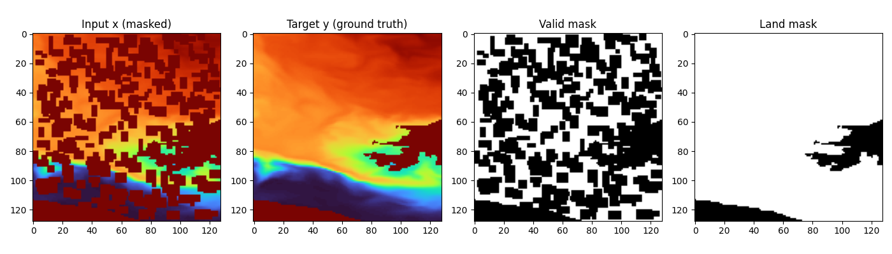
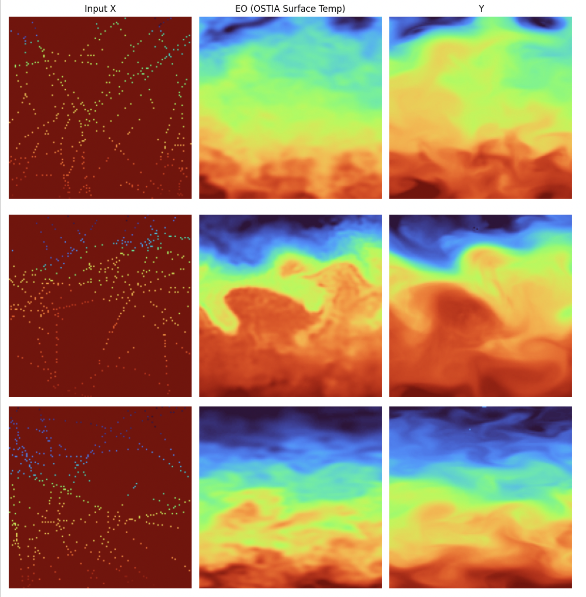
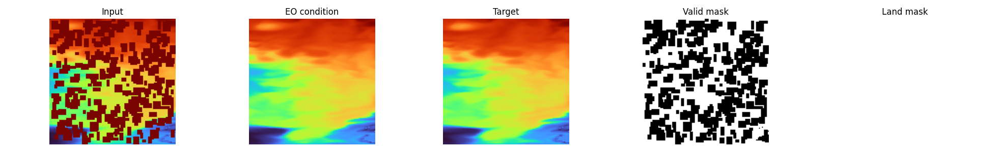
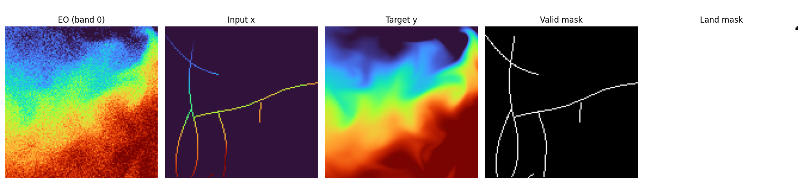

# Synthetic Dataset  
This page documents the synthetic datasets used by DepthDif after preprocessing raw ocean products.  
Current training data combines two different upstream sources:  
- sub-surface targets (`y`) and sparse sub-surface inputs (`x`) from Copernicus reanalysis (`thetao`)  
- sea-surface EO condition (`eo`) from OSTIA (`analysed_sst`)  
  
Dataset example for 50% occlusion:  
  
  
## On-Disk Export Format (Sub-Surface Reanalysis)  
The data export script is `data/dataset_to_disk.py`.  
  
Core behavior:  
- reads `*.nc` files from the `to_disk(..., root_dir=...)` input path  
- extracts any configured number of depth levels (`bands`) from any selected 3D variable (`variable`, default `thetao`)  
- writes each patch to `y_npy/<sample_id>.npy`  
- writes an index CSV with paths and metadata (`patch_index_with_paths.csv`)  
- can enforce nodata filtering via `max_nodata_fraction`  
- includes geographic bounds per patch (`lat0`, `lat1`, `lon0`, `lon1`) in the CSV  
- supports writing a geo-location-based `train`/`val` split CSV via `data/assign_window_split.py` (window-level split)  
  
For legacy `eo_4band` (same-source surface + depth), the on-disk 4-band layout is:  
- channel 0: EO/surface condition  
- channels 1..3: deeper temperature target bands  
  
## OSTIA EO Overlap Dataset  
OSTIA EO tiles are generated with `data/get_ostia/overlap_ostia_depth.py`.  
  
Core behavior:  
- reads the depth index CSV (for example `patch_index_with_paths_split.csv`)  
- keeps only months where both depth and OSTIA files are available  
- extracts OSTIA SST tiles over the same exact geographic tile bounds (`lat0/lat1/lon0/lon1`)  
- writes EO tiles to `ostia_npy/<sample_id>.npy`  
- writes a merged index CSV that preserves original depth columns and adds OSTIA linkage columns:  
  - `ostia_month_key`  
  - `ostia_nc_path`  
  - `ostia_timestamp_utc`  
  - `ostia_npy_path`  
  
Source provenance and task meaning:  
- `x` and `y` remain reanalysis sub-surface temperatures (deeper levels)  
- `eo` is now OSTIA sea-surface temperature from a different source/product  
- this setup is explicitly a cross-source conditioning task:  
  `surface SST (OSTIA) + sparse deeper reanalysis (x) -> dense deeper reanalysis (y)`  
  
Temporal resolution/alignment note:  
- historical depth files are monthly (`YYYYMM`)  
- OSTIA overlap uses one mid-month product timestamp (`YYYYMM15 12:00:00 UTC`) per month  
- compared to prior monthly composite-only workflow, EO is now a fixed 15th-day snapshot for each overlapping month  
  
Visual reference of the OSTIA-conditioned dataset:  
  
  
## OSTIA Patch-Time Index CSV (Spatial x Daily)  
For raw OSTIA-only indexing (before adding profile sources), use  
`data/get_ostia/build_ostia_patch_time_index.py`.  
  
This script:  
- builds a fixed spatial patch grid from OSTIA coverage (`tile_size`, `resolution_deg`)  
- computes per-patch invalid ratio from a reference OSTIA day  
- labels patches as `invalid` if invalid ratio exceeds threshold  
- splits remaining water patches into `train`/`val` with deterministic seed  
- expands to daily rows using all OSTIA files (`rows = patches x timesteps`)  
  
Default outputs in `depth_v2`:  
- `/data1/datasets/depth_v2/ostia_patch_index_spatial.csv`  
- `/data1/datasets/depth_v2/ostia_patch_index_daily.csv`  
  
## Implemented Dataset  
Current active pixel-space config supports `ostia_argo_disk`.  
- `configs/px_space/data_ostia_argo_disk.yaml`: exported GeoTIFF manifest-backed `ostia_argo_disk`  
- `configs/lat_space/data_config.yaml`: latent-workflow data preset (currently `eo_4band` default)  
For latent training flow, see [Autoencoder + Latent Diffusion](autoencoder.md).  
  
### `eo_4band` (EO-conditioned multiband)  
`SurfaceTempPatch4BandsLightDataset` (`data/dataset_4bands.py`) returns:  
- `eo`: channel 0 condition  
- `x`: corrupted deeper channels (channels 1..3)  
- `y`: clean deeper channels (channels 1..3)  
- `x_valid_mask`: per-channel validity mask for the corrupted `x` input  
- `y_valid_mask`: per-channel validity mask for the clean `y` target  
- `land_mask`: horizontal land/ocean mask  
- `date`: parsed integer date (`YYYYMMDD`)  
- optional: `coords`, `info`  
  
Band selection for targets is configurable through:  
- `dataset.output.target_band_start` (inclusive)  
- `dataset.output.target_band_end` (exclusive)  
  
### `ostia` (OSTIA-conditioned multiband)  
`SurfaceTempPatchOstiaLightDataset` (`data/dataset_ostia.py`) keeps the same output contract as `eo_4band`, but loads `eo` from `ostia_npy_path` in the overlap CSV produced by `data/get_ostia/overlap_ostia_depth.py`.  
  
Important behavior:  
- depth channels still come from `y_npy_path` (`[0]=legacy surface, [1:4]=deeper targets`)  
- model targets remain the deeper three channels (`1..3`)  
- OSTIA EO is loaded as condition and interpolated to the exact spatial resolution of `x`/`y` per sample  
- EO normalization and geometric transforms follow the same pipeline; EO degradation is disabled for OSTIA (`no dropout`, `no random scale`, `no speckle`)  
  
Cross-source structure notes (OSTIA surface vs reanalysis depth):  
- OSTIA sea surface appears visibly more turbulent and less smooth than the reanalysis-derived surface channel used in legacy `eo_4band`.  
- Large-scale spatial structures and fronts are often similar between sources, but agreement is not exact and varies by region/time.  
- Divergence between OSTIA surface patterns and deeper reanalysis targets generally increases with depth, so correspondence weakens for deeper levels.  
  
EO + multiband example:  
  
  
### Raw OSTIA + Argo Profiles (standalone)  
`OstiaArgoTileDataset` (`data/dataset_ostia_argo.py`) is independent from the synthetic `eo_4band/ostia` datasets and reads raw-source files directly:  
- rows come from the merged daily CSV (`patch_id/date/lat0/lat1/lon0/lon1/phase/ostia_file_path` plus Argo linkage columns)  
- OSTIA daily NetCDF files are resolved per row via `ostia_file_path` (or `matched_ostia_file_path`), with index paths typically stored as `depth_v2/...` and optional constructor `root_path` support for relocated datasets  
- nearest weekly GLORYS files are resolved per row via `matched_glorys_file_path` and loaded from variable `thetao` on the same geographic bbox  
- constructor supports `days` as total temporal window length centered on row date (`days=1` keeps single-day behavior); even values auto-adjust to odd  
  
Per `__getitem__` behavior:  
- filters `train`/`val`/`all` from CSV split labels (`phase` or `split`)  
- pre-filters CSV rows at dataset initialization to keep only valid Argo-linked entries (`argo_file_path`, valid `date`, positive Argo flags/counts, and at least one JULD-matching profile)  
- selects temporal rows at runtime from in-memory dataframe by `(same patch, date window)`  
- rebuilds the patch sampling grid from `lat0/lat1/lon0/lon1`  
- loads each available OSTIA day in the window, interpolates to the patch grid, then averages per pixel over finite values only  
- loads each available nearest-weekly GLORYS file in the window, interpolates the full `thetao(depth, lat, lon)` cube onto the same patch grid, then averages per voxel over finite values only  
- opens the row-linked EN4 monthly file from `argo_file_path` for each available day in the window  
- converts `JULD` to `YYYYMMDD`, selects profiles matching each day, independently resamples each profile onto the fixed 50-level GLORYS depth axis, rasterizes to `(50, tile_size, tile_size)`, then temporally averages using per-pixel observation counts so overlapping Argo observations are properly averaged without treating real `0°C` values as missing  
- returns `x` with shape `(50, 128, 128)` (or `(50, tile_size, tile_size)` for other tile sizes), aligned to the full GLORYS depth grid  
- returns `x_valid_mask` with the same shape as `x`, where invalid channels are rejected because they are out of Argo depth range or fail the nearest-depth cutoff  
- returns `y_valid_mask` with the same shape as `y`, marking per-depth GLORYS support after temporal averaging  
- returns `x_valid_mask_1d` with shape `(1, tile_size, tile_size)`, marking spatial columns where Argo contributes at least one valid depth level  
- returns GLORYS-driven `land_mask` with shape `(1, tile_size, tile_size)`, built from the shallowest GLORYS level so land/ocean support stays purely horizontal  
- returns: `x`, `y`, `eo`, `x_valid_mask`, `y_valid_mask`, `x_valid_mask_1d`, `land_mask`, `info`  
  
Disk export helper:  
- `save_to_disk(idx, output_root="/work/data/depth_v3")` writes one OSTIA GeoTIFF to `ostia/<basename>.tif` and one Argo GeoTIFF to `argo/<basename>.tif` with the same basename for later pairing  
- default Argo export keeps only the top three layers via `argo_depth_indices=(0, 1, 2)` and writes missing Argo pixels as `NaN`  
- GeoTIFFs are written in `EPSG:4326` with bbox-derived geotransform and a north-up row order  
- each successful export appends one row to `ostia_argo_tiff_index.csv` with centroid, filenames, output paths, source paths, and temporal-window metadata  
- `data/export_ostia_argo_tiffs.py` runs the same export in parallel through a `DataLoader`, shuffles export order by default in contiguous blocks (`--shuffle`, optional `--shuffle-seed`, `--shuffle-block-size`, default `100`) so partial output spans the timeseries better without fully randomizing file access, writes TIFFs in worker processes, and writes the manifest periodically from the main process (`--flush-every`, default `100`) plus once at the end  
- `OstiaArgoTiffDataset` (`data/dataset_ostia_argo_disk.py`) reads that manifest CSV back from disk, repairs up to two consecutive full corrupted outer border rows/columns in returned OSTIA/GLORYS tiles, normalizes `eo`/`x`/`y` with `utils.normalizations.temperature_normalize`, returns `x_valid_mask`, `y_valid_mask`, `x_valid_mask_1d`, and keeps `land_mask` as a horizontal single-band mask  
- optional synthetic mode (`dataset.synthetic.enabled=true`) ignores exported Argo `x`, samples sparse horizontal pixels from the GLORYS target, rebuilds `x` and `x_valid_mask` directly from `y` and `y_valid_mask`, and copies only valid depth support into the synthetic sparse input; the sampled count is Gaussian around `dataset.synthetic.pixel_count` and clamped to `+-10%`  
  
Current scope note:  
- profile extraction remains date-based within the monthly EN4 file, while vertical alignment is now performed against the GLORYS depth axis before the profile samples are tiled into the patch grid  
  
## Synthetic Transformations  
## Masking, Validity, and Augmentation  
### Normalization and units  
Temperature tensors are loaded in degrees Celsius and normalized through `utils.normalizations.temperature_normalize`:  
- `norm`: convert Celsius to Kelvin (`T_K = T_C + 273.15`), then apply Z-score with dataset stats (`Y_MEAN=289.74267177946783`, `Y_STD=10.933397487585731`)  
- `denorm`: invert Z-score in Kelvin space, then convert back to Celsius  
- plotting ranges (`PLOT_TEMP_MIN`, `PLOT_TEMP_MAX`) remain defined in Celsius space  
  
### Corruption pipeline  
The dataset creates sparse `x` using stochastic trajectory-style corruption:  
- this simulates a submarine moving through the patch and sampling along its path  
- target hidden coverage is controlled by `mask_fraction`  
- each track is built in flattened 1D index space and rasterized back to 2D  
- each line starts from a random location and is extended as a continuous curved streak  
- in the current dataset version, observations along each track are sparsified to one point every few pixels (random 2-8 pixel stride)  
- when a line reaches the edge, a new line starts from another random location  
- new streaks are added in a loop until the configured corruption percentage is reached  
- implementation target: observed-line budget reaches `(1 - mask_fraction)` of pixels, then hidden area is the complement  
- the final hidden region is the complement of those observed lines  
- in `eo_4band` and `ostia`, one shared spatial track mask is applied across all depth bands  
- legacy rectangular masking remains available via `mask_strategy="rectangles"`  
  
Continuous submarine-like streak example (`mask_strategy="tracks"`):  
  
  
### Validity and land masks  
- masks are derived from finite-value checks and configured fill-value logic  
- `x_valid_mask` is used for conditioning support and ambient-task supervision  
- `y_valid_mask` defines valid target/output support, including post-processing to `NaN` outside valid GLORYS depths  
- `land_mask` stays as a horizontal ocean/land summary mask in the batch contract  
- masked loss uses `y_valid_mask` in standard mode and `x_valid_mask ∩ y_valid_mask` in ambient mode  
  
### EO degradation options (`eo_4band` vs `ostia`)  
If enabled in config:  
- `eo_random_scale_enabled`: currently implemented as an additive random EO offset in `[-2.0, 2.0]` temperature units  
- `eo_speckle_noise_enabled`: multiplicative speckle (`1 + 0.01 * eps`) clamped to `[0.9, 1.1]`  
- `eo_dropout_prob`: random EO dropout by setting `eo` to zeros per sample  
  
For `ostia`, EO degradation is intentionally disabled in `SurfaceTempPatchOstiaLightDataset` to preserve observed OSTIA surface structure. At return time, EO is additionally zeroed over land using the depth-tile `land_mask`.  
  
### Geometric augmentation  
When `enable_transform=true`, random 90° rotations/flips are applied consistently to:  
- data tensors  
- validity masks  
- land masks  
  
## Coordinates and Date  
When `return_coords=true`, dataset returns patch-center coordinates:  
- latitude center: arithmetic mean of `lat0` and `lat1`  
- longitude center: dateline-safe circular midpoint from `lon0` and `lon1`  
  
Date parsing behavior:  
- `YYYYMMDD` suffix in `source_file` -> used directly  
- `YYYYMM` suffix -> converted to mid-month (`YYYYMM15`)  
- invalid/missing -> fallback `19700115`  
  
For `ostia` overlap CSVs, `source_file` still points to depth reanalysis files.  
So date conditioning remains month-based and is represented as mid-month (`YYYYMM15`), while `ostia_timestamp_utc` retains the explicit OSTIA timestamp (`YYYYMM15120000`).  
  
## Split Behavior in Current Training Runner  
This is an important implementation detail from `train.py` + `data/datamodule.py`:  
  
- `train.py` currently builds dataset with `split="all"`  
- then `DepthTileDataModule` creates a seeded random split using `split.val_fraction`  
- this means precomputed index `split` labels are not automatically enforced by the current runner  
  
If you need strict geographic window splits from index labels, use a custom train/val dataset wiring path (or adapt the runner).  
  
Helper for writing deterministic geo-location window-level splits:  
- `data/assign_window_split.py`  
  
See [Data Source](data-source.md) for provenance and download instructions.  
  
