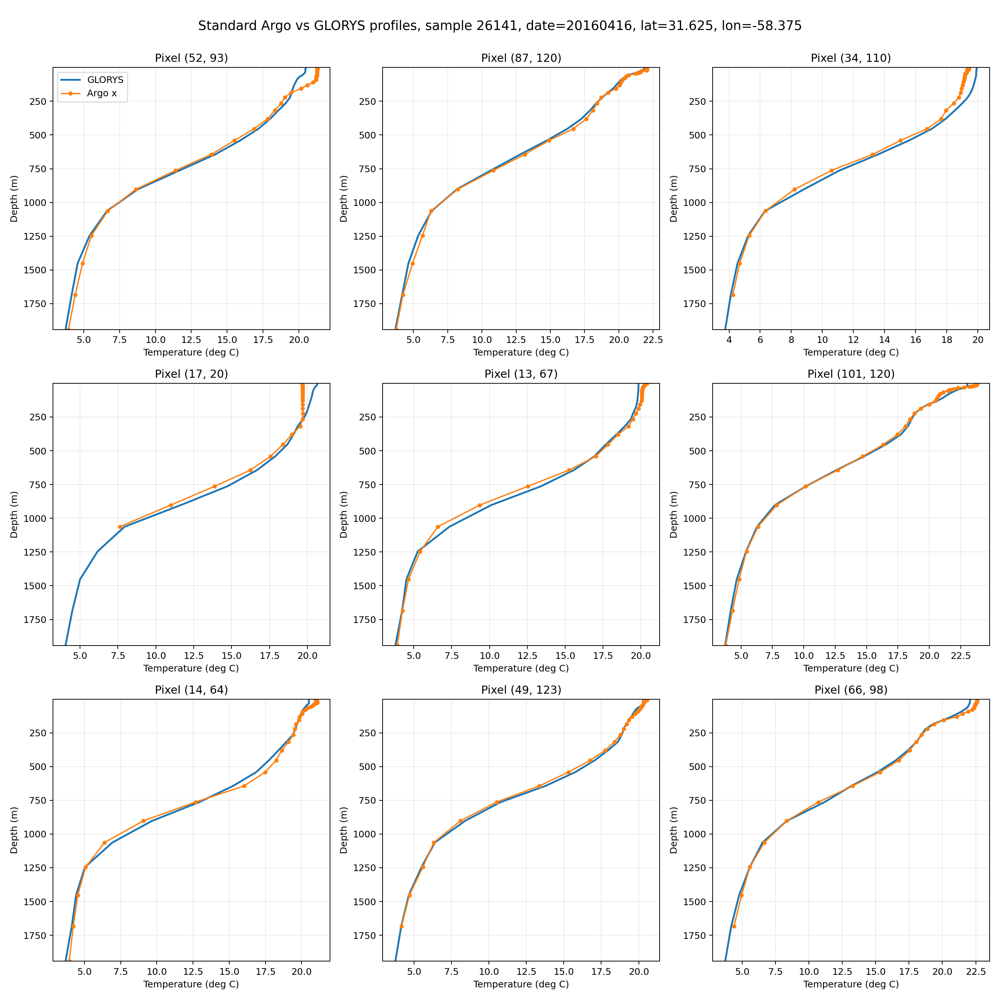
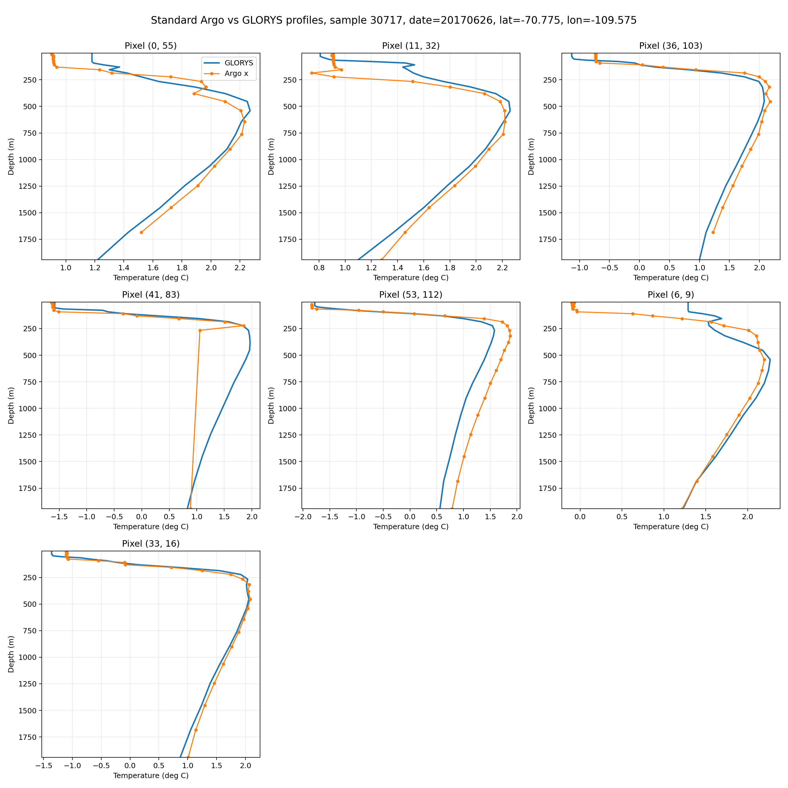

# Depth Alignment
This page documents how EN4 / ARGO temperature profiles are projected onto the GLORYS depth grid.

Use [Data Sources](data-source.md) for native product properties and [Production Dataset](production-datasets.md) for the spatial and temporal assembly pipeline.

## Native Vertical Coordinates
- GLORYS uses one fixed, monotonic 50-level `depth` coordinate.
- EN4 / ARGO stores profile samples at profile-specific `DEPH_CORRECTED` depths.
- EN4 profile arrays may have up to `400` storage slots, but those slots are not a shared physical depth axis.

## Target Grid
- The raw dataset uses the full 50 GLORYS depth levels as the target channel axis.
- Depth alignment is applied profile-by-profile before spatial rasterization.
- `x`, `y`, and `valid_mask` therefore share the same GLORYS-aligned depth layout.

## Per-Profile Alignment Procedure
1. Read finite `(DEPH_CORRECTED, TEMP)` pairs from one EN4 / ARGO profile.
2. Sort the samples by depth and collapse duplicate depths.
3. For each GLORYS target depth inside the observed profile range, linearly interpolate temperature.
4. Accept the interpolated value only when the nearest observed ARGO depth satisfies `abs(nearest_depth - target_depth) <= max(0.1 * target_depth, 10 m)`.
5. Leave out-of-range or rejected targets invalid; no depth extrapolation is applied.

## Output Semantics
- In `data/dataset_ostia_argo.py`, ARGO is resampled onto the GLORYS depth axis before tile aggregation.
- `valid_mask` marks aligned target depths that passed the profile-range and nearest-depth checks.
- Exported Argo GeoTIFFs remain georeferenced in `EPSG:4326` and store GLORYS depth-aligned band metadata.

## Visual Diagnostics
### Archive-wide ARGO depth frequencies

- This histogram aggregates finite `DEPH_CORRECTED` values across the scanned EN4 / ARGO archive.
- It shows why the nearest-depth cutoff becomes more restrictive with depth: profile support is dense near the surface and sparse deeper down.
- The dotted GLORYS markers indicate the fixed target depths used by the alignment step.

### EN4 level slots versus corrected depth

- This figure compares EN4 level index on the horizontal axis against corrected depth in meters on the vertical axis.
- The heatmap shows how often each EN4 level slot lands at a given physical depth across the archive.
- The white curve marks the median corrected depth per EN4 level, and the dashed curves mark the P10 and P90 depth envelopes.
- The top panel counts how many valid profiles contribute to each EN4 level slot, and the right panel shows the marginal depth histogram over all valid corrected depths.

### ARGO on a GLORYS grid

- This 3D view shows the final depth-aligned ARGO representation used for training after projection onto the fixed GLORYS depth grid.
- Floor axes: spatial patch dimensions.
- Vertical axis: the 50 GLORYS target levels, labeled in meters.
- Occupied voxels: aligned ARGO values after depth projection.

### Cutoff acceptance by target depth

- Shows the fraction of profiles for which each GLORYS target depth survives the nearest-depth cutoff.
- Acceptance decreases with depth as ARGO sampling becomes sparser.

### Example aligned profiles

- This example shows a typical well-aligned case: the sparse ARGO `x` points sit close to the GLORYS profile at the same pixel, so the projected profile shape is consistent across the observed depth range.
- In practice, this is the common outcome. The depth projection is usually very good when local vertical structure is smooth and the nearest-depth cutoff retains enough support.

- This second example shows that the alignment is not perfect in every case. At some locations, the sparse ARGO observations and the GLORYS profile disagree more noticeably over part of the observed depth range.
- These mismatches can happen when the local profile structure changes quickly with depth, when observations are sparse at the relevant levels, or when the nearest valid ARGO samples are still relatively far from the GLORYS target depths even though they pass the cutoff.

## Saved Alignment Artifacts
- `data/glorys_argo_alignment/argo_to_glorys_channel_mapping.json`
- `data/glorys_argo_alignment/glorys_argo_alignment_report.txt`
- `data/glorys_argo_alignment/figures/glorys_target_alignment_depth_summary.png`
- `data/glorys_argo_alignment/figures/glorys_target_alignment_within_cutoff_fraction.png`
