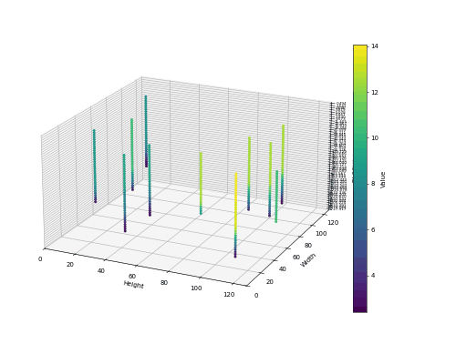
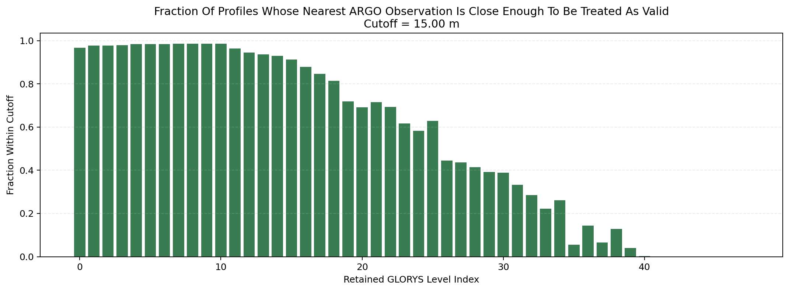

# Depth Alignment
This page documents how EN4 / ARGO temperature profiles are projected onto the GLORYS depth grid.

Use [Data Sources](data-source.md) for native product properties and [Production Dataset](production-datasets.md) for the spatial and temporal assembly pipeline.

## Native Vertical Coordinates
- GLORYS uses one fixed, monotonic 50-level `depth` coordinate.
- EN4 / ARGO stores profile samples at profile-specific `DEPH_CORRECTED` depths.
- EN4 profile arrays may have up to `400` storage slots, but those slots are not a shared physical depth axis.

## Target Grid
- The raw dataset uses the full 50 GLORYS depth levels as the target channel axis.
- Depth alignment is applied profile-by-profile before spatial rasterization.
- `x`, `y`, and `valid_mask` therefore share the same GLORYS-aligned depth layout.

## Per-Profile Alignment Procedure
1. Read finite `(DEPH_CORRECTED, TEMP)` pairs from one EN4 / ARGO profile.
2. Sort the samples by depth and collapse duplicate depths.
3. For each GLORYS target depth inside the observed profile range, linearly interpolate temperature.
4. Accept the interpolated value only when the nearest observed ARGO depth satisfies `abs(nearest_depth - target_depth) <= max(0.1 * target_depth, 10 m)`.
5. Leave out-of-range or rejected targets invalid; no depth extrapolation is applied.

## Output Semantics
- In `data/dataset_ostia_argo.py`, ARGO is resampled onto the GLORYS depth axis before tile aggregation.
- `valid_mask` marks aligned target depths that passed the profile-range and nearest-depth checks.
- Exported Argo GeoTIFFs remain georeferenced in `EPSG:4326` and store GLORYS depth-aligned band metadata.

## Visual Diagnostics
### ARGO on a GLORYS grid

- This 3D view shows the final depth-aligned ARGO representation used for training after projection onto the fixed GLORYS depth grid.
- Floor axes: spatial patch dimensions.
- Vertical axis: the 50 GLORYS target levels, labeled in meters.
- Occupied voxels: aligned ARGO values after depth projection.

### Cutoff acceptance by target depth

- Shows the fraction of profiles for which each GLORYS target depth survives the nearest-depth cutoff.
- Acceptance decreases with depth as ARGO sampling becomes sparser.

## Saved Alignment Artifacts
- `data/glorys_argo_alignment/argo_to_glorys_channel_mapping.json`
- `data/glorys_argo_alignment/glorys_argo_alignment_report.txt`
- `data/glorys_argo_alignment/figures/glorys_target_alignment_depth_summary.png`
- `data/glorys_argo_alignment/figures/glorys_target_alignment_within_cutoff_fraction.png`
