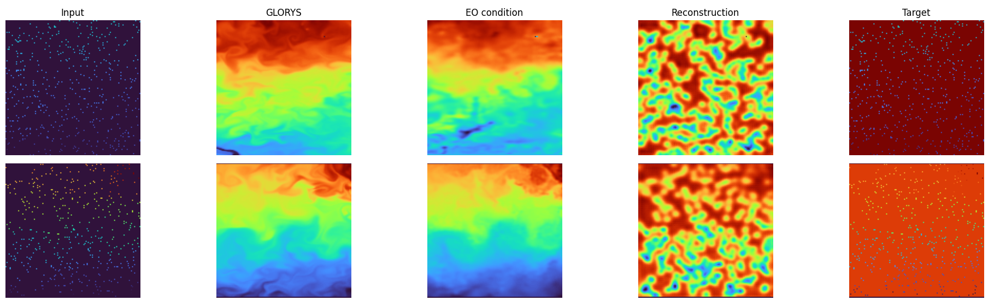

# GLORYS/Argo Aligned Experiments
This page tracks the GLORYS/Argo-aligned experiment line.

It starts with experiments based on the on-disk dataset, where exported OSTIA / Argo / GLORYS samples are loaded back from disk and used for aligned target experiments.

For the earlier synthetic-first runs, see [Synthetic And Early Experiments](experiments.md). For the production-result summary page, see [Production Results](experiments-production.md).

## Roadmap
- [x] 250 px ambient diffusion target - did not converge
- [ ] harder target, 100 pixels
- [ ] 20 pixels like in the actual data from continued checkpoint
- [ ] 20 pixels like in the actual data from scratch
- [ ] fine-tuning on actual Argo data from whichever checkpoint works best

## Scope
This section is intended for:
- experiments based on the on-disk dataset
- runs that use GLORYS-aligned targets together with Argo-derived inputs
- checkpoint continuation and point-count ablations on the aligned setup

## Experiment 1 (GLORYS as x and y, 250 points)
The first aligned on-disk run used the synthetic ambient setup with GLORYS for both `x` and `y` at `250` sampled pixels. After 11 epochs and roughly 40k steps, the model still did not converge.

This run also highlighted a practical training-cost issue: the model is quite large, and about 24 hours on `2x3090` only advanced it by a limited number of steps. More training is most likely necessary before this setup can be judged fairly, but keeping this exact run alive much longer is not practical right now.

Because of that, the next step is to back off from the synthetic-ambient objective and first verify that the new aligned dataset and model inputs train at all under a simpler target setup. The current direction is therefore:
- keep synthetic `x` inputs with `250` sampled pixels
- switch the target back to the full GLORYS `y`
- use that run as the new baseline before trying harder sparse-input or ambient-style objectives again

## Experiment 2 (50 points, continued checkpoint)
Placeholder for the continued-checkpoint comparison run.

Planned setup:
- use `50` points
- initialize from the continued checkpoint
- compare against Experiment 1 under the same aligned-data pipeline
