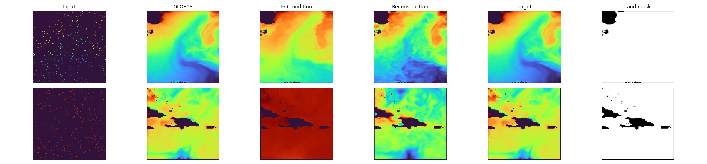
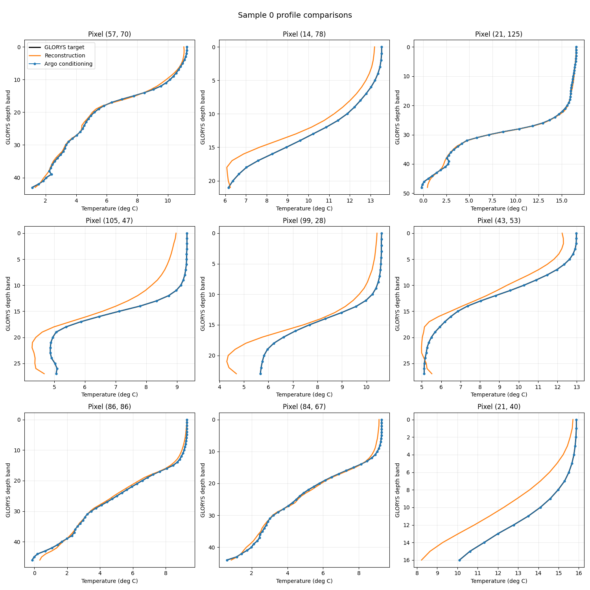
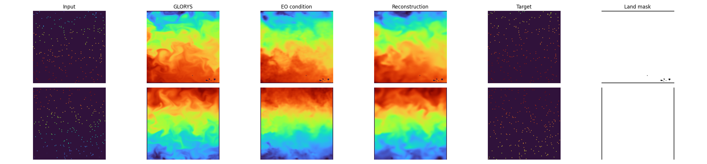
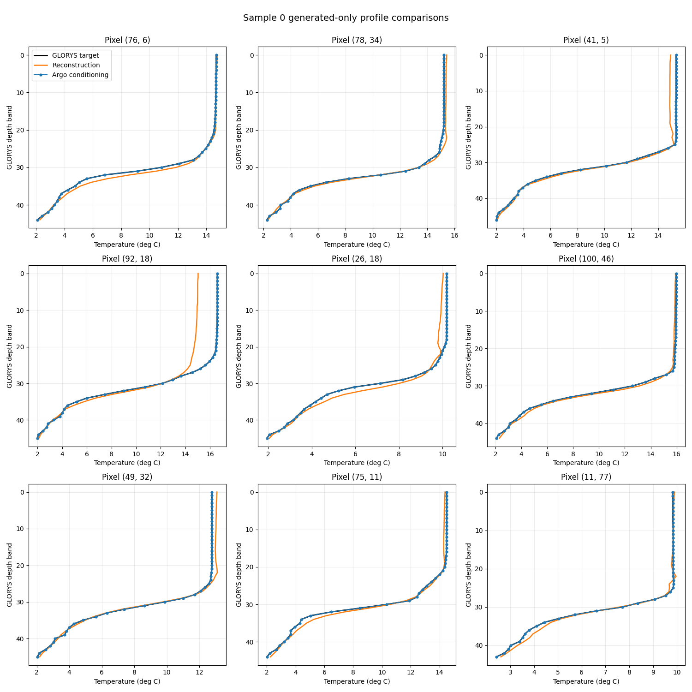

# Production Results  
This page will track experiments on the production dataset built from the real OSTIA / EN4 / GLORYS workflow.  
  
The historical synthetic and early experiments remain documented on [Synthetic And Early Experiments](experiments.md).  
  
## Scope  
This section is intended for:  
- results on the real production dataset  
- runs that use the real spatial and temporal sampling pipeline  
- experiments that depend on ARGO-to-GLORYS-aligned targets rather than synthetic targets  
  
## Current Status  
The first production-style runs are now logged below. The current snapshot includes a base full-`y` reconstruction run and a related ambient-target comparison run.  
  
## Planned Sections  
### Baselines  
Placeholder for the first comparable production baseline.  
  
### Ablations  
Placeholder for depth-grid, masking, and temporal-window ablations.  
  
### Qualitative Results  
#### Full `y` Reconstruction (`wandb/run-20260403_132046-11hm1egi`)
Setup:
- `--data-config configs/px_space/data_ostia_argo_disk.yaml`
- `--train-config configs/px_space/training_config.yaml`
- `--model-config configs/px_space/model_config.yaml`

Observation:
- this is the requested base full-`y` reconstruction reference run
- the reconstruction stays close to the target field and the 9-panel depth comparison remains coherent across the sampled profiles

Reconstruction:

9-panel depth graphs:

#### Ambient Target Comparison (`wandb/run-20260407_172356-5nu2qcl6`)
Setup:
- `--data-config configs/px_space/data_ostia_argo_disk_synth250.yaml`
- `--train-config configs/px_space/training_config.yaml`
- `--model-config configs/px_space/model_config_ambient.yaml`

Observation:
- this run was interrupted before W&B finalized the full summary, but the final saved reconstruction and 9-panel profile comparison are available locally
- it remains the current ambient-target qualitative reference for the 250-pixel setup

Reconstruction:

9-panel depth graphs:

  
### Quantitative Results  
| Run | Objective | PSNR | SSIM | L1 |
| --- | --- | ---: | ---: | ---: |
| `wandb/run-20260403_132046-11hm1egi` | Full `y` reconstruction | `19.70` | `0.000` | unavailable (`NaN` in persisted W&B table) |
| `wandb/run-20260407_172356-5nu2qcl6` | Ambient target | `18.40` (last logged before interruption) | unavailable | unavailable |
  
