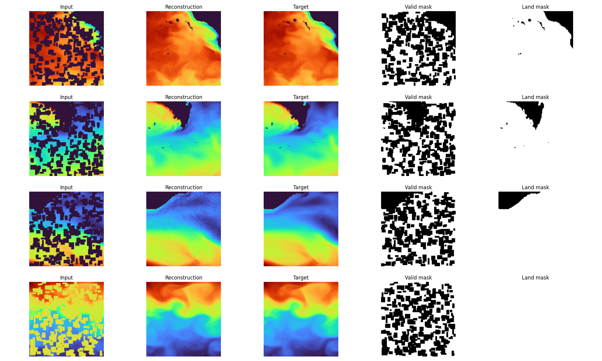
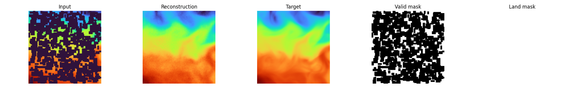
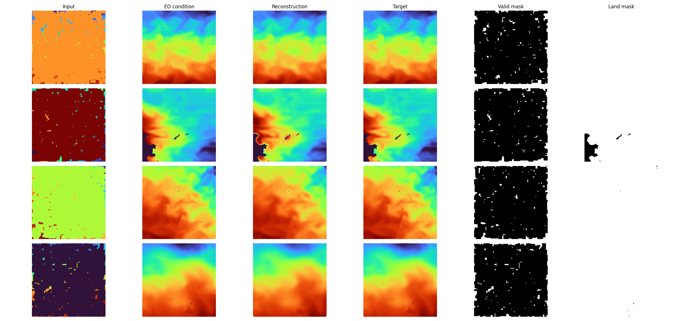

# Experiments
This page summarizes qualitative experiments from the README, with the same scenarios preserved and clarified.

## Experiment 1 (Early baseline, 50% corruption)
Preliminary sub-surface reconstruction baseline with 50% clustered occlusion after ~24h training.

Notes from the original run:
- valid masks were used in training  
- land mask was used for visualization  
- loss was computed over the whole image  
- no inpainting-style known-pixel clamping in DDPM sampling  
- reported metrics: PSNR ~40 dB, SSIM ~0.90  

Applying the same checkpoint to 75% occlusion still produced plausible reconstructions:  

## Experiment 2 (3-band x and y, EO condition, 95% corruption)
EO-conditioned multiband setup:
- `x`: corrupted 3-band deeper input (depth levels 3,4,5)  
- `y`: clean 3-band deeper target  
- `eo`: additional surface condition  

At 95% corruption, reconstructions remain strong, with noted risk of EO over-reliance.  

## Experiment 3 (High corruption and EO dropout)
Tested 75% corruption with 50% EO dropout while keeping the same checkpoint for comparison.

Observation:
- removing EO condition reduces fidelity  
- outputs still match plausible distributional structure  

After continued training (100 epochs in that setting), corruption increased to 95% while keeping 50% dropout.

Observation:
- EO-present samples reconstruct faithfully  
- EO-absent samples remain realistic but can deviate from exact ground-truth patterns  

## Experiment 4 (High corruption, EO dropout, EO degradation)
To reduce direct EO value shortcutting, EO condition was degraded using random perturbations and speckle-like noise.

Observation:
- reconstruction remains workable with degraded EO  
- model still performs plausible `x -> y` reconstruction when EO is absent or weak  

## Experiment 5 (Lower temperature levels)
Harder target depths were tested with levels:
- 0 (EO)  
- 4 (5m)  
- 10 (16m)  
- 17 (50m)  

Training setup: 95% corruption, 50% EO dropout, EO degradation.

Reported outcome: quality remained comparable on these depth levels.  

## Experiment 6 (99% occlusion)
... currently runninng...

## Experiment 7 (97.5% occlusion with streak corruption)
... currently runninng...

## Next Experiments (Roadmap)
- Crank sparse corruption to `mask_fraction=0.99` in EO multiband runs as the next baseline stress test.  
- Add more realistic corruption trajectories by replacing/augmenting random rectangles with "walk"-style masks that trace a path across each patch (submarine-like motion simulation).  
