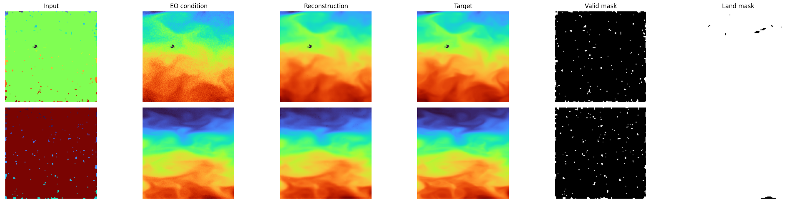
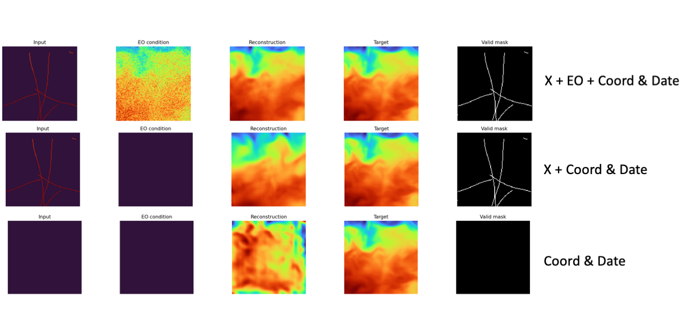
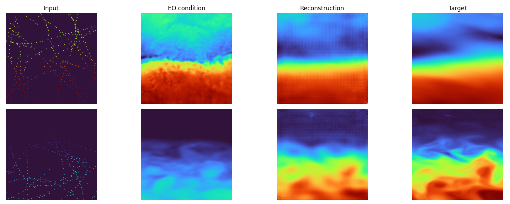

# Experiments
This page summarizes qualitative experiments from the README, with the same scenarios preserved and clarified.

## Experiment 1 (Early baseline, 50% corruption)
Preliminary sub-surface reconstruction baseline with 50% clustered occlusion after ~24h training.

Notes from the original run:  
- valid masks were used in training  
- land mask was used for visualization  
- loss was computed over the whole image  
- no inpainting-style known-pixel clamping in DDPM sampling  
- reported metrics: PSNR ~40 dB, SSIM ~0.90  

Applying the same checkpoint to 75% occlusion still produced plausible reconstructions:  

## Experiment 2 (3-band x and y, EO condition, 95% corruption)
EO-conditioned multiband setup:  
- `x`: corrupted 3-band deeper input (depth levels 3,4,5)  
- `y`: clean 3-band deeper target  
- `eo`: additional surface condition  

At 95% corruption, reconstructions remain strong, with noted risk of EO over-reliance.  

## Experiment 3 (High corruption and EO dropout)
Tested 75% corruption with 50% EO dropout while keeping the same checkpoint for comparison.

Observation:  
- removing EO condition reduces fidelity  
- outputs still match plausible distributional structure  

After continued training (100 epochs in that setting), corruption increased to 95% while keeping 50% dropout.

Observation:  
- EO-present samples reconstruct faithfully  
- EO-absent samples remain realistic but can deviate from exact ground-truth patterns  

## Experiment 4 (High corruption, EO dropout, EO degradation)
To reduce direct EO value shortcutting, EO condition was degraded using random perturbations and speckle-like noise.

Observation:  
- reconstruction remains workable with degraded EO  
- model still performs plausible `x -> y` reconstruction when EO is absent or weak  

## Experiment 5 (Deeper temperature levels)
Harder target depths were tested with levels:  
- 0 (EO)  
- 4 (5m)  
- 10 (16m)  
- 17 (50m)  

Training setup: 95% corruption, 50% EO dropout, EO degradation.

Reported outcome: quality remained comparable on these depth levels.  

## Experiment 6 (97.5% occlusion)  
Same depth levels as Exp. 5. Good reconstruction, moving on.

## Experiment 7 (97.5% occlusion with 'streak' corruption)
Corruption uses track-style streaks with one kept measurement every few pixels along each path (random 2-8 pixel stride).
Same depth levels as Exp. 5. Good reconstruction, moving on.

## Experiment 8 (Modality Ablation)
This quick experiment is not directly related to the roadmap, but it is interesting to see the reliance of the model on the different modalities. The graph shows the two standard modality combinations that were present in all previous experiments (X + EO w/ potential dropout), and also removes the X to test the reliance on the date/coord. In theory, if the model would mindlessly reconstruct the spatio-temporal patterns, it would recreate a plausible structure from only that. Since this doesn't happen, it can be assumed that the model correctly relies on the input modalities. While it might be possible to make this an unconditional task, it might not be actually beneficial to the downstream task. (tbd)  

## Experiment 9: OSTIA Surface -> 3 Deeper Reanalysis Levels (first results)
Setup:  
- condition `eo`: OSTIA sea-surface temperature tiles (`analysed_sst`)  
- `x`: sparse/corrupted deeper reanalysis channels  
- `y`: clean deeper reanalysis channels  
- overlap-only months where both depth and OSTIA are available  
- continued from the previous Experiment 7 checkpoint, while keeping the same train/val separation  

Observation:  
- good reconstruction quality in the first OSTIA run  
- no clear over-reliance on EO condition patterns  
- reconstructions are closer to the actual target than to the EO map where EO and target differ  

It doesn't seem possible to train the model on the OSTIA data from scratch, presumably due to the very few samples (~2k).  

## Experiment 10 (Sparse-target supervision with EO + degradation)
Setup:  
- condition `x`: sparse/degraded observations (track-style corruption)  
- condition `eo`: always available, with the same EO degradation pipeline as previous runs  
- target supervision: only a held-out subset of observed `x` pixels (sparse target), while reconstructing the full field  

How sparse target works in this experiment:  
- start from valid observed `x` pixels  
- randomly hide a fraction of those observed pixels from model input  
- compute loss only on the hidden subset (not on the full image). This is the main difference to the `ambient`-style training, where the loss is pulled over all pixels that are  `valid_mask==1`.

Observation:  
- reconstruction quality remains strong on the synthetic setup with EO + degradation  
- held-out sparse targets are recovered well while global structure stays coherent  
- the same experiment failed on the OSTIA dataset, most likely again due to the small dataset size  

## Experiment 11
Setup:  
- training uses the ambient objective target (ambient-occlusion training mode), differing from Experiment 10 by calculating the loss over all X pixels instead of just the generated, not conditioned-upon pixels.  

Status:  
 ...currently training...

## Next Experiments (Roadmap)
- Sparse Targets for Reanalysis data (from scratch & from pretrained)
- 99 or more perc. occlusion rates for OSTIA - do that later since it requires data download and handling
- DL daily reanalysis and OSTIA data to have a larger corpus
- Crank sparse corruption to `mask_fraction=0.99` in EO multiband runs as the next baseline stress test ✅  
- Add more realistic corruption trajectories by replacing/augmenting random rectangles with "walk"-style masks that trace a path across each patch (submarine-like motion simulation) ✅  
- Run the OSTIA cross-source conditioning experiment (`surface OSTIA -> deeper reanalysis`) and compare against the legacy same-source `eo_4band` setup ✅  
