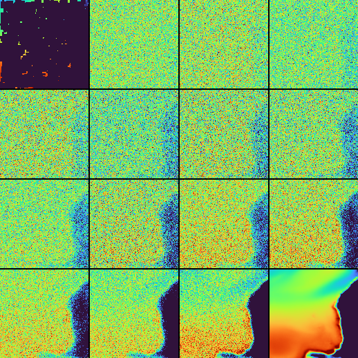

# Experiments
## Experiment 1 (1-band corruption, 50%)
Preliminary results for sub-surface reconstruction with 1-band setup and 50% pixelated occlusion (clustered), 24hr train time. Valid masks for training, land mask only for visualization. Loss calculated over whole image. No inpainting pixel anchoring in DDPM sampling. PSNR ~40dB, SSIM ~0.90.

The same checkpoint applied to 75 percent occusion indicates it learned the distribution somewhat well.  

## Experiment 2 (3-band x and y, EO condition, 95% corruption)
EO-conditioned multiband setup (`x`: 3-band corrupted input (depth levels 3,4,5), `y`: 3-band clean target, plus EO condition (surface obs.)), evaluated at 95% corruption. Good results, but likely over-reliance on EO condition.

## Experiment 3 (High corruption and EO dropout)
Test setting with 75% corruption and 50% EO condition dropout, keeping the same checkpoint for comparison. Quality obviosuly suffers with EO condition removed, but reconstructs distribution well. Note: EO dropout is random, so model has seen same location with EO condition previously. Unlikely that model momorizes this though with only 57M parameters and 110k samples.

After 100 training epochs on the previous setting, I switched to 95% percent corruption and still 50% dropout. Samples where EO is available are well and faithfully reconstructed. Samples without the EO conditioning generate a very plausible reconstruction, but it is visible that some currents/patterns look correct but are not 100% correlated with the ground truth. This might be a point where we can draw a very realistic reconstruction from the distribution, but we do not have enough information to accurately reconstruct this exact scenario.  

## Experiment 4 (High corruption, EO dropout, and EO degradation)
Now, to simulate an EO observation that is not so well correlated with the `y` variable, the `eo` gets degraded: a random multiplication between 0.9 and 1.1, and a small speckle noise gets added. This should encourage the model to respect the structure and shape of the EO observation, but rely less on it's absolute values. This model has been trained from scratch. It seems like the reconstruction still works reasonably well, both for degraded EO images and for purely `x->y` reconstruction  
  

## Experiment 5: Lower temperature Levels
The following levels were extracted to make the target harder: 0 (EO), 4 (5m), 10 (16m), 17 (50m). Training is done with 95% corruption, 50% EO dropout, and EO conditioning degradation.

Works for these depth levels without a loss in quality

## Sampling Process
The sampling process is currently guided by a cosine schedule. Plotting the intermediate steps shows a lot of noise initially, until the very end of the schedule. In addition to qualitative intermediates, we now log:
- MAE vs intermediate denoising step (using the per-step `x0` prediction against target).
- Diffusion schedule diagnostics (reverse + forward): `sqrt(alpha_bar_t)`, `sqrt(1-alpha_bar_t)`, `beta_tilde_t`, and `log10(SNR+eps)`.

Currently in the DDPM setting, a lot of compute is spent in very noisy early steps with limited visual ROI. DDIM sampling could fix that, alternatively a less agressive noise schedule. Potentially switching to `x0` parameterization can make this effect smaller as well.  

The image below shows the original x as well as 15 intermediate reconstructions along the denoising path.  

  

The generated images at the intermediate denoising steps have the following MAE in relation to the target:

  

Current noise scheduled implemented: `linear`, `sigmoid` and `cosine`. Cosine is curently active and produces the following noise schedules.  

  

