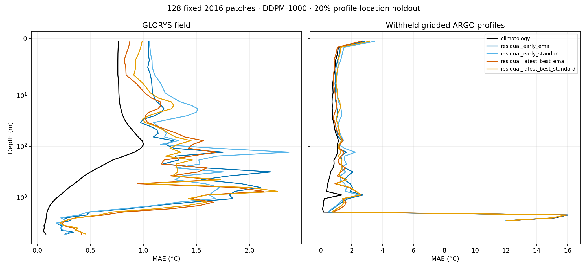

# Checkpoint selection — 5 October 2026

Status: **all four local evaluations complete; 389 tests passed**. The HPC
comparison is pending its checkpoint location. No new training was run.
The numerical diffusion winner is **step 113,304, raw weights**, effectively tied
with **step 37,768, EMA** on the primary metric. Climatology remains the stronger
accuracy baseline. The purpose was to select retained weights before spending
more compute on training.

The completed comparison is logged in W&B:
[2026-10-05-residual-checkpoint-selection (afh2xfwu)](https://wandb.ai/esa-phi-lab/DepthDif_Simon/runs/afh2xfwu).
Its evaluation artifact contains the small manifests, results, reasoning, and
figure; the large checkpoint and prediction files remain local. The uploaded
selected field score was read back and verified against the local report.

## Checkpoint identity

[checkpoints.yaml](checkpoints.yaml) records copied checkpoint paths, SHA-256,
byte size, source modification time, optimizer step, and zero-based epoch. Copies
are read-only under `outputs/checkpoint_selection_20261005/checkpoints/`.
Read-only permissions prevent accidental writes; the recorded hashes detect
changes. Original checkpoints have not been changed.

| Candidate | Step | Original source | Role |
|---|---:|---|---|
| Residual early | 37,768 | Oct 4 evaluation snapshot | Provisional reference; evaluate raw and EMA |
| Residual previous | 84,978 | Oct 5 evaluation snapshot | Historical result; preserved, not rerun |
| Residual latest best | 113,304 | Current `best-epochepoch=002.ckpt` | Evaluate raw and EMA |
| Residual recovery | 114,773 | Current `last.ckpt` | Recovery archive; not a selected candidate |

All four belong to W&B run
[062mpmkd](https://wandb.ai/esa-phi-lab/DepthDif_Simon/runs/062mpmkd).
The epoch-2 filename previously held step 84,978 and now holds step 113,304.
Never assign the earlier file's evaluation to the newer weights.

The [HPC reproduction sgp7apkx](https://wandb.ai/esa-phi-lab/DepthDif_Simon/runs/sgp7apkx)
has no checkpoint file or model artifact in W&B. Its artifact list contains only
tables, history, and events. No corresponding local checkpoint was found. The
user has been asked for an accessible location; this comparison remains pending.
Its low DDIM preview error is a reason to evaluate it, not evidence of superiority
on this benchmark. Do not substitute an unrelated local checkpoint under its name.

## Experiment history and reasoning

1. **Historical 32-patch comparison (Oct 3–4; already run).** On 2016 GLORYS,
   EMA/DDPM-1000/float32, equal-depth MAE was 0.530°C for climatology,
   1.162°C for residual step 37,768, 1.921°C for the Sept 30 reproduction's
   saved best, and 3.085°C for its evaluated last checkpoint. Evidence:
   `outputs/residual_comparison_20261004/{summary,evaluation_manifest}.json`.
   Decision: preserve the early residual, but retain climatology as the stronger
   field baseline. These results describe sampled patches, not global performance.
2. **Historical later residual comparison (Oct 5; already run).** Step 84,978
   had equal-depth MAE 1.521°C and pixel RMSE 3.831°C on the same 32 patches.
   Lower denoising loss did not improve generated fields. Evidence:
   `outputs/residual_comparison_20261005/{summary,checkpoint_metadata}.json`.
   Decision: do not select or continue training solely by denoising loss.
3. **Selection workflow verification (current).** Existing full-reconstruction
   selection uses 128 fixed patches, independent seeded noise, globally pooled
   per-depth error, and EMA when configured. The ordinary validation loader stays
   shuffled. Retention is extended from one to three best checkpoints, with epoch
   and optimizer step in filenames. The full test suite is required before use.
4. **Larger matched comparison (current; preregistered below).** Evaluate early
   and latest-best residual checkpoints with both raw and EMA weights against
   climatology. No optimizer updates, new model variants, or training ablations.

## Evaluation protocol

[experiment.yaml](experiment.yaml) pins each checkpoint and config checksum and
the climatology artifact checksum. [training_source.yaml](training_source.yaml)
preserves the launch template, which does **not** include all runtime overrides.
[model_source_effective.yaml](model_source_effective.yaml) preserves the actual
model architecture used by the run. [evaluation_config.yaml](evaluation_config.yaml)
uses that effective model, DDPM, a read-only climatology copy, and zero data-loader
workers for standalone inference. The trained architecture and data split are unchanged.

- 128 distinct patches drawn uniformly from the 2016 validation dataset, seed
  20261005. This is separate from the old 32-patch seed-7 diagnostic and the
  training selection set; exact row identities and their coverage are recorded.
- Batch size four, DDPM-1000, float32, TF32 disabled. Each batch has the same noise
  seed across weight variants. Both local GPUs may execute separate methods.
- Hide 20% (rounded, at least one when possible) of observed spatial profile
  locations per patch, at every depth; retain at least one input location. Single-
  location patches contribute field scores only. Surface EO remains available.
- Score full fields against dated valid GLORYS water cells and hidden profiles
  against the original **gridded ARGO inputs** on matching support. This is not
  independent raw EN4 validation and should not be labeled as such. GLORYS is
  also scored against the hidden profiles as a reference.
- Primary ranking: **equal-depth RMSE** (equivalent ordering to the temperature
  checkpoint-selection score). Report equal-depth MAE, pixel MAE/RMSE, bias,
  per-depth support, and profile errors too. Nonfinite scored predictions fail.
- Same tensors, masks, hidden locations, patch order, and climatology for every
  method. Input hashes are compared before interpreting the results. Saving
  per-batch predictions enables later inspection without rerunning inference.
- Because inputs now include profile holdout and the selected patches differ,
  numbers are not a continuation of the historical 32-patch benchmark.

## Execution and evidence

Run from the repository root, substituting one declared method and device:

```bash
/work/envs/depth/bin/python -m depth_recon.scripts.compare_checkpoints \
  --manifest docs/experiments/2026-10-05-checkpoint-selection/experiment.yaml \
  --method residual_early_ema --device cuda:0 \
  --output-dir outputs/checkpoint_selection_20261005/results_attempt02
```

Each method writes effective configs, exact selections, input hashes, held-out
locations, batch predictions, metrics, timings, and completion status. It refuses
to overwrite an existing method directory. Failed attempts remain evidence and
must be documented before a retry in a new output directory.

Validation commands:

```bash
/work/envs/depth/bin/python -m black .
bash tests/run_tests.sh
```

`outputs/checkpoint_selection_20261005/provenance/` preserves the initial dirty
working-tree diff and status, W&B read results, test log, and executed code state.
Existing user edits are preserved. Large model and prediction files are excluded
from Git; this Markdown record and the YAML manifests are versionable.

### Attempts and validation

- Required `black .` completed: 125 files unchanged. Its Python target-version
  warning is recorded; exit status was zero. A sandboxed formatter attempt
  stalled and was interrupted before the successful host execution.
- The sandboxed full test suite stalled during dataset setup and was interrupted.
  The host rerun passed **389 tests in 19.626 seconds**; complete log:
  `outputs/checkpoint_selection_20261005/provenance/tests_host.log`.
- **Evaluation attempt 01:** both EMA methods stopped before generating any
  predictions. Strict loading caught a 252-versus-202 input-channel mismatch.
  The copied launch template had `climatology_residual: false`, whereas the saved
  effective model config and both checkpoints require residual mode. This is a
  provenance/configuration error, not a failed model result. Initial manifests
  are retained as `*_attempt01.yaml`, and failure logs/statuses under `results/`.
- **Evaluation attempt 02:** use the saved effective architecture, including
  `climatology_residual: true`, with strict loading still enabled. Results go to
  `results_attempt02/`; failed evidence is not overwritten. Both EMA methods
  started first, one per GPU; raw weights follow on those same GPUs.
- The fixed draw contains 128 unique indices from 173,880 validation patches,
  covering 49 weekly dates and all 12 months. December has only two patches;
  this draw cannot support strong month-specific conclusions.

## Decision rule

Promote a diffusion candidate only with explicit evidence about both field and
hidden-profile performance. If climatology still wins the main field metric,
retain it as the accuracy baseline and label the diffusion winner provisional.
If field and profile winners differ, report the tradeoff instead of declaring one
universal winner. Do not start another long training run from this result alone;
first establish why the learned residual worsens its background where it does.

## Completed results and decision

All four methods completed 128 patches with identical input and holdout hashes.
There are 527 hidden grid locations counted per patch, 16,419 supported held-out
temperature values, and 125 patches with a profile holdout. Three single-location
patches contribute only to the field benchmark. Full machine-readable results,
timestamps, evidence hashes, support counts, and checkpoint identities are in
[results.yaml](results.yaml). Each method took approximately 16 minutes; two
methods ran concurrently on separate GPUs in each pass.

| Method | Equal-depth field RMSE °C (primary) | Equal-depth field MAE °C | Withheld-profile pixel MAE °C |
|---|---:|---:|---:|
| Climatology | **0.9420** | **0.5404** | **0.7895** |
| Latest raw, step 113,304 | **1.6713** | 1.0848 | 1.2788 |
| Early EMA, step 37,768 | 1.6730 | 1.1061 | 1.2911 |
| Early raw, step 37,768 | 1.7313 | 1.1380 | 1.3516 |
| Latest EMA, step 113,304 | 2.0994 | 1.0862 | **1.2042** |

The latest raw versus early EMA primary-score difference is only **0.10%**.
This single seeded benchmark does not establish a meaningful improvement.
Latest EMA is the best diffusion variant on profile MAE, so there is no universal
diffusion winner. None beats climatology on either aggregate criterion.
These are **single-sample point-error rankings**, not a ranking of predictive
distributions. No ensemble mean, calibration, or proper probabilistic score has
been evaluated. The source-QC audit below further limits the profile conclusions.
Latest raw beats climatology on per-patch pixel MAE on only 22/128 field patches
and 27/125 profile patches; early EMA wins 33/128 and 34/125 respectively.

**Selected reference:** [selection.yaml](selection.yaml) points to the numerical
field winner and its read-only, inference-only export:
`outputs/checkpoint_selection_20261005/selected_inference.ckpt`.
The exported tensors were checked for exact equality with the evaluated raw
weights. It contains no alternate EMA weights, so the usual EMA-preferring
inference loader loads precisely the selected tensors. Use
`evaluation_config.yaml` for the matching model architecture and pinned
climatology artifact. Use the archived full checkpoints for training recovery;
the inference export has no optimizer state. Keep early EMA as a close alternative.

**Training decision:** do not restart or extend training simply because its
denoising loss improves. Future runs now retain three checkpoints ranked by the
existing fixed full-reconstruction score, with step-specific filenames and the
ordinary validation loader still shuffled. That callback uses EMA when configured;
raw/EMA comparison of retained candidates remains necessary, as this experiment
demonstrates. The selected diffusion model is provisional and is not promoted over
the frozen climatology baseline. The pending HPC candidate must be evaluated on
this same protocol before an all-run comparison is claimed.

### What worsens the climatology background

On valid field cells, the true anomaly from climatology has RMS **1.134°C**.
The selected raw model applies a correction with RMS **1.982°C**; latest EMA
applies **2.424°C**. With correction `c = prediction - climatology` and true anomaly
`a = target - climatology`, the exact error change is
`MSE(prediction) - MSE(climatology) = mean(c²) - 2 mean(c a)`.
For latest raw this is **3.928 − 1.811 = +2.117°C²**; latest EMA gives
**5.877 − 1.643 = +4.234°C²**. Corrections have some useful alignment, but their
magnitude adds more error than that alignment removes. This describes the saved
predictions; it does not identify a causal training/sampler defect or validate a
new correction-scaling intervention. No such ablation was run.

### Limits of the profile evidence

The held-out reference is the existing gridded input, with its existing QC settings,
not independently reprocessed EN4. Below 2 km there are only **1–4 held-out values
per supported depth**, and some disagree with both climatology and GLORYS by
roughly 12–16°C. Those sparse reference values dominate equal-depth profile
metrics. They remain included as preregistered; use the reported support counts
and pixel-weighted profile scores, and audit their source/QC before drawing
deep-ocean observational conclusions. The GLORYS field ranking is a separate,
densely supported metric. No test of statistically independent patches or multiple
sampling seeds was performed.



### Reproduce aggregation and selection

```bash
/work/envs/depth/bin/python docs/experiments/2026-10-05-checkpoint-selection/summarize.py \
  --manifest docs/experiments/2026-10-05-checkpoint-selection/experiment.yaml \
  --results outputs/checkpoint_selection_20261005/results_attempt02 \
  --output-dir docs/experiments/2026-10-05-checkpoint-selection
/work/envs/depth/bin/python docs/experiments/2026-10-05-checkpoint-selection/export_selected.py \
  --record-dir docs/experiments/2026-10-05-checkpoint-selection \
  --output outputs/checkpoint_selection_20261005/selected_inference.ckpt
```

Export refuses to overwrite an existing file. Check its recorded SHA-256 rather
than recreating it merely to rerun the report. The W&B logging helper records the
run ID before uploading, preventing accidental duplicate experiment runs.

## Implementation and interpretation audit — 5 October 2026

This follow-up inspected the implementation, the frozen climatology metadata,
the saved latest-raw predictions, and their deepest held-out profile sources.
**No new model inference, training, ablation, or checkpoint change was performed.**
[implementation_audit.json](implementation_audit.json) records exact checkpoint
identity, source-file hashes, depth statistics, source profile indices, QC flags,
and the audit timestamp. This follow-up is recorded locally; the earlier W&B
artifact represents the comparison as it stood before this audit.

### Climatology and residual reconstruction

- The frozen artifact records 1,230 fit dates from 2000-01-01 through 2024-07-26,
  with **zero dates in validation year 2016**. Its grid and depth axis match the
  manifest; the ARGO store's actual depth coordinates also match. The fitter
  excludes the validation year before accumulation. This is a retrospective
  held-out-year baseline, not a past-only forecasting baseline.
- The background is a monthly mean on a stride-four grid, sampled back onto
  native patch coordinates by nearest neighbour. Missing monthly cells fall back
  to training-only annual/local or depth-wide means. Depth index 49 is entirely
  unsupported; its placeholder is rejected if a dated target is valid there.
- Absolute observations, targets, and climatology use the same affine temperature
  normalization. Subtraction therefore gives `(T - climatology) / 10.9333975`.
  Missing observations remain zero with a separate mask. Prediction adds the
  normalized background once before denormalization. Gaussian postprocessing and
  known-pixel clamping are disabled in this evaluated configuration.
- Reviewed paths: `climatology.py::fit_monthly_climatology`, dataset
  `_open_climatology`/`__getitem__`, and `PixelDiffusion` depth-context,
  training, validation, and prediction methods. Existing suite coverage includes
  residual training targets and adding the background exactly once. The previous
  full-suite result remains 389 passing tests; this read-only follow-up added no
  production code and did not rerun that suite.

This supports the background and reconstruction implementation; it is not a
blanket certification of every data path or historical training-code version.
An additive climatology background changes the modeled variable to an anomaly.
It does **not** impose an explicit depth-dependent shrinkage prior. The effective
run uses x0 prediction, global temperature scaling, and pooled masked MSE, with
no per-depth anomaly scaling. Smaller deep anomalies contribute less squared
target variation, and deep cells have less spatial support. These are plausible
optimization concerns, not experimentally established causes of the error.

### Confirmed profile-quality problem

Both the actual saved `data_config_effective.yaml` and the frozen evaluation
config have `filter_bad_argo_quality: false`, despite listing accepted flags 1
and 2. **All 12 held-out values below 2,000 m come from five source profiles with
temperature profile QC 4 and level QC 4.** Their stored validity flag is still 1;
validity alone therefore does not enforce quality. Decoding the source values
reproduces the suspicious temperatures: for example, source profile 5,948,378
contains 30.512°C at 2,533 m, versus GLORYS 1.787°C. The depth axes match, so this
trace does not indicate a shifted channel interpretation.

The existing QC policy would reject every one of these deepest held-out values.
There would then be **no reliable held-out profile evidence below 2 km in this
draw**. Historical results remain unchanged, including these observations; no
post-hoc filtering has been used to improve reported scores. A corrected protocol
must apply QC before rasterization and conditioning, record the resulting patch
and profile support, and generate predictions for those corrected inputs.
Filtering only the scoring references would leave bad conditioning untouched.
The same disabled filter was used for training inputs, which merits attention
before further training. The dense field targets are GLORYS, not these profiles;
the separate field-score arithmetic is not invalidated by this finding.

The source trace initially stalled while opening Zarr inside the sandbox and was
interrupted before reading data. A read-only host retry completed successfully.

### Deep correction magnitude and probabilistic interpretation

For the saved latest-raw checkpoint, step 113,304, on the same 128 patches:

| Depth m | GLORYS anomaly from climatology, RMS °C | Sampled model correction, RMS °C | Model field RMSE °C |
|---|---:|---:|---:|
| 1,062 | 0.367 | 1.920 | 1.928 |
| 1,942 | 0.239 | 0.961 | 0.949 |
| 2,533 | 0.240 | 0.595 | 0.576 |
| 3,992 | 0.185 | 0.926 | 0.941 |

These dense-field statistics are independent of the tiny deep-profile score
support. They indicate excessive correction magnitude on this benchmark, but a
single draw per input cannot separate conditional-mean error from ensemble spread.
Across-patch signed correction means in the JSON are not conditional ensemble means.

A realistic random draw can have worse point error than a conditional mean even
when its distribution is correct. For a fixed truth, expected squared error over
model draws is `(ensemble mean - truth)^2 + ensemble variance`. Visual realism
alone does not establish that the generated uncertainty or spatial dependencies
are calibrated. This distinction is discussed in
[ECMWF's forecast-verification analysis](https://www.ecmwf.int/en/about/media-centre/science-blog/2026/separating-signal-noise).
The current full-reconstruction callback correctly pools masked errors and uses
fixed patches/noise, but its single-draw RMSE remains a point-error diagnostic.
It cannot, by itself, select the best predictive distribution. The ordinary
validation loader remains shuffled as intended.

### Recommended next diagnostic, not yet run

1. Version a QC-enabled evaluation protocol, preserving this frozen comparison.
   Check retained profiles and support before relying on observational scores.
2. On a small fixed set with corrected inputs, evaluate about 16 independent
   samples per case for latest raw and early EMA. Record every seed and checkpoint
   hash. Compare ensemble-mean RMSE, ensemble-median MAE, CRPS, interval coverage
   and width by depth; add spatial/vertical dependence checks for the generated
   structures. Use both the deterministic climatology and a training-only
   empirical climatological distribution as references. Never select the sample
   closest to the reference. CRPS and interval scores assess distributions as
   described by [Gneiting and Raftery](https://sites.stat.washington.edu/people/raftery/Research/PDF/Gneiting2007jasa.pdf).
3. Use that result to choose the intervention. A good ensemble mean with excessive
   spread suggests a calibration/sampling issue; a poor ensemble mean also requires
   investigating conditioning and learned mean errors. Consider depth-aware
   residual scaling or weighting only after this distinction is measured. Fit any
   scale or calibration on training/calibration data, leaving an independent final
   evaluation set for the resulting model. Do not resume long training solely on
   the present single-draw ranking.
