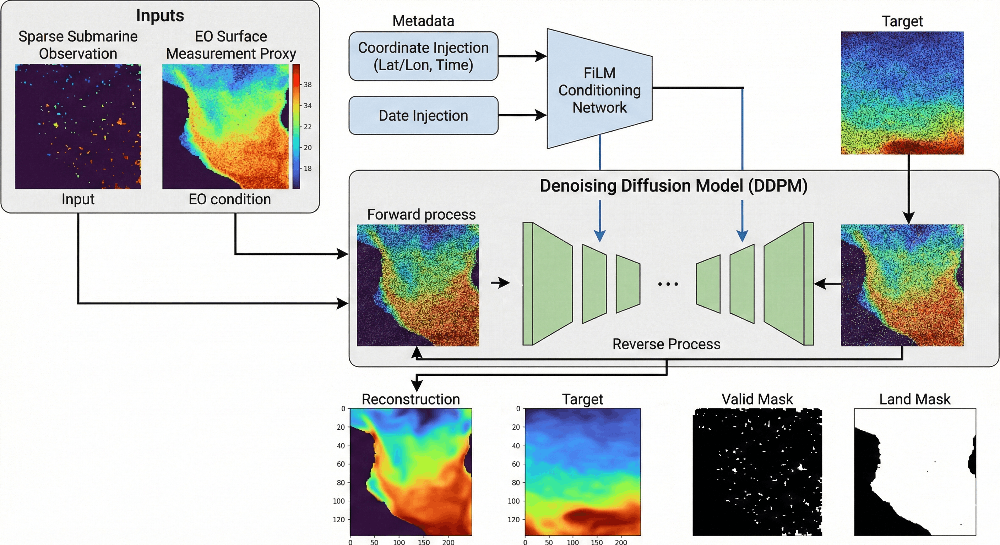

  
  

# Densifying Sparse Ocean Depth Observations
DepthDif explores conditional diffusion for reconstructing dense subsurface ocean temperature fields from sparse, masked observations.

The repository currently supports:
- EO-conditioned multi-band reconstruction (surface condition + deeper target bands)

## Model Description
DepthDif is a conditional diffusion model: it reconstructs dense depth fields from corrupted submarine observations, conditioned on EO (surface) data plus sparse corrupted subsurface input. Synthetic sparse inputs are generated with continuous curved trajectory masks to mimic submarine movement, adding streaks until the configured corruption percentage is reached. It can inject coordinate/date context via FiLM conditioning and reconstruct the full target image. See the full model details in [Model](model.md).  

## Documentation Map
- [Quick Start](quickstart.md): environment setup + fastest train/infer path
- [Data Source](data-source.md): source product, download, and raw variable tables
- [Synthetic Dataset](data.md): preprocessing, synthetic corruption, and split behavior
- [Model](model.md): architecture and diffusion conditioning flow
- [Date + Coordination Injection](date-coordination-injection.md): coordinate/date FiLM conditioning details
- [Training](training.md): CLI usage, run outputs, logging, checkpoints
- [Inference](inference.md): script and direct `predict_step` workflows
- [Configs](configs.md): per-file config keys, defaults, and explanations
- [Sampling Diagnostics](sampling-diagnostics.md): denoising intermediates, MAE-vs-step, and schedule profiling
- [Experiments](experiments.md): qualitative test results
- [Model Settings](settings.md): key config knobs and where they are used
- [Development](development.md): known issues, TODOs, and roadmap
- [API Reference](api.md): auto-generated module reference via `mkdocstrings`
