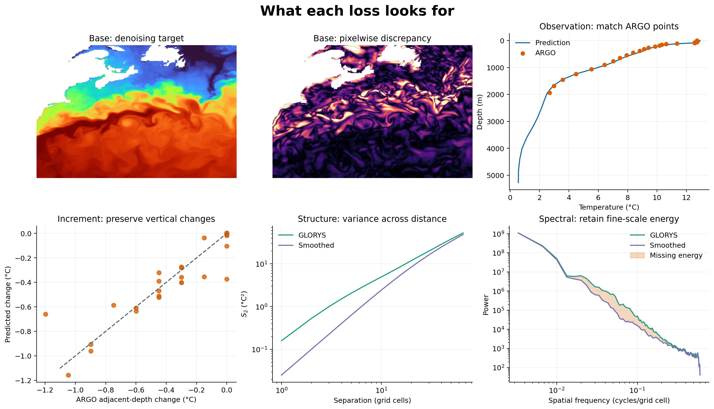
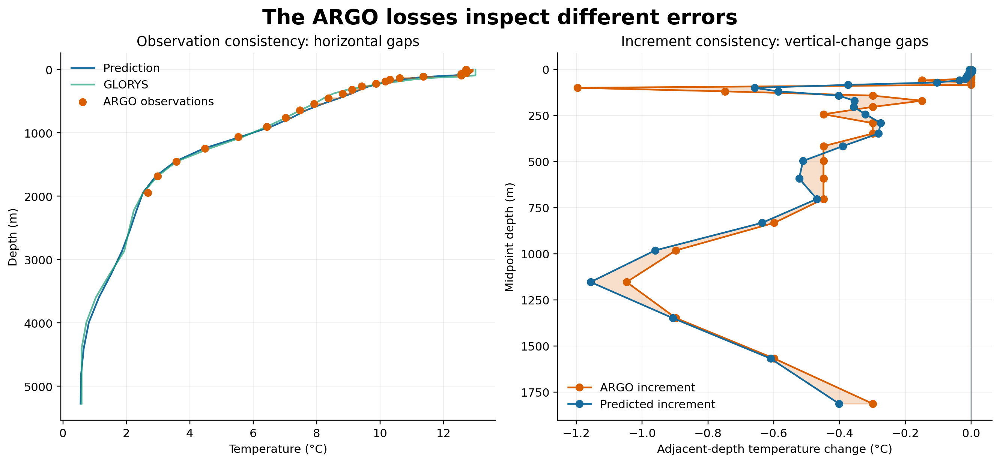
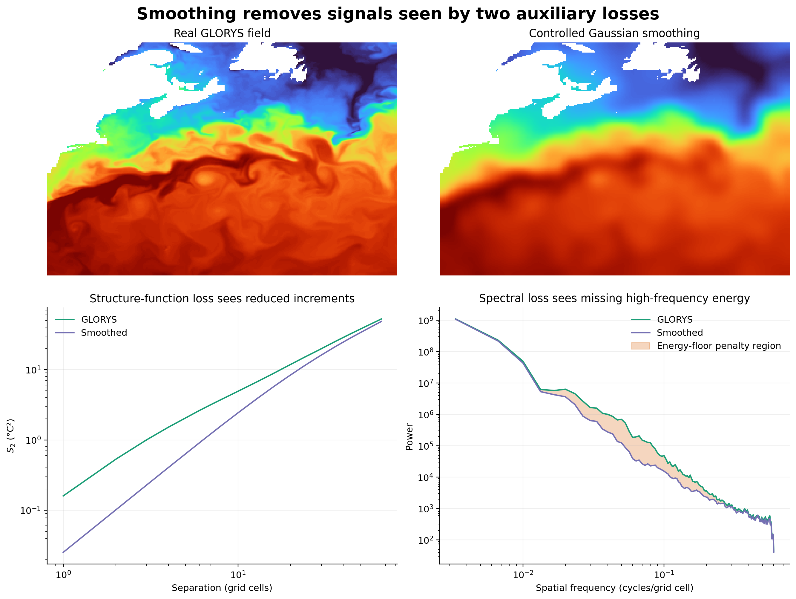
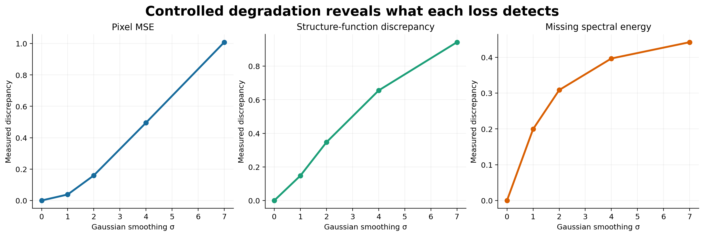
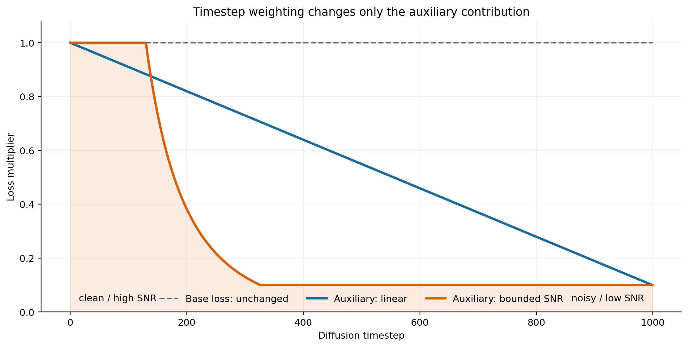
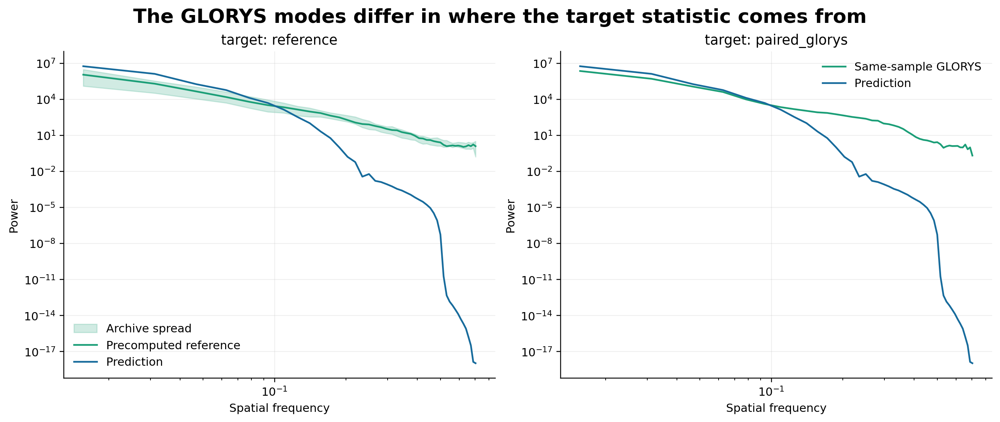

# Ambient Diffusion - Aux Losses

This page documents the optional loss stack under `model.losses.*` for pixel-space ambient ocean reconstruction. These terms are designed for sparse ARGO-conditioned diffusion training where temperature and salinity are trained as separate scalar fields.

By default, GLORYS auxiliary terms are disabled and the historical `target: reference` mode uses precomputed distributional, spectral, or statistical reference values. For explicit experiments, `target: paired_glorys` computes structure-function and spectral auxiliary losses between `x0_pred` and the paired dense GLORYS target `y`; this remains opt-in and does not add direct dense pixel MSE/L1 supervision.

## Notation

For one normalized model sample:

- \(\hat{x}_0 \in \mathbb{R}^{C \times H \times W}\): predicted clean field recovered from the denoiser output. In the current scalar-field setup, \(C\) is the number of depth channels for one variable.
- \(x \in \mathbb{R}^{C \times H \times W}\): sparse observed ARGO field in model-normalized units.
- \(A \in \{0,1\}^{C \times H \times W}\): sparse ARGO observation mask, `x_valid_mask`.
- \(Y \in \{0,1\}^{C \times H \times W}\): valid target/support mask, `y_valid_mask`.
- \(G \in \{0,1\}^{1 \times H \times W}\): GLORYS-derived ocean/domain support, `land_mask` in the dataloader contract.
- \(t\): diffusion timestep.
- \(\epsilon\): Gaussian noise used by the forward diffusion process.
- \(\lambda_k\): scalar config weight for loss term \(k\).

The implementation operates in normalized model units. This is intentional: ARGO sparse observations, predictions, and diffusion targets are already standardized by the dataset and model path. Physical-unit interpretation belongs to denormalized diagnostics, not the training objective.

## Combined Objective

The total optimized loss is:

\[
\mathcal{L}_{\text{total}}
=
\lambda_{\text{amb}}\mathcal{L}_{\text{amb}}
+
\lambda_{\text{obs}}\mathcal{L}_{\text{obs}}
+
\lambda_{\text{inc}}\mathcal{L}_{\text{inc}}
+
\lambda_{\text{S2}}\mathcal{L}_{\text{S2}}
+
\lambda_{\text{spec}}\mathcal{L}_{\text{spec}}.
\]

The scalar-field training preset keeps all optional auxiliary terms disabled by default. The configured weights are used only when a term is explicitly enabled:

| Term | Config key | Default enabled | Default weight |
| --- | --- | --- | ---: |
| Base diffusion / ambient loss | `model.losses.ambient` | always present | `1.0` |
| Sparse observation consistency | `model.losses.sparse_observation` | `false` | `0.25` |
| Sparse increment consistency | `model.losses.increment` | `false` | `0.1` |
| GLORYS structure-function prior | `model.losses.structure_function_prior` | `false` | `0.1` |
| GLORYS spectral energy floor | `model.losses.spectral_energy_floor` | `false` | `0.05` |
| Feature Gram prior | `model.losses.feature_gram_prior` | `false` | `0.01` reserved, not implemented |

`train/loss` and `val/loss` are the total loss. Component logs are emitted as `*/loss_ambient`, `*/loss_obs`, `*/loss_increment`, `*/loss_s2_glorys`, `*/loss_spectral_glorys`, and `*/loss_total`.

## Auxiliary Timestep Weighting

Clean-field auxiliary losses act on \(\hat{x}_0\). At very noisy timesteps, \(\hat{x}_0\) can be a weak or unstable estimate even when the diffusion loss is still meaningful. `model.losses.aux_timestep_weighting` therefore optionally multiplies only the auxiliary part of the objective by a scalar derived from the sampled training timestep. The base diffusion or ambient loss is not changed.

The implemented objective is:

\[
\mathcal{L}_{\text{total}}
=
\lambda_{\text{amb}}\mathcal{L}_{\text{amb}}
+
\bar{w}_{\text{aux}}(t)
\left(
\lambda_{\text{obs}}\mathcal{L}_{\text{obs}}
+
\lambda_{\text{inc}}\mathcal{L}_{\text{inc}}
+
\lambda_{\text{S2}}\mathcal{L}_{\text{S2}}
+
\lambda_{\text{spec}}\mathcal{L}_{\text{spec}}
\right).
\]

Because the current auxiliary losses reduce over the whole batch, the implementation uses the batch mean of per-sample timestep weights:

\[
\bar{w}_{\text{aux}}=\frac{1}{B}\sum_b w_{\text{aux}}(t_b).
\]

Two modes are available. `linear` uses the forward-diffusion convention that `t=0` is clean/high-SNR and `t=T-1` is noisy/low-SNR:

\[
u(t)=1-\frac{t}{T-1},
\]

\[
w_{\text{linear}}(t)=w_{\text{start}}+u(t)(w_{\text{end}}-w_{\text{start}}).
\]

With the default linear endpoints, auxiliary losses are strongest near clean timesteps and weakest at the noisiest timesteps.

`snr` computes:

\[
\mathrm{SNR}(t)=\frac{\bar{\alpha}_t}{1-\bar{\alpha}_t}
\]

and applies bounded normalized Min-SNR-style weighting:

\[
w_{\text{snr}}(t)=\frac{\min(\mathrm{SNR}(t),\gamma)}{\gamma}.
\]

The final scalar is clamped to `[min_weight, max_weight]`. This suppresses very noisy low-SNR steps while preventing high-SNR steps from receiving unbounded auxiliary weight. The logged key is `*/loss_aux_timestep_weight`.

## Base Diffusion And Ambient Loss

The base term is the existing diffusion training loss. It is unchanged by the auxiliary loss stack.

For `parameterization: x0`, the denoiser predicts the clean target directly:

\[
\mathcal{L}_{\text{amb}}
=
\frac{\sum_p M(p)\left(\hat{x}_0(p)-x_0(p)\right)^2}{\sum_p M(p)},
\]

where \(M\) is the active supervised support. In standard mode, \(M\) is based on `y_valid_mask` and `land_mask`. In ambient occlusion mode, \(M = A \odot Y \odot G\), and the clean target is the original sparse observation tensor `x` rather than dense GLORYS `y`.

For `parameterization: epsilon`, the base loss remains the existing noise-prediction MSE. The auxiliary losses still need a clean estimate, so the diffusion process converts the predicted noise to \(\hat{x}_0\):

\[
\hat{x}_0
=
\frac{x_t - \sqrt{1-\bar{\alpha}_t}\,\hat{\epsilon}}{\sqrt{\bar{\alpha}_t}}.
\]

Why this term is kept: it is the diffusion objective that makes the reverse process learn denoising dynamics. The auxiliary terms shape the clean estimate, but they do not replace the diffusion objective.

## Sparse Observation Consistency

The sparse observation term compares the clean prediction to real sparse ARGO observations at observed locations:

\[
\mathcal{L}_{\text{obs}}
=
\frac{\sum_p A(p)\,\rho\left(\hat{x}_0(p)-x(p)\right)}{\sum_p A(p)}.
\]

The robust penalty is Charbonnier loss:

\[
\rho(r)=\sqrt{r^2 + \varepsilon^2}.
\]

Default \(\varepsilon = 10^{-3}\).

Implementation details:

- Primary path uses gridded sparse tensors: `x` and `x_valid_mask`.
- Packed observation values and indices are supported for future batch formats and tests.
- Missing or invalid observations are masked out.
- Optional weights can be applied when supplied by a caller.
- Reduction is a masked mean.

Why we assume it helps: the diffusion model is free to generate plausible fields, but reconstruction still has to honor the measurements that are actually available. Charbonnier is less brittle than MSE when individual ARGO observations have representativeness error, interpolation noise, or local mismatch with gridded support.

What it does not do: it does not compare against dense GLORYS values at unobserved pixels.

## Sparse Increment Consistency

Pointwise observation consistency can still allow over-smoothed profiles. The increment loss compares local differences between observed pairs:

\[
\Delta_{ij}^{\text{pred}} = \hat{x}_0(i)-\hat{x}_0(j),
\]

\[
\Delta_{ij}^{\text{obs}} = x(i)-x(j),
\]

\[
\mathcal{L}_{\text{inc}}
=
\frac{1}{|\mathcal{P}|}
\sum_{(i,j)\in\mathcal{P}}
\rho\left(\Delta_{ij}^{\text{pred}}-\Delta_{ij}^{\text{obs}}\right).
\]

Here \(\mathcal{P}\) is the sampled set of valid observed pairs.

The default implementation builds vertical adjacent-depth pairs from the gridded ARGO tensor:

\[
\mathcal{P}_{\text{vertical}}
=
\{((z,h,w),(z+1,h,w)) : A(z,h,w)=1, A(z+1,h,w)=1\}.
\]

Optional horizontal pairs use same-depth right/down neighbor pairs when enabled:

\[
\mathcal{P}_{\text{horizontal}}
=
\{((z,h,w),(z,h+\delta_h,w+\delta_w)) : A\text{ is valid at both points}\}.
\]

Pairs are randomly capped by `max_pairs_per_sample` for efficiency.

Why we assume it helps: smoothing often preserves coarse values while shrinking gradients and profile contrasts. Increment matching directly penalizes that gradient shrinkage at observed locations. It is especially useful for vertical ocean structure because thermocline and halocline sharpness is carried more by differences between nearby depths than by isolated absolute values.

What it does not do: it does not invent a dense target gradient from GLORYS. It only uses observed sparse ARGO increments unless future explicit pair indices are provided by the batch.

## GLORYS Structure-Function Loss

The structure-function loss supports two target modes. In `target: reference` mode, it compares generated field increment statistics to precomputed GLORYS reference statistics for a class such as variable, region, month, or depth. In `target: paired_glorys` mode, it compares the same binned increment statistics from `x0_pred` and the paired dense GLORYS target `y` on `y_valid_mask ∩ land_mask`.

For a spatial displacement vector \(r\), the second-order structure function is:

\[
S_2(r)=\mathbb{E}_p\left[\left(x(p+r)-x(p)\right)^2\right].
\]

The model estimate \(\hat{S}_2\) is computed by randomly sampling same-depth point pairs from \(\hat{x}_0\), binning them by pair distance, and averaging squared increments inside each distance bin.

For bin \(b\):

\[
\hat{S}_2(b)=
\frac{1}{|\mathcal{P}_b|}
\sum_{(i,j)\in\mathcal{P}_b}
\left(\hat{x}_0(i)-\hat{x}_0(j)\right)^2.
\]

The loss compares log structure functions:

\[
\mathcal{L}_{\text{S2}}
=
\frac{1}{|\mathcal{B}_{\text{valid}}|}
\sum_{b\in\mathcal{B}_{\text{valid}}}
\left|
\log\left(\hat{S}_2(b)+\varepsilon\right)
-
\log\left(S_2^{\text{ref}}(b)+\varepsilon\right)
\right|.
\]

Default \(\varepsilon = 10^{-6}\).

Reference file format:

```python
{
    "distance_bins": tensor([...]),      # bin edges, shape [num_bins + 1]
    "s2_ref": tensor([...]),             # shape [num_bins] or [C, num_bins]
}
```

If `per_depth: true`, a `[C, num_bins]` reference compares each depth channel to its corresponding reference row. Empty sampled bins are skipped.

Why we assume it helps: ocean textures are scale-dependent. Over-smoothed predictions usually have too little variance at short and intermediate separations, even if their large-scale mean looks plausible. Structure functions summarize how roughness grows with spatial scale, so matching them nudges the generated distribution toward realistic multiscale variability. In paired mode, the matched statistics come from the same GLORYS sample rather than an archive-level reference file.

Why log space: ocean variance can differ by orders of magnitude across distances and depths. Log comparison makes the loss care about relative scale errors instead of letting high-energy bins dominate everything.

## GLORYS Spectral Energy Floor

The spectral loss also supports `target: reference` and `target: paired_glorys`. In reference mode, it prevents generated fields from becoming too smooth by enforcing a lower bound on precomputed radial Fourier-band energy. In paired mode, the lower bound is computed from the paired dense GLORYS target `y` for the same batch.

For each depth slice, the model computes a 2D Fourier power spectrum:

\[
P(k_x,k_y)=\left|\mathcal{F}_{2D}\{\hat{x}_0\}(k_x,k_y)\right|^2.
\]

Power is radially binned into bands \(b\):

\[
\hat{P}(b)=\mathbb{E}_{(k_x,k_y)\in b}\left[P(k_x,k_y)\right].
\]

The loss is a lower-bound hinge in log-energy space:

\[
\mathcal{L}_{\text{spec}}
=
\frac{1}{|\mathcal{B}_{\text{valid}}|}
\sum_{b\in\mathcal{B}_{\text{valid}}}
\max\left(
0,
\log(P^{\text{ref}}(b)+\varepsilon)
-
\log(\hat{P}(b)+\varepsilon)
-
m
\right).
\]

Here \(m\) is `margin`, and default \(\varepsilon = 10^{-8}\).

Reference file format accepts one of these keys:

```python
{
    "energy_ref": tensor([...]),          # or power_ref / band_energy_ref / spectral_energy_ref
}
```

The tensor may be shaped `[bands]` or `[C, bands]`. `min_band: 1` skips the DC band by default. `max_band: null` uses all available bands.

Why we assume it helps: averaged reconstructions lose high-frequency energy. An exact spectral match would be too restrictive because each generated sample need not reproduce a particular GLORYS spectrum. The hinge only penalizes missing energy below the GLORYS reference floor, so it pushes against excessive smoothness while still allowing the model to produce more energetic fields when observations and conditioning support it.

Current limitation: the reference FFT path does not apply an irregular land/ocean mask before transforming. The paired FFT path applies the same `y_valid_mask ∩ land_mask` support to prediction and GLORYS before radial spectra are computed, which keeps the two spectra comparable but can still introduce mask-edge energy.


### Paired GLORYS Structure/Spectral Experiment

The paired GLORYS auxiliaries are opt-in. They keep the base ambient objective unchanged and add structure/spectral losses between `x0_pred` and the paired dense GLORYS target `y`:

```bash
/work/envs/depth/bin/python train.py --scenario temperature \
  --set model.losses.structure_function_prior.enabled=true \
  --set model.losses.structure_function_prior.target=paired_glorys \
  --set model.losses.structure_function_prior.weight=0.1 \
  --set model.losses.spectral_energy_floor.enabled=true \
  --set model.losses.spectral_energy_floor.target=paired_glorys \
  --set model.losses.spectral_energy_floor.weight=0.05
```

`reference_path` is required only for `target: reference`; paired mode uses the batch `y` tensor directly.

## Feature Gram Prior

`model.losses.feature_gram_prior` is present in the config as a reserved disabled section. It is not implemented. If enabled, construction raises `NotImplementedError`.

The intended future form is a frozen encoder and class-level GLORYS feature statistics:

\[
\mathcal{L}_{\text{gram}}
=
\left\|\operatorname{Gram}(\phi(\hat{x}_0))-G^{\text{ref}}\right\|_1.
\]

This would still be distributional: \(G^{\text{ref}}\) must be precomputed for a class or bin, not taken from the same sample's paired GLORYS field.

## Reference Statistics And Class Conditioning

Reference files are used only by GLORYS terms with `target: reference`. The meaning of a reference file is controlled outside the loss by how the file was built. For example, a valid reference could represent:

- temperature, North Atlantic, winter, all depths;
- salinity, Mediterranean, monthly bin, per depth;
- global temperature, per-depth climatological statistics.

The loss does not currently select different reference rows by date/region metadata at runtime. If multiple classes are needed in reference mode, the recommended extension is to precompute separate files and select the desired file in the training config for that run. With `target: paired_glorys`, no reference file is loaded; the same-batch dense `y` target supplies the structure-function or spectral comparison statistics.

## Why These Losses Are Compatible With Ambient Diffusion

Ambient diffusion learns from corrupted observations by supervising the observed support under the measurement process. In this repository, optional auxiliary terms keep that base objective intact:

- measurement consistency: sparse ARGO terms match actual observed values or observed vertical increments;
- reference realism: `target: reference` GLORYS terms match archive-level structure or spectral statistics;
- paired statistical guidance: `target: paired_glorys` GLORYS terms match same-sample structure or spectral statistics from dense `y` without adding direct pixel-wise GLORYS MSE/L1.

That distinction matters because direct dense GLORYS pixel losses would turn training into paired reconstruction against reanalysis. The paired statistical losses can still make outputs more GLORYS-like in roughness or frequency content, but they do not force pointwise equality to `y`.

## Visual Guide: What Each Loss Sees

The figures below use real 22 June 2018 North Atlantic GLORYS and DepthDif exports and a real exported ARGO temperature profile. Gaussian smoothing is used only as a controlled failure mode: it removes small-scale variation while keeping the source field recognizable.



This overview is arranged as six panels. Each panel shows a different question
that can be asked about the same reconstruction:

1. **Base: denoising target** shows the real GLORYS temperature field used as
   the dense target in standard training. Color represents temperature. Fronts,
   eddies, and narrow filaments are visible as curved bands and sharp color
   transitions. In ambient mode the exact supervised target changes to the
   original sparse observation tensor, but the underlying question remains the
   same: did the denoiser recover the value expected by the base diffusion
   objective?
2. **Base: pixelwise discrepancy** shows the absolute difference between the
   exported DepthDif prediction and GLORYS at every valid grid cell. Dark pixels
   indicate close agreement; bright pixels indicate a larger local error. This
   panel is deliberately location-sensitive: shifting a front by a few pixels
   produces an error along the front even if the predicted front has a realistic
   shape.
3. **Observation: match ARGO points** shows one real exported vertical ARGO
   temperature profile. Orange markers are observed ARGO values at valid
   depths, while the blue curve is the prediction at the same horizontal
   location. The observation loss looks only at depths containing orange
   markers. It does not penalize the blue curve at unobserved depths.
4. **Increment: preserve vertical changes** compares temperature changes
   between consecutive observed depths. A point on the diagonal means that the
   prediction reproduced the ARGO change exactly. A point away from the
   diagonal means that the prediction changed too much, too little, or in the
   wrong direction between those depths. This can reveal an overly flat profile
   even when its absolute temperatures are approximately correct.
5. **Structure: variance across distance** plots the second-order structure
   function. The horizontal axis is separation in grid cells; the vertical axis
   is the average squared temperature difference between points at that
   separation. The smoothed field lies lower because nearby pixels have become
   too similar. The structure-function loss therefore responds to missing
   spatial roughness at particular distance scales rather than to the exact
   placement of every feature.
6. **Spectral: retain fine-scale energy** shows radial Fourier power against
   spatial frequency. Moving right means looking at progressively smaller
   spatial features. The orange shaded area is power present in GLORYS but
   removed by smoothing. It visualizes the kind of missing-energy region that
   activates the spectral energy-floor loss.

The first four panels are tied to particular values or observations. The final
two summarize statistical structure. That distinction is important: a field
can have realistic roughness and spectral energy while placing an individual
eddy differently, and it can have a small average pixel error while still
being visibly too smooth.

### Reading The ARGO Observation And Increment Figure



Both panels use the same real ARGO profile, but they expose two different kinds
of disagreement.

#### Left: Observation Consistency

Depth increases downward on the vertical axis, matching the physical direction
into the ocean. Temperature in degrees Celsius is on the horizontal axis:

- Orange circles are actual ARGO observations. Gaps in the orange series mean
  that no valid observation was available at that model depth.
- The blue line is the DepthDif prediction at the profile location.
- The green line is colocated GLORYS and is included only as context. The sparse
  observation loss does not use it.
- Each faint horizontal orange segment connects an observed value to the
  prediction at the same depth. Its length is the pointwise residual inspected
  by sparse observation consistency.

Only orange-supported depths enter this auxiliary loss. It does not turn the
task into dense GLORYS supervision, and it does not assume that the profile is
observed continuously from the surface to the bottom.

#### Right: Increment Consistency

This panel first subtracts each observed temperature from the next observed
temperature below it. The resulting value is an adjacent-depth increment:

- Orange markers and line show increments calculated from ARGO.
- Blue markers and line show increments calculated from the prediction at the
  same pairs of depths.
- The vertical coordinate is the midpoint depth of each pair.
- The shaded horizontal gap between the lines is the increment error.
- The vertical zero line separates warming with depth from cooling with depth.

Suppose both predicted temperatures are 1 °C too warm. The left panel shows two
pointwise errors, but their common bias cancels in the right panel. Conversely,
a prediction can pass close to both observations while changing too gradually
between them. The increment panel makes that loss of vertical sharpness much
easier to see. This is why observation and increment consistency complement
rather than duplicate one another.

### Reading The Structure And Spectral Figures



The upper row establishes the controlled experiment:

- **Real GLORYS field** is a genuine North Atlantic temperature crop. Curved
  fronts, filaments, and eddies provide structure over many spatial scales.
- **Controlled Gaussian smoothing** is made from that exact field. It retains
  the broad warm and cold regions but removes narrow fronts and small features.
  It is not presented as a model output; it is a deliberately constructed
  example of over-smoothing.

The lower-left panel measures the effect in physical space. For each separation
on the horizontal axis, pairs of pixels are sampled horizontally and vertically
and their squared temperature differences are averaged. At very short
separations, smoothing makes neighboring pixels more alike, so the purple curve
falls below the green GLORYS curve. At larger separations, broad temperature
contrasts survive and the curves become more similar. The structure-function
loss sees the distance-dependent gap between these curves.

The lower-right panel measures the same degradation in frequency space. The
Fourier transform decomposes the field into broad and fine spatial variations:

- The left side contains low spatial frequencies: basin-scale and broad frontal
  patterns.
- The right side contains high spatial frequencies: narrow fronts, filaments,
  and small eddies.
- Green is the energy measured in the original GLORYS crop.
- Purple is the energy left after smoothing.
- Orange shading marks frequency bands where the smoothed field falls below the
  GLORYS energy.

The spectral floor uses a one-sided hinge: missing energy is penalized, while
energy already above the target floor is not forced downward. It therefore
discourages an under-energetic, overly smooth result without requiring every
Fourier coefficient—or every feature location—to match GLORYS.



This figure repeats the smoothing experiment at five strengths. The horizontal
axis is Gaussian blur standard deviation in pixels. At zero, the candidate and
reference are identical. Moving right progressively removes smaller features.
Each panel reports a different response:

1. **Pixel MSE** averages squared value differences at corresponding grid
   cells. It rises because smoothing changes temperatures near fronts and
   extrema. This metric cares about exactly where values occur.
2. **Structure-function discrepancy** compares the logarithms of the
   distance-binned structure functions. It rises because the relative
   temperature variance at short and intermediate separations is being removed.
   It cares about how roughness grows with distance.
3. **Missing spectral energy** averages only positive shortfalls between the
   reference and candidate log spectra. It rises as progressively more Fourier
   bands lose power. It cares about which spatial scales have become
   under-energetic.

The curves should not be compared by their raw vertical magnitudes because the
three panels use different units and reductions. The meaningful comparison is
their trend as degradation increases. The plot demonstrates why one loss
cannot be treated as a numerical substitute for another: they all react to
smoothing, but each describes the failure in a different representation.

### Reading The Auxiliary Timestep-Weighting Figure



The horizontal axis runs from the clean end of the forward diffusion process on
the left to the noisiest timesteps on the right. The vertical axis is the scalar
multiplier applied to a loss contribution:

- The dashed gray line stays at `1.0`. It represents the base diffusion or
  ambient loss, which is not changed by auxiliary timestep weighting.
- The blue line is linear weighting. With the illustrated defaults, auxiliary
  influence decreases steadily from `1.0` near clean timesteps to `0.1` near
  the noisiest timestep.
- The orange line is bounded SNR weighting. It remains strong while the
  signal-to-noise ratio is useful, then drops more sharply and stops at the
  configured minimum weight of `0.1`.
- Orange shading emphasizes the amount of auxiliary contribution retained by
  the SNR rule.

The reason for this asymmetry is that observation, increment, structure, and
spectral losses are evaluated on the recovered clean estimate
\(\hat{x}_0\). At a very noisy timestep that estimate can be unstable even when
the noise-prediction task remains valid. Reducing auxiliary influence prevents
an unreliable clean estimate from dominating training. The implementation
computes a weight for each sampled timestep and uses their batch mean because
the current auxiliary losses have already reduced the batch to one scalar.

### Reading The Reference And Paired-Target Figure



Both panels show power against spatial frequency. The blue curve is the same
candidate prediction in both panels; what changes is the source of the green
target.

#### Left: `target: reference`

The green line is a representative statistic summarized across many real
GLORYS patches. The translucent green band shows patch-to-patch spread. A
precomputed `.pt` reference used in training plays this role: it describes the
typical spectrum for a selected variable, region, month, or depth class. The
prediction is therefore encouraged to resemble an archive-level distribution,
not one particular GLORYS realization.

This mode is useful when the intended question is “does the generated field
have the normal amount of structure for this class?” It also means that the
quality of the reference grouping matters. A winter North Atlantic reference,
for example, may not be appropriate for a tropical summer sample.

#### Right: `target: paired_glorys`

The green curve comes from the dense GLORYS field paired with the current
training sample. There is no archive spread because the comparison target is
calculated from that specific field. The question becomes “does this prediction
contain the same scale-dependent energy as its corresponding GLORYS target?”

Paired mode is more sample-specific, but it is still not a direct pixel loss.
The blue and green fields may place eddies differently and nevertheless have
similar spectra or structure functions. Conversely, two fields can look
broadly similar in a map while paired statistics reveal that one is missing
fine-scale variability. The same reference-versus-paired distinction applies
to the structure-function auxiliary loss.

### Reproducing The Figures

```bash
/work/envs/depth/bin/python -m depth_recon.utils.visualization.plot_loss_explanations \
  --export-dir inference/outputs/global_variables_2018_W25_v2/temperature \
  --output-dir docs/assets/figures
```

## Practical Tuning

Start with the base ambient objective. Enable sparse ARGO terms only when you want extra measurement anchoring:

```bash
/work/envs/depth/bin/python train.py \
  --scenario temperature \
  --set model.ambient_occlusion.enabled=true \
  --set model.losses.sparse_observation.enabled=true \
  --set model.losses.increment.enabled=true
```

Then raise anti-smoothing terms gradually:

- Increase `model.losses.increment.weight` when observed vertical profiles look too flat.
- Increase `model.losses.structure_function_prior.weight` when spatial roughness is too weak across distance scales.
- Increase `model.losses.spectral_energy_floor.weight` when mid/high-frequency texture is underpowered.
- Keep GLORYS-prior weights conservative unless the reference statistics or paired-GLORYS behavior are well matched to the training subset.

For salinity, use `--scenario salinity` and salinity-specific reference statistics or paired targets. Do not enable auxiliary losses for `--scenario joint`; temperature and salinity are intentionally trained as separate scalar-field models for this loss stack.
