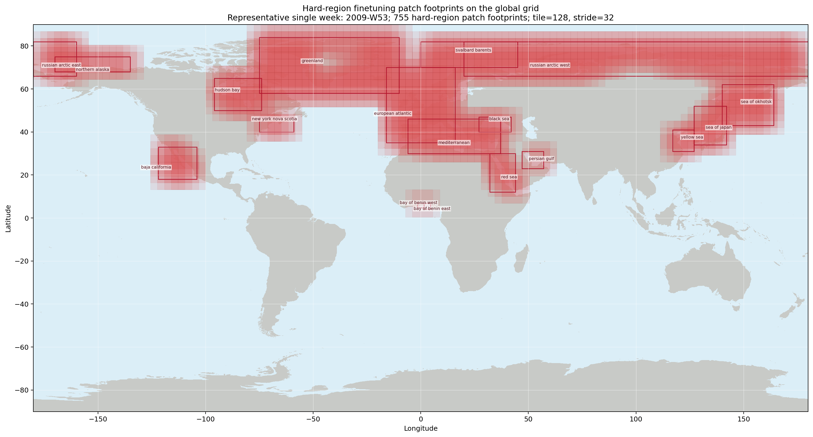

# Production Dataset

This page documents the maintained production dataset path. The active pixel
workflow reads the self-contained Hugging Face-style dataset folder at
`/work/data/OceanVariableReconstruction` through
`ArgoGeoTIFFGriddedPatchDataset`, the maintained production dataloader path.

Use [Data Sources](data-source.md) for native product properties,
[Depth Alignment](depth-alignment.md) for ARGO-to-GLORYS vertical resampling,
and [Data Export](data-export.md) for rebuilding the packaged folder.

## Dataset Root

Expected local structure:

```text
/work/data/OceanVariableReconstruction/
  manifest.yaml
  rasters/
  argo/argo_profiles_on_grid.zarr/
  data/argo_glors_ostia_ssh.zarr/
  masks/world_land_mask_glorys_0p1.tif
  metadata/
  indices/
```

The active config is `src/depth_recon/configs/px_space/training_super_config.yaml`.
It sets `data.dataset.core.geotiff_root_dir` to the package root and uses
dataset-root-relative mask paths such as `masks/world_land_mask_glorys_0p1.tif`.

## Dataset Assembly

At runtime, the loader:

1. Reads `manifest.yaml` from the package root.
2. Resolves dense raster paths under root-level `rasters/`.
3. Opens compact ARGO profiles from `argo/argo_profiles_on_grid.zarr`.
4. Builds a deterministic land-mask-derived patch grid from `masks/`.
5. Assigns train/val from `split.val_year` when overlapping patches are enabled.
6. Reads GeoTIFF rasters and compact ARGO profiles lazily per sample.

Only metadata caches are written under `dataset.core.metadata_cache_dir`.
Model-facing tensors are produced on demand.

## Patch Grid Concept

A patch is a fixed-size window on the 0.1 degree GLORYS grid. The production
configuration uses `tile_size: 128`, so each patch covers 128 by 128 grid cells.
Instead of placing every patch once in a non-overlapping grid, the loader moves
the window by `patch_stride`. The default GeoTIFF stride is 32 cells, which means
nearby patches overlap by 75% of their width and height.

The same world grid is reused every time the dataset is instantiated. That makes
the patch locations deterministic: changing the date range changes which
timesteps are available, but it does not move the patch boundaries.


The global view shows all candidate patch windows. Transparent outlines make
overlap visible: darker regions are covered by more candidate patches. Retained
patches pass the ocean/land rules, force-included patches are retained by a
regional override, and rejected patches are land-heavy candidates that are not
used for training or validation rows.

## Patch Filtering

The grid is built from the packaged GLORYS-aligned land-mask GeoTIFF:
`/work/data/OceanVariableReconstruction/masks/world_land_mask_glorys_0p1.tif`.
In that mask, `1` means land and `0` means ocean. For each candidate patch, the
dataset computes the fraction of land pixels and keeps the patch when
`land_fraction <= dataset.grid.max_land_fraction`.

The default cap is `0.30`, so normal retained patches are at least 70% ocean.
Patches centered on the Mediterranean, Baltic, Red Sea, and Hudson Bay are force-included with a relaxed land cap through
`dataset.grid.force_include_regions`, because those water bodies are narrow or coastline-heavy and would
otherwise lose useful ocean context around coastlines.

Hard-area finetuning can temporarily extend these relaxed grid regions through
`dataset.finetune_sampling.hard_regions` when `dataset.finetune_sampling.enabled=true`
and `dataset.finetune_sampling.relax_land_filter=true`. That run-specific extension
lets coast-heavy patches enter the train split for the 75/25 hard/easy finetune mix
without changing the default training or validation patch registry.

The figure labels show the current region-specific land caps and retained patch counts.
The overview marks the configured bounding boxes and retained force-include patch centers for
the stride-32 GeoTIFF preset. The regional panel shows the corresponding 128-pixel
patch footprints over the committed land mask.


Overlapping patches mean an ARGO profile is not tied to only one spatial
context. If a profile falls inside several retained patch bounds, it can
contribute support to each matching `(patch, date)` row. The stride-32 GeoTIFF
preset increases these contexts compared with the earlier half-overlap grid,
giving each profile more local visual neighborhoods during training.


## Patch Registry Storage

During dataset instantiation, the loader expands the retained patch table across
the available OSTIA dates, then filters those dates to the GLORYS and sea-level
coverage already present on disk. The resulting registry is a table of
`(patch_id, date)` rows and becomes `dataset.rows`.

Each patch row stores the grid indices, latitude/longitude bounds, center
coordinates, `land_fraction`, `ocean_fraction`, `invalid_fraction`, and any
force-include metadata. Each date row stores the timestep, split assignment, and
optional ARGO-support count. Cache filenames include the grid source, stride,
tile size, land threshold, temporal window, split policy, and mask metadata so a
changed configuration creates a new cache instead of reusing stale rows.

The cache is metadata only. It records where patches are and which dates are
valid; it does not store precomputed GLORYS, OSTIA, sea-level, or ARGO tensors.

## Sample Visualization

Representative surface-level training patches show the image-like model input
and target layout used by the dataset.


## Sample Read Path

When training asks for an item, `__getitem__` reads one registry row, converts
the stored patch bounds back into source-file slices, and lazily loads the
matching GLORYS, OSTIA, and sea-level data for that date. ARGO profiles are
selected by the patch bounds and the configured temporal window, projected onto
the GLORYS depth axis, then rasterized into the sample tensors and validity
masks.

## Spatial And Temporal Semantics

- `dataset.grid.tile_size` controls patch height/width.
- `dataset.grid.resolution_deg` controls patch pixel spacing.
- `dataset.grid.patch_stride` controls patch overlap; values below `tile_size`
  require `split.val_year`.
- `dataset.grid.max_land_fraction` filters land-heavy patches from the
  committed GLORYS-aligned world mask.
- `dataset.grid.force_include_regions` keeps patches centered on the Mediterranean, Baltic, Red Sea, and Hudson Bay up
  to a relaxed land fraction so the training registry retains those water bodies.
- `dataset.finetune_sampling.*` can filter the train split to named hard-region
  patch centers and add those boxes as run-specific relaxed land-fraction regions.
- `dataset.sampling.temporal_window_days` controls the centered ARGO profile
  search window for each patch date.
- `dataset.selection.require_argo_for_train` defaults to `false`;
  `dataset.selection.require_argo_for_val` defaults to `true`.
- `dataset.selection.require_argo_for_all` defaults to `false` so global
  inference can cover rows without ARGO observations.
- `split.val_year` defaults to `2018`, assigning that year to validation and
  all other years to training.

## Depth Semantics

- GLORYS `thetao` defines the dense target `y`.
- ARGO `TEMP` is projected from `DEPH_CORRECTED` samples onto the GLORYS depth
  axis before rasterization.
- `dataset.depth_axis_m` exposes the physical GLORYS depth levels to inference
  and export code.

## Output Contract

Each sample returns `eo`, `x`, `y`, `x_valid_mask`, `y_valid_mask`,
`x_valid_mask_1d`, `land_mask`, `date`, and optional `coords`/`info`. `x_valid_mask` is ARGO observation support and `land_mask` is GLORYS spatial support for conditioning/loss, falling back to OSTIA finite support and then the on-disk mask if GLORYS support is unavailable. The common on-disk mask is loaded only by prediction/export paths when final cleanup is needed.

See [Data Contract](data-contract.md) for the full tensor contract.


## Finetuning

Hard-area finetuning is disabled by default and can be enabled with
`data.dataset.finetune_sampling.enabled=true`. When enabled for the train split,
the GeoTIFF dataset keeps all rows whose patch centers fall inside the configured
hard regions, then adds a deterministic random sample of easy rows to target the
configured 75/25 hard/easy mix. Validation keeps the normal global split so the
main validation metric stays comparable across runs.

When `data.dataset.finetune_sampling.relax_land_filter=true`, the same hard-region
boxes are also added as run-specific relaxed land-fraction regions before the
patch registry is built. This lets narrow coastline-heavy areas enter finetuning
without changing the default training grid.


