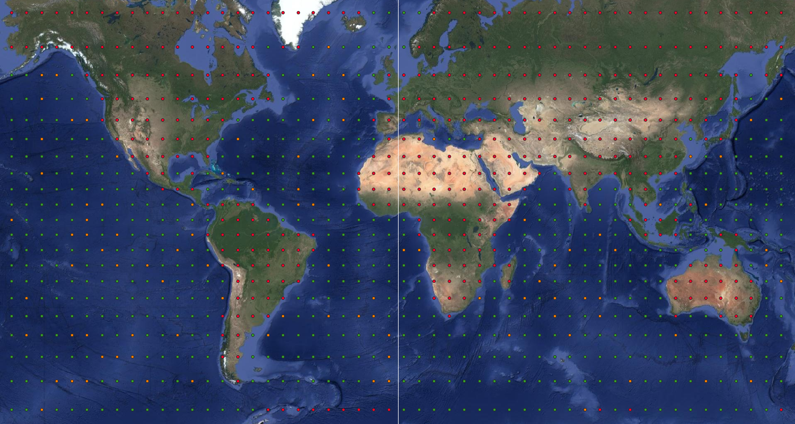

# Production Datasets
This page documents the non-toy datasets currently used in DepthDif:
- OSTIA L4 reprocessed daily sea-surface temperature (EO condition)
- EN4.2.2 profile archives (submarine/in-situ profile observations)

## 1) OSTIA L4 Reprocessed (EO Surface Condition)
Source:
- Copernicus Marine product: `SST_GLO_SST_L4_REP_OBSERVATIONS_010_011`
- Dataset ID used for download: `METOFFICE-GLO-SST-L4-REP-OBS-SST`

Coverage used:
- Daily files from `2010-01-01` to `2024-07-31`
- Global grid at 0.05 degree

Filename structure:
- `YYYYMMDD120000-UKMO-L4_GHRSST-SSTfnd-OSTIA-GLOB_REP-v02.0-fv02.0.nc`
- Example: `20100206120000-UKMO-L4_GHRSST-SSTfnd-OSTIA-GLOB_REP-v02.0-fv02.0.nc`

Logical structure in each NetCDF:
- One daily time slice (12:00 UTC snapshot)
- 2D global fields on latitude/longitude grid
- Main variable used here: `analysed_sst`

Download workflow in this repo:
- Script: `data/get_ostia/download_ostia.sh`
- Behavior:
  - Checks each day (dry-run availability)
  - Immediately downloads that day if available
  - Writes CSV log for each day (`filename,path,datetime,status`)
  - Prints progress and ETA

### Building the OSTIA Patch Dataset (0.05 degree grid)
Patch-level train/val indexing is built from the downloaded OSTIA files using:
- Script: `data/get_ostia/build_ostia_patch_time_index.py`
- Input: daily OSTIA NetCDF files in `ostia_dir`
- Logic:
  - infer native OSTIA resolution (0.05 degree when using default inference)
  - build fixed-size spatial patches on that grid
  - classify each patch as `invalid`/`train`/`val` from invalid-pixel fraction
  - expand spatial patches to daily `(patch, day)` rows
- Outputs:
  - spatial patch metadata CSV (`ostia_patch_index_spatial.csv`)
  - daily expanded CSV (`ostia_patch_index_daily.csv`)

Recommended command (native OSTIA resolution):

```bash
/work/envs/depth/bin/python data/get_ostia/build_ostia_patch_time_index.py \
  --ostia-dir /data1/datasets/depth_v2/ostia \
  --output-spatial-csv /data1/datasets/depth_v2/ostia_patch_index_spatial.csv \
  --output-daily-csv /data1/datasets/depth_v2/ostia_patch_index_daily.csv \
  --tile-size 128 \
  --invalid-threshold 0.2 \
  --val-fraction 0.15 \
  --split-seed 7 \
  --valid-mask-values 1
```

Notes for this command:
- if `--resolution-deg` is omitted, native OSTIA spacing is inferred from file coordinates (`~0.05°`)
- patch geographic span is `tile_size * resolution_deg` per axis
- invalid patches are excluded by default (`train`/`val` only); use `--include-invalid` to keep them

Patch split visualization (red = land/invalid, green = train, yellow = val):



Source portal:
- <https://data.marine.copernicus.eu/product/SST_GLO_SST_L4_REP_OBSERVATIONS_010_011>

## 2) EN4.2.2 Profiles (Argo + Other In-Situ)
Source:
- UK Met Office Hadley Centre EN4 page:
  <https://www.metoffice.gov.uk/hadobs/en4/download-en4-2-2.html>

Coverage used:
- Yearly profile archives from `2010` onward
- Files are annual ZIPs

Filename structure:
- `EN.4.2.2.profiles.g10.YYYY.zip`
- Example: `EN.4.2.2.profiles.g10.2022.zip`

Direct URL structure:
- `https://www.metoffice.gov.uk/hadobs/en4/data/en4-2-1/EN.4.2.2.profiles.g10.YYYY.zip`

Archive content structure (high-level):
- One ZIP per year containing profile observation files for that year
- Includes Argo and other in-situ profile sources used in EN4

Download workflow in this repo:
- Script: `data/get_argo/download_en4_profiles.sh`
- Behavior:
  - Checks each year URL availability
  - Immediately downloads when available
  - Writes CSV log including transfer stats
    (`filename,path,datetime,status,expected_bytes,downloaded_bytes,duration_seconds,avg_mb_per_s`)
  - Prints per-file live progress (size/speed/ETA), plus run progress/ETA

## 3) Argo <-> OSTIA Datetime Matching
After EN4 monthly NetCDF profile files are available in
`/data1/datasets/depth_v2/en4_profiles`, build the datetime matching table:

```bash
/work/envs/depth/bin/python data/get_argo/build_argo_datetime_match_index.py \
  --argo-dir /data1/datasets/depth_v2/en4_profiles \
  --ostia-dir /data1/datasets/depth_v2/ostia \
  --output-csv /data1/datasets/depth_v2/argo_profile_datetime_match.csv
```

Script:
- `data/get_argo/build_argo_datetime_match_index.py`

Output columns:
- `argo_row_id`
- `argo_month_key`
- `argo_profile_date`
- `profile_idx`
- `argo_file_path`
- `matched_ostia_date`
- `matched_ostia_file_path`

Matching behavior:
- convert EN4 `JULD` to `YYYYMMDD`
- for each profile date, choose nearest OSTIA day within the same month
- unreadable/corrupted EN4 files are skipped

## 4) Single Source-Of-Truth Daily CSV
Merge Argo validity into the OSTIA daily patch CSV:

```bash
/work/envs/depth/bin/python data/get_argo/merge_argo_into_ostia_daily_index.py \
  --daily-csv /data1/datasets/depth_v2/ostia_patch_index_daily.csv \
  --argo-match-csv /data1/datasets/depth_v2/argo_profile_datetime_match.csv \
  --output-csv /data1/datasets/depth_v2/ostia_patch_index_daily.csv
```

Script:
- `data/get_argo/merge_argo_into_ostia_daily_index.py`

Added columns in final daily CSV:
- `argo_valid` (`1` if day has matched Argo profiles, else `0`)
- `argo_profile_count` (matched profile count for that day)
- `argo_month_key`
- `argo_file_path`

## End-To-End Build Order
Run these steps in order:
1. Download OSTIA daily files (`data/get_ostia/download_ostia.sh`).
2. Download EN4 profile data (`data/get_argo/download_en4_profiles.sh`) and extract `.nc` files, for example:

```bash
mkdir -p /data1/datasets/depth_v2/en4_profiles
for z in /data1/datasets/depth_v2/en4_profiles/*.zip; do
  unzip -o "$z" -d /data1/datasets/depth_v2/en4_profiles
done
```

Then ensure monthly files like `EN.4.2.2.f.profiles.g10.YYYYMM.nc` exist in that folder.
3. Build OSTIA patch index (`data/get_ostia/build_ostia_patch_time_index.py`).
4. Build Argo datetime match table (`data/get_argo/build_argo_datetime_match_index.py`).
5. Merge into one final daily CSV (`data/get_argo/merge_argo_into_ostia_daily_index.py`).

## Parameter Tuning Guide (OSTIA Patch Index)
Most relevant knobs in `build_ostia_patch_time_index.py`:
- `--tile-size`: patch size in pixels (`128` means 128x128)
- `--resolution-deg`: pixel size in degrees; omit for native OSTIA
- `--invalid-threshold`: max invalid fraction before patch is marked invalid
- `--val-fraction`: fraction of valid water patches assigned to `val`
- `--split-seed`: deterministic train/val split seed
- `--valid-mask-values`: OSTIA mask classes counted as valid water
- `--include-invalid`: include invalid/land patches in outputs

Examples:
- native 0.05° OSTIA patches: omit `--resolution-deg`
- custom 0.1°/pixel patches: set `--resolution-deg 0.1`

## Operational Notes
- Both download scripts support `DRY_RUN_ONLY=1` for availability checks without downloading.
- Both download scripts append tracking CSV logs in the output directory by default.
- For EN4, `404` means the specific year/file is not present at the current published path.
