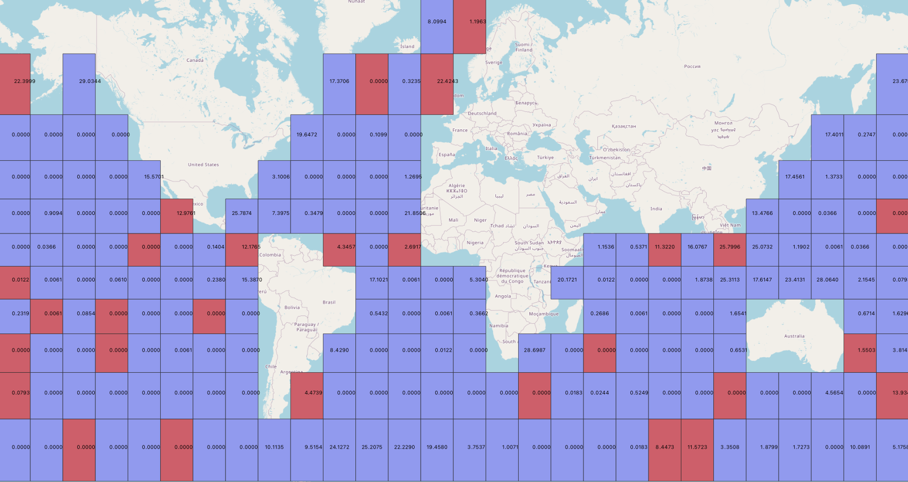
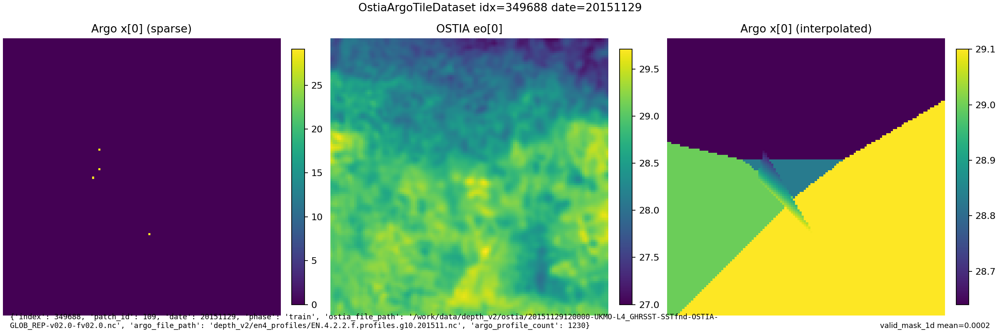
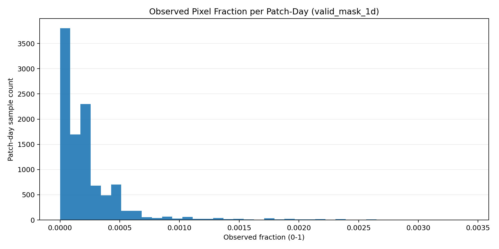
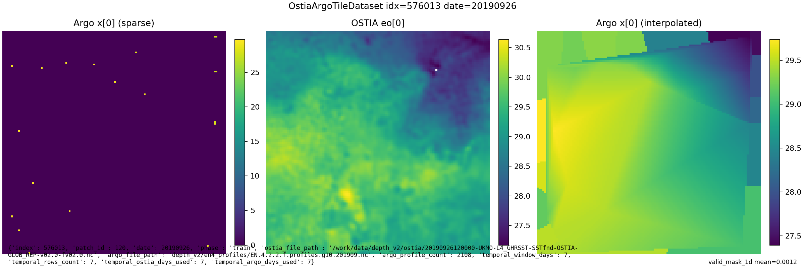
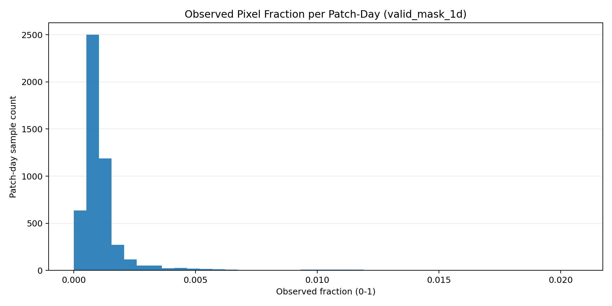

# Production Dataset
This page documents the production dataset assembly pipeline: how the raw products are aligned in space, time, and depth, how the indexing CSVs are built, and what the current dataset versions look like.

Use [Data Sources](data-source.md) for native product properties and [Depth Alignment](depth-alignment.md) for the detailed ARGO-to-GLORYS vertical resampling procedure.

## Scope
The production workflow aligns the sources in three ways:
1. Spatially: build a fixed OSTIA-derived patch grid and sample all modalities on the same patch footprint.
2. Temporally: expand that grid into daily rows, attach nearest-source metadata, and optionally aggregate a multi-day window.
3. Depth-wise: project ARGO profiles onto the GLORYS depth coordinate before rasterization; see [Depth Alignment](depth-alignment.md).
  
## Source Inputs Required  
Expected source trees:  
- `/data1/datasets/depth_v2/ostia`  
- `/data1/datasets/depth_v2/en4_profiles`  
- optional aligned GLORYS helpers in `/data1/datasets/depth_v2/glorys_weekly`  
  
Main build scripts:  
- `data/get_ostia/build_ostia_patch_time_index.py`  
- `data/get_argo/build_argo_datetime_match_index.py`  
- `data/get_argo/merge_argo_into_ostia_daily_index.py`  
  
## 1) Spatial Sampling  
The fixed patch geometry is derived from OSTIA because OSTIA defines the surface EO coverage.  
  
Patch-grid logic:  
- infer or set the pixel resolution  
- choose a tile size  
- classify each spatial tile as valid or invalid from OSTIA land-flag coverage  
- split valid water tiles into `train` and `val`  
  
Current commonly used setup:  
- pixel resolution: `0.1°`  
- tile size: `128 x 128`  
- physical span: `12.8° x 12.8°`  
  
Recommended native-grid OSTIA patch-index build:  
  
```bash  
/work/envs/depth/bin/python data/get_ostia/build_ostia_patch_time_index.py \  
  --ostia-dir /data1/datasets/depth_v2/ostia \  
  --glorys-dir /data1/datasets/depth_v2/glorys_weekly \  
  --output-spatial-csv /data1/datasets/depth_v2/ostia_patch_index_spatial.csv \  
  --output-daily-csv /data1/datasets/depth_v2/ostia_patch_index_daily.csv \  
  --tile-size 128 \  
  --invalid-threshold 0.5 \  
  --invalid-mask-flags land \  
  --val-fraction 0.15 \  
  --split-seed 7  
```  

Current default semantics:
- `invalid_fraction` measures the fraction of sampled pixels whose OSTIA `mask` carries the `land` flag
- sea ice is kept by default
- the spatial CSV already includes a WKT polygon column for each patch
  
Spatial split visualization:  
  
  
## 2) Temporal Sampling
After the spatial patch grid exists, the production dataset expands it across time.  
  
### Daily Sampling  
Daily OSTIA index rows are:  
- one row per `(patch, day)`  
- each row contains:  
  - patch bounds  
  - split label  
  - OSTIA file path for that day  
  - nearest weekly GLORYS file metadata for that day  
  
ARGO is then attached date-wise:  
- EN4 `JULD` is converted to `YYYYMMDD`  
- each ARGO profile day is matched to the nearest OSTIA day in the same month  
- each ARGO profile day is also matched to the nearest weekly GLORYS file across the weekly archive  
- that match metadata is merged into the daily patch CSV  
  
Datetime match command:  
  
```bash  
/work/envs/depth/bin/python data/get_argo/build_argo_datetime_match_index.py \  
  --argo-dir /data1/datasets/depth_v2/en4_profiles \  
  --ostia-dir /data1/datasets/depth_v2/ostia \  
  --glorys-dir /data1/datasets/depth_v2/glorys_weekly \  
  --output-csv /data1/datasets/depth_v2/argo_profile_datetime_match.csv  
```  
  
Merge command:  
  
```bash  
/work/envs/depth/bin/python data/get_argo/merge_argo_into_ostia_daily_index.py \  
  --daily-csv /data1/datasets/depth_v2/ostia_patch_index_daily.csv \  
  --argo-match-csv /data1/datasets/depth_v2/argo_profile_datetime_match.csv \  
  --output-csv /data1/datasets/depth_v2/ostia_patch_index_daily.csv  
```  
  
### Multi-Day Temporal Windows
The dataset layer can also aggregate a centered time window instead of one single day.

Current behavior in the production loader:
- `days=1` keeps single-day behavior
- `days=7` aggregates a seven-day temporal window around the target row date
- the output stays one spatial sample with aggregated observations, not `7x` stacked temporal channels

Interpretation:
- single observations may contribute to multiple neighboring daily rows when they fall inside the configured temporal window
- this increases observation density without changing the fixed output tensor shape

## 3) Depth Alignment Summary
- ARGO profile temperatures are resampled onto the GLORYS `depth` coordinate before tile aggregation.
- The raw dataset currently uses the full 50 GLORYS depth levels for `x`, `y`, and `valid_mask`.
- Targets outside the observed ARGO depth range, or outside the nearest-depth cutoff, remain invalid.
- The detailed profile-level procedure is documented on [Depth Alignment](depth-alignment.md).

## 4) Production Index Files
Core CSV artifacts:  
- `ostia_patch_index_spatial.csv`  
- `ostia_patch_index_daily.csv`  
- `argo_profile_datetime_match.csv`  
  
Important path-format rule:  
- stored paths are anchored at `depth_v2/...` rather than absolute machine-specific paths  
- this keeps the dataset tree relocatable  
  
Columns typically added during ARGO merge:  
- `argo_valid`  
- `argo_profile_count`  
- `argo_month_key`  
- `argo_file_path`  

Columns now written during CSV generation for nearest weekly GLORYS lookup:  
- `matched_glorys_date`  
- `matched_glorys_file_path`  
- `matched_glorys_abs_day_delta`  
  
## 5) Current Dataset Versions
Snapshot numbers below were measured/recomputed on **March 10, 2026**.  
  
Shared source inventory:  
- OSTIA daily files (`ostia/*.nc`): `5,326`  
- EN4 monthly profile files (`en4_profiles/*.nc`): `186`  
- daily-index date range: `2010-01-01` to `2024-07-31`  
  
### Version A: 0.05 Degree, Daily  
Files:  
- `ostia_patch_index_spatial.csv`  
- `ostia_patch_index_daily.csv`  
  
Counts:  
- spatial patches: `751`  
- spatial split: `638 train`, `113 val`  
- daily rows: `3,999,826`  
- daily split rows: `3,397,988 train`, `601,838 val`  
- rows with `argo_valid=1`: `3,153,449` (`78.84%`)  
- rows with `argo_valid=0`: `846,377` (`21.16%`)  
  
### Version B: 0.1 Degree, Daily  
Files:  
- `ostia_patch_index_spatial_0p1_recomputed.csv`  
- `ostia_patch_index_daily_0p1_recomputed_merged.csv`  
  
Counts:  
- spatial patches: `175`  
- spatial split: `149 train`, `26 val`  
- daily rows: `932,050`  
- daily split rows: `793,574 train`, `138,476 val`  
- rows with `argo_valid=1`: `734,825` (`78.84%`)  
- rows with `argo_valid=0`: `197,225` (`21.16%`)  
  
Sample Image:  
  
  
Train-set valid-fraction histogram:  
  
  
### Version C: 0.1 Degree, 7-Day Aggregate  
Interpretation:  
- the same spatial grid as Version B  
- temporal support expanded to a centered 7-day window  
- observations contribute to multiple neighboring rows when they overlap in time  
  
Counts:  
- patch-day rows: `932,050`  
- spatial split: `149 train`, `26 val`  
- daily split rows: `793,574 train`, `138,476 val`  
- rows without any ARGO observations after aggregation: about `1.5%`  
- average observations for valid tiles: about `20.5`  
  
Sample Image:  
  
  
Train-set valid-fraction histogram:  
  
  
  
## 6) End-To-End Build Order
1. Download OSTIA daily files with `data/get_ostia/download_ostia.sh`.  
2. Download and extract EN4 profile data with `data/get_argo/download_en4_profiles.sh`.  
3. Build the OSTIA spatial and daily patch index.  
4. Build the ARGO <-> OSTIA datetime match table.  
5. Merge ARGO validity and linkage columns into the daily patch CSV.  
6. Choose the dataset version:  
   - daily rows  
   - or multi-day temporal windows at load time  
  
## 7) Practical Interpretation
This page focuses on the assembled dataset geometry:
- where the shared patch footprints come from
- how rows are expanded across time
- how ARGO, OSTIA, and GLORYS metadata are linked per row
- how depth alignment enters the final tensors at a high level

The detailed vertical resampling logic lives in [Depth Alignment](depth-alignment.md).
