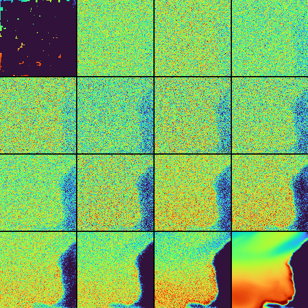
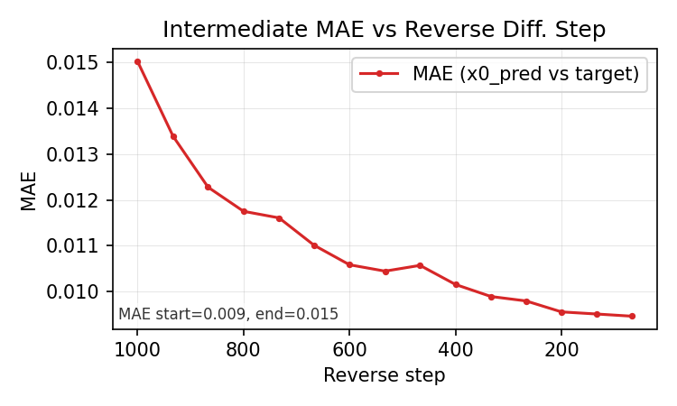
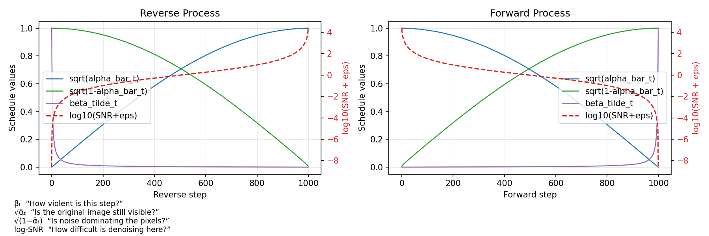

# Sampling Process Diagnostics  
Current validation sampling uses a cosine-guided noise schedule.  
  
Logged diagnostics include:  
- intermediate denoising frames  
- MAE vs reverse denoising step (using per-step `x0` prediction)  
- diffusion schedule profiles (`sqrt(alpha_bar_t)`, `sqrt(1-alpha_bar_t)`, `beta_tilde_t`, `log10(SNR+eps)`)  
  
Observed DDPM tradeoff:  
- many early steps remain highly noisy  
- compute is spent on low-visual-information stages  
  
Current DDIM status:  
- DDIM sampling works for validation and inference and gives the intended compute/fidelity tradeoff.  
- In current qualitative checks, 50 DDIM steps is the practical minimum that still gives acceptable results; use more steps when visual fidelity matters more than runtime.  

Potential improvement directions:  
- alternate schedules  
- parameterization choices (`x0` vs `epsilon`)  
  
Intermediate reconstructions over the denoising path:  
{ width="40%" }  
  
MAE trend across intermediate denoising steps:  
{ width="50%" }  
  
Implemented schedule options in code:  
- `linear`  
- `cosine`  
- `quadratic`  
- `sigmoid`  
  
Example schedule profile image:  
{ width="85%" }  
  
