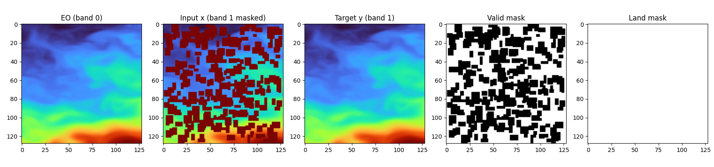

# Model Settings
This page maps key configuration flags to their runtime behavior in code.

Primary config files used in current EO setup:
- `configs/data_config_eo_4band.yaml`
- `configs/model_config_eo_4band.yaml`
- `configs/training_config_eo_4band.yaml`

Legacy single-band configs:
- `configs/older_configs/data_config.yaml`
- `configs/older_configs/model_config.yaml`
- `configs/older_configs/training_config.yaml`

## Major Settings
### Conditioning channels
Config (`model_config_*`):
- `model.generated_channels`
- `model.condition_channels`
- `model.condition_mask_channels`
- `model.condition_include_eo`
- `model.condition_use_valid_mask`

Runtime effect:
- controls how `condition = [eo?, x, valid_mask?]` is assembled
- channel count is validated against expected `condition_channels`

### Diffusion target parameterization
Config:
- `model.parameterization`: `epsilon` or `x0`

Runtime effect:
- defines target in diffusion loss and sampler conversions
- current EO config uses `x0`

### Masked loss
Config:
- `model.mask_loss_with_valid_pixels`

Runtime effect:
- if enabled, loss is computed on missing pixels (`1 - valid_mask`)
- optionally gated by `land_mask` to focus on ocean pixels
- mask alignment preserves per-band semantics (`B x C x H x W`) unless a single shared mask channel is explicitly used

### Inference output composition
Runtime effect:
- final output keeps observed pixels from `x` where `valid_mask=1`
- model predictions are used where `valid_mask=0`
- `land_mask` is then applied to zero land pixels

### Known-pixel clamping during sampling
Config:
- `model.clamp_known_pixels`

Runtime effect:
- if enabled and known masks/values are available, known pixels are overwritten each reverse step
- useful for inpainting-style stability

Illustration:  

### Coordinate/date FiLM conditioning
Config:
- data: `dataset.return_coords`
- model:
  - `coord_conditioning.enabled`
  - `coord_conditioning.encoding`
  - `coord_conditioning.include_date`
  - `coord_conditioning.date_encoding`
  - `coord_conditioning.embed_dim`

Runtime effect:
- creates a coordinate/date embedding and injects it via FiLM in ConvNeXt blocks
- details: [Date + Coordination Injection](date-coordination-injection.md)

## Training and Optimization Settings
### Noise schedule and diffusion steps
Config (`training.noise`):
- `num_timesteps`
- `schedule`: `linear`, `cosine`, `quadratic`, `sigmoid`
- `beta_start`, `beta_end`

### Validation sampling mode
Config (`training.validation_sampling`):
- `sampler`: `ddpm` or `ddim`
- `ddim_num_timesteps`, `ddim_eta`
- `log_intermediates`

Runtime effect:
- training loss still uses forward noising objective
- full reverse sampling diagnostics use chosen validation sampler

### Learning-rate warmup and plateau scheduler
Config (`scheduler`):
- `warmup.enabled`, `warmup.steps`, `warmup.start_ratio`
- `reduce_on_plateau.enabled`
- `reduce_on_plateau.monitor`, `mode`, `factor`, `patience`, `threshold`, `cooldown`

Runtime effect:
- warmup is applied per optimizer step in `optimizer_step`
- plateau scheduler is applied on epoch-level monitored metric

## Trainer/Runtime Controls
Config (`trainer`):
- hardware/precision: `accelerator`, `devices`, optional `num_gpus`, `precision`
- logging/checkpoint cadence: `log_every_n_steps`, `ckpt_monitor`, `lr_logging_interval`
- validation load: `val_batches_per_epoch` or `limit_val_batches`
- stability knobs: `gradient_clip_val`, warning suppressions

## Dataloader Settings
Config (`dataloader`):
- `batch_size`, `val_batch_size`
- `num_workers`, `val_num_workers`
- `shuffle`, `val_shuffle`
- `pin_memory`, `persistent_workers`, `prefetch_factor`

Runtime notes:
- `prefetch_factor` is only applied when `num_workers > 0`
- validation shuffle defaults to true in DataModule unless explicitly changed

## Logging Settings (W&B)
Config (`wandb`):
- project/entity/run naming
- model logging policy
- watch toggles (`watch_gradients`, `watch_parameters`)
- scalar/image logging intervals

Runtime notes:
- watch mode is resolved from explicit gradient/parameter toggles
- config files used in the run are uploaded to W&B run files when possible
