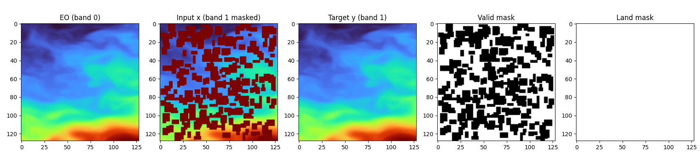

# Model Settings  
This page maps key configuration flags to their runtime behavior in code.  

Primary config files used in current EO setup:  
- `src/depth_recon/configs/px_space/data_ostia_argo_netcdf.yaml` (OSTIA + Argo + GLORYS lazy NetCDF training preset)  
- `src/depth_recon/configs/px_space/model_config.yaml`  
- `src/depth_recon/configs/px_space/model_config_ambient.yaml`  
- `src/depth_recon/configs/px_space/training_config.yaml`  

Latent-space config set:  
- `src/depth_recon/configs/lat_space/model_config.yaml`  
- `src/depth_recon/configs/lat_space/training_config.yaml`  
- `src/depth_recon/configs/lat_space/ae_config.yaml`  

See [Autoencoder + Latent Diffusion](autoencoder.md) for latent architecture and training workflow.  

## Major Settings  
### Conditioning channels  
Config (`model_config_*`):  
- `model.generated_channels`  
- `model.condition_channels`  
- `model.condition_mask_channels`  
- `model.condition_include_eo`  
- `model.condition_use_valid_mask`  

Runtime effect:  
- controls how `condition = [eo?, x, x_valid_mask?]` is assembled  
- channel count is validated against expected `condition_channels`  

### Diffusion target parameterization  
Config:  
- `model.parameterization`: `epsilon` or `x0`  

Runtime effect:  
- defines target in diffusion loss and sampler conversions  
- current EO config uses `x0`  

### Masked loss  
Config:  
- `model.mask_loss_with_valid_pixels`  

Runtime effect:  
- if enabled, loss uses the task-valid support instead of the old missing-pixel mask  
- standard mode: `y_valid_mask` over the full `y` target  
- ambient mode: `x_valid_mask ∩ y_valid_mask` over the `x` target  
- mask alignment preserves per-band semantics (`B x C x H x W`) unless a single shared mask channel is explicitly used  

### Inference output composition  
Runtime effect:  
- direct `y` prediction keeps the generated field and masks invalid `y_valid_mask` support to `NaN`  
- ambient `x` completion leaves known-pixel enforcement to `clamp_known_pixels` during sampling  
- both modes then mask invalid `y_valid_mask` support to `NaN`  

### Known-pixel clamping during sampling  
Config:  
- `model.clamp_known_pixels`  

Runtime effect:  
- if enabled and known masks/values are available, known pixels are overwritten each reverse step  
- useful for inpainting-style stability  

Illustration:  
  

### Coordinate/date FiLM conditioning  
Config:  
- data: `dataset.output.return_coords`  
- model:  
  - `coord_conditioning.enabled`  
  - `coord_conditioning.encoding`  
  - `coord_conditioning.include_date`  
  - `coord_conditioning.date_encoding`  
  - `coord_conditioning.embed_dim`  

Runtime effect:  
- creates a coordinate/date embedding and injects it via FiLM in ConvNeXt blocks  
- details: [Data + Coordinate Injection](data-coordinate-injection.md)  

## Training and Optimization Settings  
### Noise schedule and diffusion steps  
Config (`training.noise`):  
- `num_timesteps`  
- `schedule`: `linear`, `cosine`, `quadratic`, `sigmoid`  
- `beta_start`, `beta_end`  

### Validation sampling mode  
Config (`training.validation_sampling`):  
- `sampler`: `ddpm` or `ddim`  
- `ddim_num_timesteps`, `ddim_eta`, `ddim_temperature`  
- `log_intermediates`  

Runtime effect:  
- training loss still uses forward noising objective  
- full reverse sampling diagnostics use chosen validation sampler  

### Exponential moving average weights  
Config (`model.ema`):  
- `enabled`: disabled by default  
- `decay`: EMA smoothing factor, e.g. `0.9999`  
- `apply_every_n_steps`: optimizer-step cadence for updates  
- `start_step`: first global step where updates may run  
- `save_ema_weights_in_callback_state`: stores EMA weights in Lightning checkpoints  
- `evaluate_ema_weights_instead`: swaps EMA weights in for validation/test, then restores training weights  

Runtime effect:  
- EMA is wired as a Lightning callback in `train.py`  
- checkpoints keep raw training weights for resume plus EMA weights in callback state when saving is enabled  
- validation image logging emits both `x_y_full_reconstruction_standard` and  
  `x_y_full_reconstruction_ema` when EMA is enabled  
- validation also logs `val_standard/*`, `val_ema/*`, and raw-vs-EMA weight  
  diagnostics under `ema/*`  

### Learning-rate warmup and plateau scheduler  
Config (`scheduler`):  
- `warmup.enabled`, `warmup.steps`, `warmup.start_ratio`  
- `reduce_on_plateau.enabled`  
- `reduce_on_plateau.monitor`, `interval`, `mode`, `factor`, `patience`, `threshold`, `cooldown`  

Runtime effect:  
- warmup is applied per optimizer step in `optimizer_step`  
- plateau scheduler is applied on the configured `step` or `epoch` interval  
- the default plateau monitor remains validation loss; cheap validation loss can use  
  more batches without increasing the single full-reconstruction pass per validation run  

## Trainer/Runtime Controls  
Config (`trainer`):  
- hardware/precision: `accelerator`, `devices`, optional `num_gpus`, `precision`  
- logging/checkpoint cadence: `log_every_n_steps`, `ckpt_monitor`, `lr_logging_interval`  
- validation cadence/load: `val_check_interval`, `val_batches_per_epoch`, or `limit_val_batches`  
- stability knobs: `gradient_clip_val`, warning suppressions  

## Dataloader Settings  
Config (`dataloader`):  
- `batch_size`, `val_batch_size`  
- `num_workers`, `val_num_workers`  
- `shuffle`, `val_shuffle`  
- `pin_memory`, `persistent_workers`, `prefetch_factor`  

Runtime notes:  
- `prefetch_factor` is only applied when `num_workers > 0`  
- validation shuffle defaults to true in DataModule unless explicitly changed  

## Logging Settings (W&B)  
Config (`wandb`):  
- project/entity/run naming  
- model logging policy  
- watch toggles (`watch_gradients`, `watch_parameters`)  
- scalar/image logging intervals  

Runtime notes:  
- watch mode is resolved from explicit gradient/parameter toggles  
- config files used in the run are uploaded to W&B run files when possible  

## FUll settings documentation  
This section contains the complete key-by-key configuration reference previously documented on the separate Configs page.  

### Dataset Configs (`src/depth_recon/configs/px_space/data_ostia_argo_netcdf.yaml`)  
Dataset settings are grouped by intent (`core`, `grid`, `sampling`, `selection`, `output`, `runtime`).  
Defaults below refer to `src/depth_recon/configs/px_space/data_ostia_argo_netcdf.yaml` unless noted.  

| Config key | Default value | Explanation |  
|---|---|---|  
| `dataset.core.dataset_variant` | `"argo_netcdf_gridded"` | Selects the dataset implementation in `train.py`; use `"argo_geotiff_gridded"` with `src/depth_recon/configs/px_space/data_ostia_argo_geotiff.yaml` for exported GeoTIFF stores. |  
| `dataset.core.dataloader_type` | `"light"` | The current training runner supports only `"light"` loading. |  
| `dataset.core.argo_dir` | `"/data1/datasets/depth_v2/en4_profiles"` | Root directory scanned for raw ARGO/EN4 monthly NetCDF files. |  
| `dataset.core.glorys_dir` | `"/data1/datasets/depth_v2/glorys_weekly"` | Root directory scanned for GLORYS NetCDF target files. |  
| `dataset.core.ostia_dir` | `"/data1/datasets/depth_v2/ostia"` | Root directory scanned for OSTIA NetCDF EO files. |  
| `dataset.core.sealevel_dir` | `"/data1/datasets/depth_v2/sealevel_daily"` | Root directory scanned for sea-level NetCDF files used for optional metadata/diagnostics. |  
| `dataset.core.geotiff_root_dir` | `"/work/data/depthdif"` | Export root containing `manifest.yaml`, dense GeoTIFF rasters, and `argo/argo_profiles_on_grid.zarr` for the GeoTIFF dataset variant. |  
| `dataset.core.metadata_cache_dir` | `"/data1/datasets/depth_v2/depthdif_cache"` | Directory for compact patch/date metadata caches only. |  
| `dataset.grid.tile_size` | `128` | Patch height and width in pixels. |  
| `dataset.grid.resolution_deg` | `0.1` | Patch grid resolution in geographic degrees. |  
| `dataset.grid.patch_grid_source` | `"land_mask"` | Builds patch origins from the committed GLORYS-aligned land-mask GeoTIFF. Use `"ostia_mask"` for the legacy OSTIA-derived grid. |  
| `dataset.grid.land_mask_path` | `"src/depth_recon/data/dataset_creation/data_download_raw/get_world/world_land_mask_glorys_0p1.tif"` | GeoTIFF used when `patch_grid_source="land_mask"`; value `1` is land and `0` is water. |  
| `dataset.grid.patch_stride` | `64` NetCDF; `32` GeoTIFF | Pixel stride between patch origins. Values smaller than `tile_size` create overlapping patch views. |  
| `dataset.grid.max_land_fraction` | `0.30` | Maximum allowed fraction of land pixels in a land-mask-derived patch. |  
| `dataset.grid.force_include_regions` | Mediterranean bbox, max land `0.60` | Optional named lat/lon regions that keep patches whose centers fall inside the region using that region's relaxed `max_land_fraction`. |  
| `dataset.sampling.glorys_var_name` | `"thetao"` | GLORYS target variable. |  
| `dataset.sampling.ostia_var_name` | `"analysed_sst"` | OSTIA EO variable. |  
| `dataset.sampling.temporal_window_days` | `7` | Total date window centered on each patch date for Argo profile selection. |  
| `dataset.sampling.argo_temp_var_name` | `"TEMP"` | ARGO temperature profile variable projected onto the GLORYS depth axis. |  
| `dataset.sampling.argo_depth_var_name` | `"DEPH_CORRECTED"` | ARGO depth profile variable used for GLORYS-axis projection. |  
| `dataset.selection.require_argo_for_train` | `true` | Drops train rows with no Argo support. |  
| `dataset.selection.require_argo_for_val` | `true` | Drops validation rows with no Argo support. |  
| `dataset.selection.require_argo_for_all` | `false` | Keeps no-Argo rows for full-grid inference unless explicitly enabled. |  
| `dataset.synthetic.enabled` | `false` | If true, builds sparse `x` by sampling GLORYS `y` instead of ARGO profiles. |  
| `dataset.synthetic.pixel_count` | `250` | Number of horizontal pixels copied from GLORYS `y` into sparse `x` per patch. |  
| `dataset.output.return_info` | `false` | Returns per-sample metadata under `batch["info"]`. |  
| `dataset.output.return_coords` | `true` | Returns patch-center coordinates under `batch["coords"]`. |  
| `dataset.runtime.random_seed` | `7` | Seed used for deterministic split and random dataset sampling behavior. |  
| `dataset.runtime.cache_size` | `8` | Maximum number of open NetCDF files cached per source store. |  
| `split.val_year` | `2018` | Calendar year assigned to validation rows; all other years become training rows. Required when `patch_stride < tile_size` to avoid overlapping spatial train/val leakage. |  
| `split.val_fraction` | `0.2` | Patch fraction reserved for validation when `split.val_year` is null. |  

### `src/depth_recon/configs/px_space/model_config.yaml`  
| Config key | Default value | Explanation |  
|---|---|---|  
| `model.model_type` | `"cond_px_dif"` | Model type (`"cond_px_dif"` for pixel diffusion, `"latent_cond_dif"` for latent diffusion with AE bridge). |  
| `model.resume_checkpoint` | `false` | `false/null` starts from scratch; checkpoint path loads checkpoint state. |  
| `model.load_checkpoint_only` | `false` | When `true`, loads model `state_dict` only; when `false`, resumes optimizer/scheduler/trainer state too. |  
| `model.generated_channels` | `50` | Number of predicted GLORYS depth channels. |  
| `model.condition_channels` | `52` | Condition channel count: OSTIA EO (`1`) + corrupted Argo stack (`50`) + collapsed `x_valid_mask` (`1`). |  
| `model.condition_mask_channels` | `1` | Number of `x_valid_mask` condition channels. |  
| `model.condition_include_eo` | `true` | Includes `batch["eo"]` as condition input. |  
| `model.condition_use_valid_mask` | `true` | Includes `x_valid_mask` in condition input. |  
| `model.clamp_known_pixels` | `false` | Clamps known pixels each reverse step for inpainting-style stability. |  
| `model.mask_loss_with_valid_pixels` | `true` | Computes loss on the task-valid supervision mask (`y_valid_mask` in standard mode, `x_valid_mask ∩ y_valid_mask` in ambient mode). |  
| `model.parameterization` | `"x0"` | Diffusion training target (`"epsilon"` or `"x0"`). |  
| `model.log_intermediates` | `true` | Default validation intermediate logging behavior. |  
| `model.ambient_occlusion.enabled` | `false` | Enables ambient-diffusion style occlusion objective (further-corrupt input, supervise `x` on `x_valid_mask ∩ y_valid_mask`). |  
| `model.ambient_occlusion.further_drop_prob` | `0.1` | Additional drop probability `delta` applied on already observed pixels during training. |  
| `model.ambient_occlusion.apply_to_noisy_branch` | `true` | Applies the further mask to the noisy target branch in `p_loss` (`~A x_t`). |  
| `model.ambient_occlusion.shared_spatial_mask` | `true` | Uses one spatial further-mask per sample and shares it across channels. |  
| `model.ambient_occlusion.min_kept_observed_pixels` | `1` | Guarantees a minimum number of observed pixels kept after further corruption. |  
| `model.ambient_occlusion.require_x0_parameterization` | `true` | Enforces `model.parameterization == "x0"` when ambient objective is enabled. |  
| `model.post_process.gaussian_blur.enabled` | `true` | Enables final denormalized Gaussian blur post-process. |  
| `model.post_process.gaussian_blur.sigma` | `0.75` | Gaussian blur sigma in pixels. |  
| `model.post_process.gaussian_blur.kernel_size` | `3` | Blur kernel size; even values are adjusted to odd. |  
| `model.coord_conditioning.enabled` | `true` | Enables coordinate conditioning with FiLM. |  
| `model.coord_conditioning.encoding` | `"unit_sphere"` | Coordinate encoding type (`"unit_sphere"`, `"sincos"`, `"raw"`). |  
| `model.coord_conditioning.include_date` | `true` | Includes date encoding with coordinates. |  
| `model.coord_conditioning.date_encoding` | `"day_of_year_sincos"` | Date encoding mode (day-of-year sin/cos, denominator 365). |  
| `model.coord_conditioning.embed_dim` | `null` | FiLM embedding dimension; defaults to `unet.dim` when null. |  
| `model.unet.dim` | `64` | Base channel width of U-Net denoiser. |  
| `model.unet.dim_mults` | `[1, 2, 4, 8]` | Per-stage width multipliers; controls depth/width scaling. |  
| `model.unet.with_time_emb` | `true` | Enables timestep embeddings in denoiser. |  
| `model.unet.output_mean_scale` | `false` | Optional output mean correction for diffusion variants. |  
| `model.unet.residual` | `false` | If enabled, predicts residual added to input. |  

Detailed objective math, implementation mapping, visualization, and citation: [Ambient Occlusion Objective](ambient-occlusion-objective.md).  

### `src/depth_recon/configs/px_space/training_config.yaml`  
| Config key | Default value | Explanation |  
|---|---|---|  
| `training.lr` | `1.0e-4` | Optimizer learning rate. |  
| `training.batch_size` | `4` | Informational training batch size (dataloader section is source of truth). |  
| `training.noise.num_timesteps` | `1000` | Number of diffusion timesteps. |  
| `training.noise.schedule` | `"cosine"` | Noise schedule: `linear`, `cosine`, `quadratic`, `sigmoid`. |  
| `training.noise.beta_start` | `1.0e-4` | First-step noise level (must be positive and below `beta_end`). |  
| `training.noise.beta_end` | `2.0e-2` | Final-step noise level (must be below `1` and above `beta_start`). |  
| `training.validation_sampling.sampler` | `"ddim"` | Validation sampler (`ddpm` full chain, `ddim` faster). |  
| `training.validation_sampling.ddim_num_timesteps` | `100` | DDIM steps when `sampler="ddim"`. |  
| `training.validation_sampling.ddim_eta` | `0.0` | DDIM eta; `0.0` is deterministic DDIM. |  
| `training.validation_sampling.ddim_temperature` | `1.0` | DDIM initial and stochastic step noise scale; lower values reduce generative variation. |  
| `training.validation_sampling.log_intermediates` | `false` | Captures/logs denoising intermediate images in validation. |  
| `training.validation_sampling.skip_full_reconstruction_in_sanity_check` | `true` | Skips expensive full reconstruction during Lightning sanity checks when true. |  
| `training.validation_sampling.max_full_reconstruction_samples` | `5` | Max first-batch val samples used for the single full reconstruction pass. |  
| `trainer.max_epochs` | `1500` | Maximum training epochs. |  
| `trainer.accelerator` | `"auto"` | Lightning accelerator backend selection. |  
| `trainer.devices` | `"auto"` | Device selection (`auto`, int, list). |  
| `trainer.num_gpus` | `null` | Legacy explicit GPU count override; `null` leaves `accelerator`/`devices` in control. |  
| `trainer.strategy` | `"auto"` | Distributed strategy selection. |  
| `trainer.precision` | `"16-mixed"` | Mixed precision mode. |  
| `trainer.matmul_precision` | `"high"` | `torch.set_float32_matmul_precision` mode. |  
| `trainer.suppress_accumulate_grad_stream_mismatch_warning` | `true` | Suppresses PyTorch stream mismatch warning noise. |  
| `trainer.suppress_lightning_pytree_warning` | `true` | Suppresses Lightning LeafSpec deprecation warning noise. |  
| `trainer.ckpt_monitor` | `"val/loss_ckpt"` | Metric monitored for best-checkpoint saving. |  
| `trainer.lr_logging_interval` | `"step"` | Learning-rate logging cadence (`step` or `epoch`). |  
| `trainer.log_every_n_steps` | `25` | Trainer logging interval in steps. |  
| `trainer.num_sanity_val_steps` | `1` | Number of startup sanity-validation steps. |  
| `trainer.val_check_interval` | `0.1` | Validation cadence within each training epoch. |  
| `trainer.limit_val_batches` | `16` | Number/fraction of validation batches per validation run. |  
| `trainer.enable_model_summary` | `true` | Enables Lightning model summary printout. |  
| `trainer.gradient_clip_val` | `1.0` | Gradient clipping threshold (`0.0` disables). |  
| `wandb.project` | `"DepthDif_Simon"` | W&B project name. |  
| `wandb.entity` | `"esa-phi-lab"` | W&B entity/team (null uses default account). |  
| `wandb.run_name` | `"ostia_argo_netcdf_px"` | Explicit run name. |  
| `wandb.log_model` | `"false"` | W&B model artifact logging policy. |  
| `wandb.verbose` | `true` | Enables extra metric/image logging. |  
| `wandb.watch_gradients` | `false` | Enables gradient history logging via `wandb.watch`. |  
| `wandb.watch_parameters` | `false` | Enables parameter history logging via `wandb.watch`. |  
| `wandb.watch_log_freq` | `100` | `wandb.watch` logging frequency in steps. |  
| `wandb.watch_log_graph` | `false` | Logs computation graph when watch is enabled. |  
| `wandb.log_stats_every_n_steps` | `200` | Step interval for scalar debug stats. |  
| `wandb.log_images_every_n_steps` | `200` | Step interval for validation preview images. |  
| `dataloader.batch_size` | `4` | Training dataloader batch size. |  
| `dataloader.val_batch_size` | `5` | Validation batch size (falls back to `batch_size` if omitted). |  
| `dataloader.num_workers` | `4` | Number of training dataloader workers. |  
| `dataloader.val_num_workers` | `0` | Validation workers (`0` avoids h5netcdf sanity-check instability). |  
| `dataloader.persistent_workers` | `true` | Keeps train workers alive across epochs when true. |  
| `dataloader.val_persistent_workers` | `false` | Validation worker persistence (when `val_num_workers > 0`). |  
| `dataloader.prefetch_factor` | `2` | Prefetched batches per worker (only used when workers > 0). |  
| `dataloader.shuffle` | `true` | Shuffles training dataset each epoch. |  
| `dataloader.val_shuffle` | `true` | Shuffles validation set (often used with limited val batches). |  
| `dataloader.pin_memory` | `true` | Enables pinned host memory for faster H2D transfer. |  
| `scheduler.warmup.enabled` | `true` | Enables linear warmup before plateau scheduling. |  
| `scheduler.warmup.steps` | `2000` | Warmup step count to ramp LR from `start_ratio` to base LR. |  
| `scheduler.warmup.start_ratio` | `0.2` | Initial warmup LR as ratio of `training.lr`. |  
| `scheduler.reduce_on_plateau.enabled` | `true` | Enables `ReduceLROnPlateau`. |  
| `scheduler.reduce_on_plateau.monitor` | `"val/loss_ckpt"` | Validation metric monitored for LR reduction. |  
| `scheduler.reduce_on_plateau.interval` | `"step"` | Scheduler cadence; `patience` counts this unit (`step` or `epoch`). |  
| `scheduler.reduce_on_plateau.mode` | `"min"` | Plateau mode (`min` or `max`). |  
| `scheduler.reduce_on_plateau.factor` | `0.5` | Multiplicative LR decay factor on plateau. |  
| `scheduler.reduce_on_plateau.patience` | `2000` | Scheduler intervals with no improvement before reducing LR. |  
| `scheduler.reduce_on_plateau.threshold` | `1.0e-4` | Minimum significant metric change. |  
| `scheduler.reduce_on_plateau.threshold_mode` | `"rel"` | Threshold mode (`rel` or `abs`). |  
| `scheduler.reduce_on_plateau.cooldown` | `0` | Scheduler-interval cooldown after LR reduction. |  
| `scheduler.reduce_on_plateau.min_lr` | `1.0e-6` | Lower bound for LR. |  
| `scheduler.reduce_on_plateau.eps` | `1.0e-8` | Minimum effective LR change. |  
